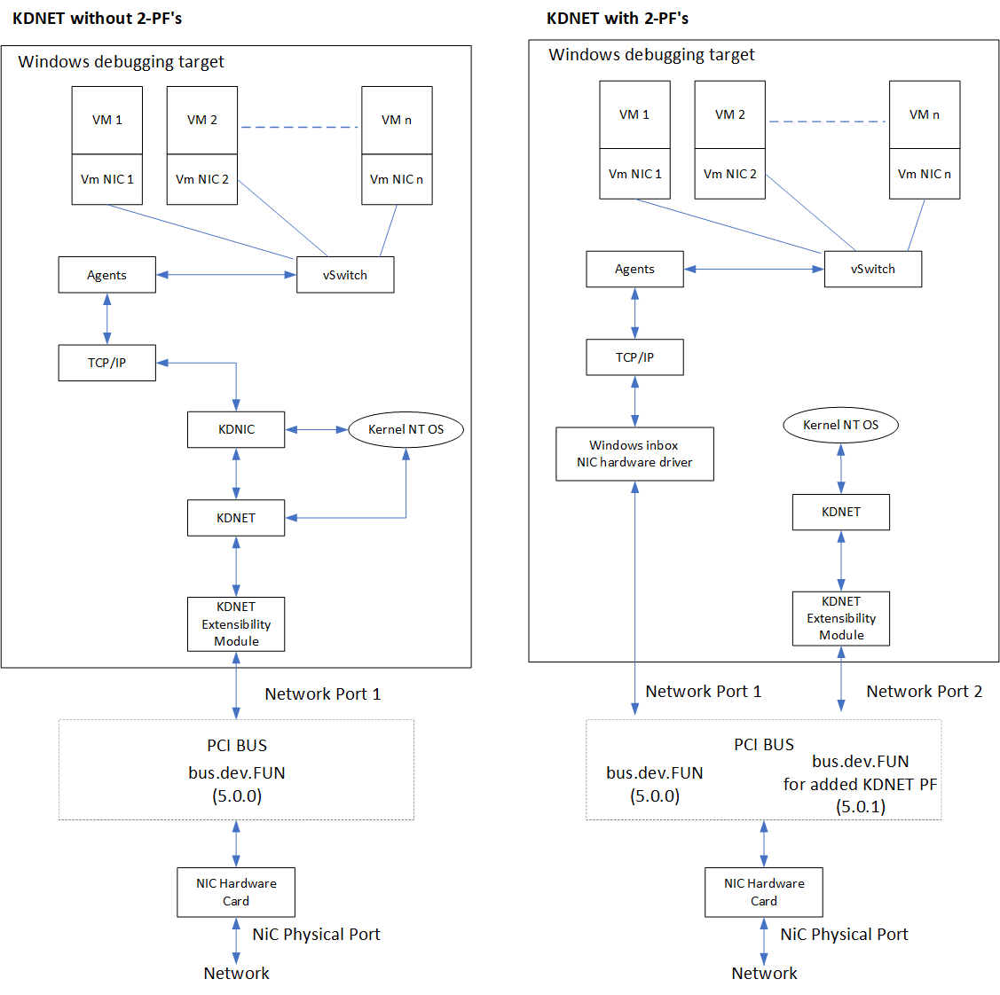

# Debugger 2PF KDNET Support

This topic describes how to enable your miniport NDIS driver for 2PF debugger support to allow increased performance for high speed adapters, often used in data centers. This feature is available in Windows 10 Insider Preview Build 21313 and later.

When enabling kernel debugging on a NIC, the kernel debugging support takes over the physical device to provide both a kernel debugging and network connection on the box. This works fine on consumer low bandwidth NICs (1-10 Gbps), but on
high throughput devices that support 10-40+ Gbps the kernel debugging extensibility modules that talk to the hardware generally cannot keep up with the amount of traffic that comes from Windows networking stack, so this degradates overall system performance.

Using the PCI multiple Physical Function (PF) feature for KDNET allows for debugging to be enabled with almost no performance impact.

The Physical Function (PF) is a PCI Express (PCIe) function of a network adapter that supports the single root I/O virtualization (SR-IOV) interface. The PF includes the SR-IOV Extended Capability in the PCIe Configuration space. The capability is used to configure and manage the SR-IOV functionality of the network adapter, such as enabling virtualization and exposing PCIe Virtual Functions (VFs).

The PF supports the SR-IOV Extended Capability structure in its PCIe configuration space. This structure is defined in the [PCI-SIG Single Root I/O Virtualization and Sharing 1.1 specification](https://pcisig.com/specifications/iov/single_root/).

The debugger transport will take advantage of multiple or 2PF enabled miniport drivers. To allow debugging of systems of high speed servers, it is recommended that NIC vendors enable 2PF in all NICs that support multiple PF in the the network card firmware.

For information on configuring 2PF support to test a connection, see [Setting Up 2PF Kernel-Mode Debugging using KDNET](../debugger/setting-up-kernel-mode-debugging-using-2pf.md).

## Multiple PF KDNET architecture overview

- The Multiple PF (2PF) functionality is to add/assign a new PF to the original PCI network port (e.g.
Bus.dev.fun0.0).

- The new added PF (e.g. bus.dev.fun0.1) is used only by KDNET to route Debugger packets to/from the target.

- The original PF will be used by the Windows inbox NIC driver to route the Windows networking packets (TCP/IP) .

- Using this approach both drivers can work in parallel w/o interfering with each other work.

- Both drivers will run over the partitioned PCI configuration space

    - Windows Inbox driver will run out of the original network port at bus.dev.**fun0.0**

    - KDNET-KDNET-Ext. module will run out of the added PF at bus.dev.**fun0.1**, This way ensures that the Windows inbox NIC driver does not get impacted by sharing the NIC with KDNET.

- The kdnet.exe user mode tool configures the 2PF feature using the Windows inbox driver by adding specific IOCTL codes to add/remove KDNET PF.



## Multiple PFs feature design requirements

1. The KDNET 2PF feature needs to work for all current KD scenarios whether it is the pre-NT OS (e.g. Boot Manager, OS loader, WinResume, Hyper-V, SK, etc.), NT OS, or Windows Desktop.

2. Rebooting the system will be required when adding a new PF for a device results in a change needed to the BCD configuration for  debugging settings. This means that the configuration for an additional PF must be persistent across boots.

3. The KDNET 2PF should be used only by the debugger to ensure that there is not any other Windows/UEFI ethernet driver
accessing/running from the PCI 2PF location when the debugger owns the debug device (the 2PF location is configured using dbgsettings::busparams).

4. Windows or UEFI Ethernet drivers cannot run out of the added KDNET 2PF even when KDNET is not enabled in the system.

5. The 2PF feature should support a dynamic mechanism for adding/enabling and removing/disabling the functionality on the
current NIC.

6. The Windows miniport drivers will implement the 2PF feature via servicing the following NDIS OIDs.

|  OID Name | Description |
|-----------|-------------|
| OID_KDNET_ENUMERATE_PFS | Enumerates PFs on the current bus.dev.fun (BDF), where the miniport driver is running. |
 OID_KDNET_ADD_PF | Adds a PF to the current BDF, where the miniport  driver is running. |
 OID_KDNET_REMOVE_PF | Removes the added PF, from the passed in BDF. |
 OID_KDNET_QUERY_PF_INFORMATION | Queries PF information data from the passed in BDF.  |

   The OIDs and their structures are defined in ntddndis.h and kdnetpf.h files that are released with the public WDK.

   See the details below on Input/Output parameters for each OID and the information provided in the kdnetpf.h header file.

7. KDNET should be configured via the KDNET 2PF feature on NICS where multiple PF feature is available, and the NIC enables 2PF functionality by following all of the requirements described above.

## KDNET Multiple PF Interface for Windows NIC Drivers

To support the KDNET Multiple PF Interface Miniport drivers will need to implement the handling of the following four NDIS OIDs.

- OID_KDNET_ENUMERATE_PFS

- OID_KDNET_ADD_PF

- OID_KDNET_REMOVE_PF

- OID_KDNET_QUERY_PF_INFORMATION

These OIDs and structures are populated in the ntddndis.h and kdnetpf.h files in the public WDK release on this path:

`<WDK root directory>\ddk\inc\ndis`

These files also are available in the Windows SDK, and can be found a:

`\Program Files (x86)\Windows Kits\10\Include\<Version for example 10.0.21301.0>\shared`

The client tool (kdnet.exe) uses a private NDIS IOCTL to route the KDNET 2PF NDIS OIDs to the miniport drivers.

## The Multiple PF feature NDIS OIDs

The Multiple PF feature is operated by using these four NDIS OIDs.

#### 1. Enumerate PFs on the miniport BDF primary port  using OID: ***OID_KDNET_ENUMERATE_PFS***, see  definition below.

- ***OID_KDNET_ENUMERATE_PFS*** returns a list of all BDFs associated to the given primary port from where the miniport driver is running from. The port is represented by the bus.dev.fun (BDF). The operation will list/enumerate the list of PFs that are **associated only** to the bus.dev.fun (BDF port) from where the miniport driver is running on the system, since every miniport driver can determine its BDF location. 

- The list of PFs will be returned to the client via a NDIS Query operation.

- The ***OID_KDNET_ENUMERATE_PFS*** OID is associated with the **NDIS_KDNET_ENUMERATE_PFS** structure.

- The ***OID_KDNET_ENUMERATE_PFS*** driver handler will return a buffer containing the PFs list with each PF element described by the type **NDIS_KDNET_PF_ENUM_ELEMENT**.

   The PfNumber field contains the PF Function Number, (e.g. bus.dev.**fun**)

    The PfState field contains the PF state possible values- each element type described by **NDIS_KDNET_PF_STATE** enum.

    **NDIS_KDNET_PF_STATE::NdisKdNetPfStatePrimary** - This is a primary PF and it's usually used only by the miniport driver.

    **NDIS_KDNET_PF_STATE::NdisKdnetPfStateEnabled** - This is an added secondary PF, that is used by KDNET.

    **NDIS_KDNET_PF_STATE::NdisKdnetPfStateConfigured** - This is an added PF, but it is only added/configured and is not used.

- If the PF list output buffer size is not large enough to allocate the actual PFs list, then the OID handler needs to return `E_NOT_SUFFICIENT_BUFFER` error return value, together with the required buffer size, so the client tool can allocate the required size buffer, and then the client can make another call with the correct buffer size allocated. In addition, the that the OID request status field (described by NDIS_IOCTL_OID_REQUEST_INFO.status) should be set to equal to `NDIS_STATUS_BUFFER_TOO_SHORT`.

#### 2. Add PCI PF to the miniport BDF primary port (OID: ***OID_KDNET_ADD_PF,*** see definition below)

- Add a PF to the miniport primary port. The port is represented by the BDF.

- The newly added PF will be returned to the client via a NDIS Query operation.

- The ***OID_KDNET_ADD_PF*** OID is associated with the **NDIS_KDNET_ADD_PF** structure.

- The ***OID_KDNET_ADD_PF*** driver handler will return an ULONG containing the *added* PF function number.

- This OID request will have only one Output parameter: `AddedFunctionNumber`. The `AddedFunctionNumber` indicates the added Function number value at the miniport PCI location (the BDF miniport). The kdnet.exe utility will receive this value and setup dbgsettings::busparams to points to the added PF. 

>[!NOTE]
> The added PF can be used exclusively by KDNET, so Windows  NIC drivers are rigged to expressly \*NOT\* run on an added PF, so this also applies when KDNET is \*NOT\* enabled on the system and the PF has been added to the port.

#### 3. Remove PCI PF (OID: ***OID_KDNET_REMOVE_PF***, see definition below )

- Remove a PF from the <u>given port</u>. The port is represented by the BDF.

- The ***OID_KDNET_REMOVE_PF*** OID is associated with the **NDIS_KDNET_REMOVE_PF** structure

- The ***OID_KDNET_REMOVE_PF*** OID has an input BDF port and returns an ULONG containing the *removed* PF function number via a NDIS Method operation.

- This function will succeed only on the PFs that has been added via using the ***OID_KDNET_ADD_PF*** OID.
 
- This OID request will have the input BDF port from where needs to be removed the BDF. This function has an Output parameter of `FunctionNumber`. The output `FunctionNumber` will contain the removed Function number value.

#### 4. Query PCI PF information (OID: ***OID_KDNET_QUERY_PF_INFORMATION***, see definition below)

- This OID code allows querying specific PF data on a <u>given port</u>. The port is represented by the BDF.

- The requested PF information will be returned to the client via a NDIS Method operation.

- The ***OID_KDNET_QUERY_PF_INFORMATION*** OID is associated with the **NDIS_KDNET_QUERY_PF_INFORMATION** structure.

- The ***OID_KDNET_QUERY_PF_INFORMATION*** OID has an input BDF port and returns a buffer containing the following data:

    - MAC Address: Network address of the assigned new KDNET PF if there is any.

    - Usage Tag: Describes the entity that owns the PF port. It contains a constant value described by
**NDIS_KDNET_PF_USAGE_TAG** enum.

    - Maximum Number of PFs: Contains an ULONG with the maximum number of PFs that can be added to the given BDF.

    - Device ID: Contains the device ID associated to the given BDF port. This is required for cases where the NIC FW assigns a new device ID to the new added KDNET PF port.

- This OID requests the information for any passed in BDF port (BDF is an input parameter for this operation), so it’s *not* necessarily related to the current BDF from where the driver is running from.

## NDIS OIDs for KDNET on 2PF

***Ntddndis.h*** file defines the OIDs.

```cpp
#if (NDIS_SUPPORT_NDIS686)

 //

 // Optional OIDs to handle network multiple PF feature.

 //
#define OID_KDNET_ENUMERATE_PFS 0x00020222
#define OID_KDNET_ADD_PF 0x00020223
#define OID_KDNET_REMOVE_PF 0x00020224
#define OID_KDNET_QUERY_PF_INFORMATION 0x00020225
#endif // (NDIS_SUPPORT_NDIS686)
```

***Kdnetpf.h*** file describes the type and structures associated with the NDIS OIDs.

```cpp
#if (NDIS_SUPPORT_NDIS686)

 //
 // Used to query/add/remove Physical function on a network port.
 // These structures are used by these OIDs:
 // OID_KDNET_ENUMERATE_PFS
 // OID_KDNET_ADD_PF
 // OID_KDNET_REMOVE_PF
 // OID_KDNET_QUERY_PF_INFORMATION
 // These OIDs handle PFs that are primary intended to be used by  KDNET.
 //
 //
 // PCI location of the port to query
 //
 typedef struct _NDIS_KDNET_BDF
 {
 ULONG SegmentNumber;
 ULONG BusNumber;
 ULONG DeviceNumber;
 ULONG FunctionNumber;
 ULONG Reserved;
 } NDIS_KDNET_BDF, *PNDIS_KDNET_PCI_BDF;

 //
 // PF supported states.
 //
 typedef enum _NDIS_KDNET_PF_STATE
 {
 NdisKdNetPfStatePrimary = 0x0,
 NdisKdnetPfStateEnabled = 0x1,
 NdisKdnetPfStateConfigured = 0x2,
 } NDIS_KDNET_PF_STATE,*PNDIS_KDNET_PF_STATE;

 //
 // PF Usage Tag
 // Used to indicate the entity that owns the PF.
 // Used by the query NdisKdnetQueryUsageTag.
 //
 typedef enum _NDIS_KDNET_PF_USAGE_TAG
 {
 NdisKdnetPfUsageUnknown = 0x0,
 NdisKdnetPfUsageKdModule = 0x1,
 } NDIS_KDNET_PF_USAGE_TAG,*PNDIS_KDNET_PF_USAGE_TAG;

 //
 // PF element array structure
 //
 typedef struct _NDIS_KDNET_PF_ENUM_ELEMENT
 {
 NDIS_OBJECT_HEADER Header;

 //
 // PF value (e.g. if <bus.dev.fun>, then PF value = fun)
 //
 ULONG PfNumber;

 //
 // The PF state value (defined by NDIS_KDNET_PF_STATE)
 //
 NDIS_KDNET_PF_STATE PfState;

 } NDIS_KDNET_PF_ENUM_ELEMENT, *PNDIS_KDNET_PF_ENUM_ELEMENT;
#define NDIS_KDNET_PF_ENUM_ELEMENT_REVISION_1 1
#define NDIS_SIZEOF_KDNET_PF_ENUM_ELEMENT_REVISION_1 \
 RTL_SIZEOF_THROUGH_FIELD(NDIS_KDNET_PF_ENUM_ELEMENT, PfState)

 //
 // This structure describes the data required to enumerate the list of PF
 // Used by OID_KDNET_ENUMERATE_PFS.
 //
 typedef struct _NDIS_KDNET_ENUMERATE_PFS
 {
 NDIS_OBJECT_HEADER Header;

 //
 // The size of each element is the sizeof(NDIS_KDNET_PF_ENUM_ELEMENT)
 //
 ULONG ElementSize;

 //
 // The number of elements in the returned array
 //
 ULONG NumberOfElements;

 //
 // Offset value to the first element of the returned array.
 // Each array element is defined by NDIS_KDNET_PF_ENUM_ELEMENT.
 //
 ULONG OffsetToFirstElement;
 } NDIS_KDNET_ENUMERATE_PFS, *PNDIS_KDNET_ENUMERATE_PFS;

#define NDIS_KDNET_ENUMERATE_PFS_REVISION_1 1
#define NDIS_SIZEOF_KDNET_ENUMERATE_PFS_REVISION_1 \
 RTL_SIZEOF_THROUGH_FIELD(NDIS_KDNET_ENUMERATE_PFS,
 OffsetToFirstElement)

 //
 // This structure indicates the data required to add a PF to the BDF port.
 // Used by OID_KDNET_ADD_PF.
 //
 typedef struct _NDIS_KDNET_ADD_PF
 {
 NDIS_OBJECT_HEADER Header;

 //
 // One element containing the added PF port number
 //
 ULONG AddedFunctionNumber;
 } NDIS_KDNET_ADD_PF, *PNDIS_KDNET_ADD_PF;

#define NDIS_KDNET_ADD_PF_REVISION_1 1
#define NDIS_SIZEOF_KDNET_ADD_PF_REVISION_1 \
 RTL_SIZEOF_THROUGH_FIELD(NDIS_KDNET_ADD_PF, AddedFunctionNumber)

 //
 // This structure indicates the data required to remove a PF from the BDF port.
 // Used by OID_KDNET_REMOVE_PF.
 //

 typedef struct _NDIS_KDNET_REMOVE_PF
 {
 NDIS_OBJECT_HEADER Header;

 //
 // PCI location that points to the PF that needs to be removed
 //
 NDIS_KDNET_BDF Bdf;

 //
 // One element containing the removed PF port
 //
 ULONG FunctionNumber;
 } NDIS_KDNET_REMOVE_PF, *PNDIS_KDNET_REMOVE_PF;
#define NDIS_KDNET_REMOVE_PF_REVISION_1 1
#define NDIS_SIZEOF_KDNET_REMOVE_PF_REVISION_1 \
 RTL_SIZEOF_THROUGH_FIELD(NDIS_KDNET_REMOVE_PF, FunctionNumber)

 //
 // This structure describes the data required to query the PF management data
 // Used by OID_KDNET_QUERY_PF_INFORMATION
 //
 typedef struct _NDIS_KDNET_QUERY_PF_INFORMATION
 {
 NDIS_OBJECT_HEADER Header;

 //
 // PF PCI location to query for
 //
 NDIS_KDNET_BDF Bdf;

 //
 // PF assigned MAC address
 //
 UCHAR NetworkAdddress[6];

 //
 // PF Usage tag described by NDIS_KDNET_PF_USAGE_TAG
 //
 ULONG UsageTag;

 //
 // Maximum number of Pfs that can be associated to the Primary BDF.
 //
 ULONG MaximumNumberOfSupportedPfs;

 //
 // KDNET PF device ID (Used if there is a new added PF and
 // the FW assigns a new DeviceID to the added KDNET PF)
 //
 ULONG DeviceId;

 } NDIS_KDNET_QUERY_PF_INFORMATION, *PNDIS_KDNET_QUERY_PF_INFORMATION;
#define NDIS_KDNET_QUERY_PF_INFORMATION_REVISION_1 1
#define NDIS_SIZEOF_KDNET_QUERY_PF_INFORMATION_REVISION_1 \
 RTL_SIZEOF_THROUGH_FIELD(NDIS_KDNET_QUERY_PF_INFORMATION, DeviceId)

#endif // (NDIS_SUPPORT_NDIS686)
```

## See also

[Setting Up 2PF Kernel-Mode Debugging using KDNET](../debugger/setting-up-kernel-mode-debugging-using-2pf.md)

[Network OIDs](network-oids.md)
