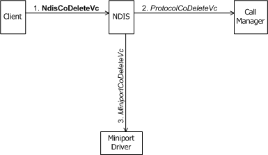
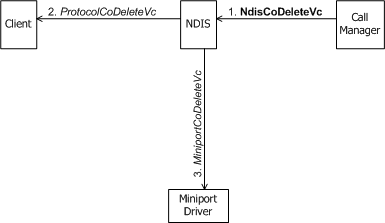

# Deleting a VC

Only the connection-oriented client, call manager, or MCM driver that initiated the creation of a virtual circuit (VC) can initiate the deletion of that VC. A client therefore deletes a VC that it previously created for an outgoing call, a call manager or MCM driver deletes a VC that it previously created for an incoming call over the network, and a call manager deletes a VC that it previously created for exchanging signaling messages over the network. (An MCM driver does not call NDIS to delete a VC that it created for exchanging signaling messages. The MCM driver deletes such a VC with an internal operation that is opaque to NDIS.)

A connection-oriented client or call manager initiates the deletion of a VC with [**NdisCoDeleteVc**](https://msdn.microsoft.com/library/windows/hardware/ff561698).

The following figure shows a client of a call manager initiating the deletion of a VC.

The following figure shows a client of an MCM driver initiating the deletion of a VC.

The following figure shows a call manager initiating the deletion of a VC.

When a client or call manager calls **NdisCoDeleteVc** or when an MCM driver calls **NdisMCmDeleteVc**, there must be no outstanding calls on the given VC and that VC must already have been [deactivated](deactivating-a-vc.md). To meet these requirements implies that the following conditions are satisfied:

-   The client has already called [**NdisClCloseCall**](https://msdn.microsoft.com/library/windows/hardware/ff561627) with the given *NdisVcHandle* and its [close-call request](client-initiated-request-to-close-a-call.md) has completed successfully.

-   The call manager has already called [**NdisCmDeactivateVc**](https://msdn.microsoft.com/library/windows/hardware/ff561657) or the MCM driver has already called [**NdisMCmDeactivateVc**](https://msdn.microsoft.com/library/windows/hardware/ff562818) with the given *NdisVcHandle* and the deactivation request has completed successfully (see [Incoming Request to Close a Call](incoming-request-to-close-a-call.md)).

A client's or call manager's call to **NdisCoDeleteVc** causes NDIS to call both the underlying miniport driver's [**MiniportCoDeleteVc**](https://msdn.microsoft.com/library/windows/hardware/ff559358) function and the [**ProtocolCoDeleteVc**](https://msdn.microsoft.com/library/windows/hardware/ff570253) function of the client or call manager with which the caller shares the *NdisVcHandle* (see the three preceding figures).

*MiniportCoDeleteVc* frees any resources allocated for the VC, as well as the miniport driver's context for the VC. *ProtocolCoDeleteVc* releases any resources that the client or call manager used to perform operations on and track state for the VC. Both *MiniportCoDeleteVc* and *ProtocolCoDeleteVc* are synchronous functions that cannot return NDIS\_STATUS\_PENDING.

An MCM driver initiates the deletion of a VC with [**NdisMCmDeleteVc**](https://msdn.microsoft.com/library/windows/hardware/ff562819)(see the following figure).

An MCM driver's call to **NdisMCmDeleteVc** causes NDIS to call the [**ProtocolCoDeleteVc**](https://msdn.microsoft.com/library/windows/hardware/ff570253) function of the client with which the MCM driver shared the *NdisVcHandle* .

When **NdisCoDeleteVc** or **NdisMCmDeleteVc** returns control, the *NdisVcHandle* is no longer valid.

 

 

