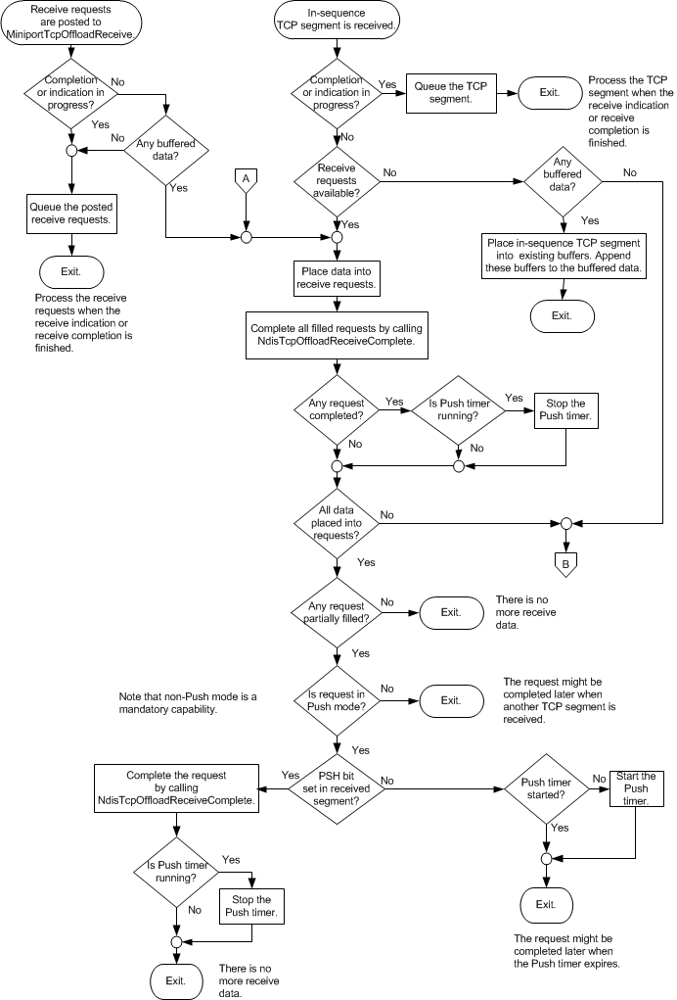
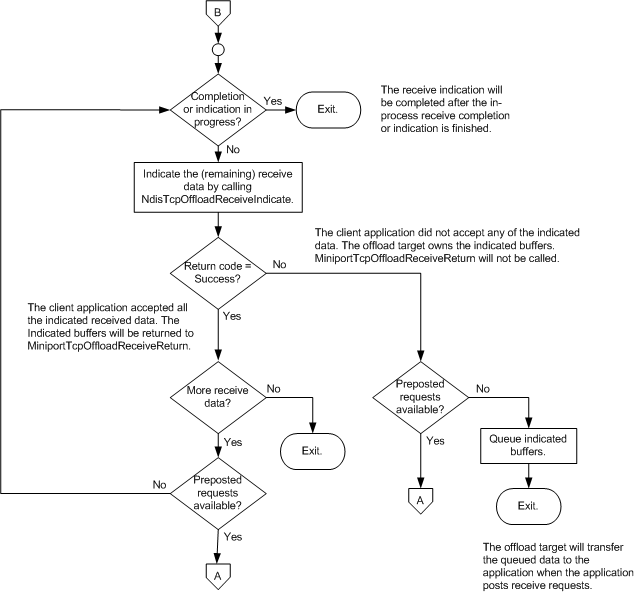
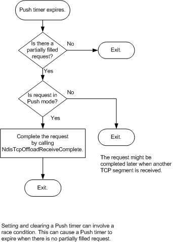

# Delivery Algorithm

\[The TCP chimney offload feature is deprecated and should not be used.\]

The following three flowcharts illustrate the algorithm that the offload target must use to process each of the following events:

-   The offload target receives an in-sequence TCP segment.

-   NDIS posts one or more receive requests (application-supplied receive buffers) to the offload target's [*MiniportTcpOffloadReceive*](https://msdn.microsoft.com/library/windows/hardware/ff559460) function.

-   The push timer for an offloaded TCP connection expires.

The offload target must serialize calls to the [**NdisTcpOffloadReceiveComplete**](https://msdn.microsoft.com/library/windows/hardware/ff564599) function and to the [**NdisTcpOffloadReceiveHandler**](https://msdn.microsoft.com/library/windows/hardware/ff564606) function on a per-connection basis.

To increase performance, the offload target can complete all filled receive requests--and optionally one partially filled receive request--in a single call to the **NdisTcpOffloadReceiveComplete** function. For simplicity, this option is not illustrated in the delivery algorithm flowcharts.

After starting the delivery algorithm, the offload target must complete the algorithm.

 

 

