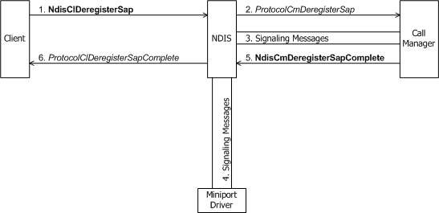
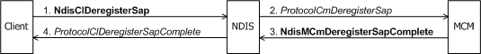

# Deregistering a SAP

A connection-oriented client deregisters a SAP with [**NdisClDeregisterSap**](https://msdn.microsoft.com/library/windows/hardware/ff561628).

The following figure shows a client of a call manager deregistering a SAP.

The following figure shows a client of an MCM driver deregistering a SAP.

The call to **NdisClDeregisterSap** causes NDIS to call the call manager's or MCM driver's [**ProtocolCmDeregisterSap**](https://msdn.microsoft.com/library/windows/hardware/ff570243) function. In *ProtocolCmDeregisterSap*, the call manager or MCM driver might communicate with network control devices or other media-specific agents to deregister the SAP on the network. In addition, *ProtocolCmDeregisterSap* must free any resources that it dynamically allocated for the SAP.

*ProtocolCmDeregisterSap* can complete synchronously or asynchronously. To complete asynchronously, the *ProtocolCmDeregisterSap* function of a call manager calls [**NdisCmDeregisterSapComplete**](https://msdn.microsoft.com/library/windows/hardware/ff561659). The *ProtocolCmDeregisterSap* function of an MCM driver calls [**NdisMCmDeregisterSapComplete**](https://msdn.microsoft.com/library/windows/hardware/ff562821). **Ndis(M)CmDegisterSapComplete** notifies both NDIS and the client that the call manager has completed the SAP-deregistration request for which its *ProtocolCmDeregisterSap* function previously returned NDIS\_STATUS\_PENDING.

A call to **Ndis(M)CmDeregisterSapComplete** causes NDIS to call the client's [**ProtocolClDeregisterSapComplete**](https://msdn.microsoft.com/library/windows/hardware/ff570226) function. A call to *ProtocolClDeregisterSapComplete* indicates that the client's preceding call to **NdisClDeregisterSap** has been processed by the call manager or MCM driver.

Note that a client can deregister a SAP without affecting an incoming call that has already been received on that SAP and without affecting the VC for that incoming call.

 

 

