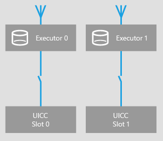
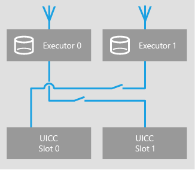

# Dual SIM

Windows Phone 8.1 and later supports Dual SIM Dual Active (DSDA) and Dual SIM Dual Standby (DSDS). DSDA allows voice calls and SMS on both lines simultaneously. DSDS allows registration on both lines, and calls can be received/made from either line. However, only one line can be in a voice call at any given time. For both DSDA and DSDS, data is limited to only one line.

Windows Phone 8.1 and later supports W/G + G.

Windows Phone 8.1 GDR1 adds support for C + G.

## Architecture

Each UICC slot is associated with an executor. An executor registers to a particular cellular network, and handles cellular related tasks such as making and receiving phone calls and SMS.

### W/G + G

For phones that have radio type W/G + G, one executor is W/G capable and one executor is G capable. Depending on the UICC slot that the user chooses to use for the data line, that slot is automatically associated with the more capable W/G executor. The following diagrams show the two possible executor associations depending on the UICC slot that the user chose for the data line.

### C+G

For phones that have radio type C + G, the slot that contains a CDMA UICC always uses executor 0. If there are two GSM UICCs, the UICC chosen for the data line is associated with executor 0.

For more information about configuring C + G, see [Configure C+G dual SIM settings](https://msdn.microsoft.com/library/windows/hardware/dn757414).

## UICC swapping

Hot removal of the UICC in either slot is supported. On UICC removal, the associated executor will lose service and a dialog will be shown. Hot insertion of UICCs is not supported. The device will remain unregistered if a new UICC is inserted after boot.

UICC specific user settings such as manual APNs settings are saved per UICC and are restored when the UICC is reinserted.

## Airplane mode

Turning on airplane mode turns cellular off for both lines. If the user turns a cellular line on while in airplane mode, a prompt to turn airplane mode off is displayed.

## PIN lock

PIN1, PIN2, and PUK are supported for both UICCs.

## SIM toolkit

UTK is supported on both UICCs. UTK UI is supported on only one UICC at a time.

The UICC REFRESH with RESET UTK command is supported for both UICC slots.

 

 

