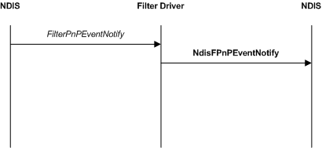
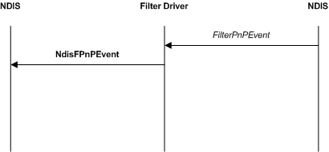

# Filter Module PnP Event Notifications

Filter drivers can receive all the device Plug and Play (PnP) notifications that underlying miniport drivers receive. Also, filter drivers can receive all the network PnP notifications that overlying protocol drivers receive.The handling of PnP notifications is driver specific.

The following figure illustrates a filtered device PnP event notification.

Filter drivers provide a [*FilterDevicePnPEventNotify*](/windows-hardware/drivers/ddi/ndis/nc-ndis-filter_device_pnp_event_notify) function that NDIS calls to pass in device PnP and Power Management event notifications. This is similar to the [*MiniportDevicePnPEventNotify*](/windows-hardware/drivers/ddi/ndis/nc-ndis-miniport_device_pnp_event_notify) function.

Filter drivers can forward device PnP and Power Management events to underlying drivers. To forward a device PnP or Power Management event, call the [**NdisFDevicePnPEventNotify**](/windows-hardware/drivers/ddi/ndis/nf-ndis-ndisfdevicepnpeventnotify) function.

The following figure illustrates a filtered network PnP event notification.

Filter drivers provide a [*FilterNetPnPEvent*](/windows-hardware/drivers/ddi/ndis/nc-ndis-filter_net_pnp_event) function that NDIS calls to pass in network PnP and Power Management event notifications. This is similar to the [*ProtocolNetPnPEvent*](/windows-hardware/drivers/ddi/ndis/nc-ndis-protocol_net_pnp_event) function.

Filter drivers can forward network PnP and Power Management events to overlying drivers. To forward a network PnP or Power Management event, call the [**NdisFNetPnPEvent**](/windows-hardware/drivers/ddi/ndis/nf-ndis-ndisfnetpnpevent) function.

Filter drivers should handle driver stack changes. For more information about driver stack changes, see [Modifying a Running Driver Stack](modifying-a-running-driver-stack.md).

If necessary to allow handling of these events, NDIS can initiate a pause operation after the PnP or Power Management notification. For more information, see [Pausing a Driver Stack](pausing-a-driver-stack.md).

 

