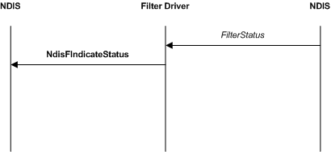

# Filter Module Status Indications

Filter drivers can supply a [*FilterStatus*](https://msdn.microsoft.com/library/windows/hardware/ff549973) function that NDIS calls when an underlying driver reports status. Filter drivers can also initiate status indications.

The following figure illustrates a filtered status indication.

NDIS calls a filter driver's [*FilterStatus*](https://msdn.microsoft.com/library/windows/hardware/ff549973) function, after an underlying driver calls a status indication function ([**NdisMIndicateStatusEx**](https://msdn.microsoft.com/library/windows/hardware/ff563600) or [**NdisFIndicateStatus**](https://msdn.microsoft.com/library/windows/hardware/ff561824)). For more information about how to indicate status from a miniport driver, see [Adapter Status Indications](miniport-adapter-status-indications.md).

A filter driver calls **NdisFIndicateStatus** in its [*FilterStatus*](https://msdn.microsoft.com/library/windows/hardware/ff549973) function, to pass on a filtered status indication to overlying drivers. A filter driver can filter out status indications (by not calling [**NdisFIndicateStatus**](https://msdn.microsoft.com/library/windows/hardware/ff561824)) or modify the indicated status before it calls **NdisFIndicateStatus**.

To originate status indications, filter drivers call [**NdisFIndicateStatus**](https://msdn.microsoft.com/library/windows/hardware/ff561824) without a prior call to [*FilterStatus*](https://msdn.microsoft.com/library/windows/hardware/ff549973).

In this case, the filter driver should set the **SourceHandle** member to the handle that NDIS passed to the *NdisFilterHandle* parameter of the [*FilterAttach*](https://msdn.microsoft.com/library/windows/hardware/ff549905) function. If the status indication is associated with an OID request, the filter driver can set the **DestinationHandle** and **RequestId** members so that NDIS can provide the status indication to a specific protocol binding.

After a filter driver calls [**NdisFIndicateStatus**](https://msdn.microsoft.com/library/windows/hardware/ff561824), NDIS calls the status function ([**ProtocolStatusEx**](https://msdn.microsoft.com/library/windows/hardware/ff570270) or *FilterStatus*) of the next overlying driver.

 

 

