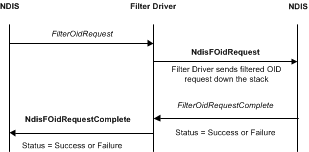

# Filtering OID Requests in an NDIS Filter Driver

Filter drivers can process OID requests that are originated by overlying drivers. NDIS calls the [*FilterOidRequest*](/windows-hardware/drivers/ddi/ndis/nc-ndis-filter_oid_request) function to process each OID request. Filter drivers can forward OID requests to underlying drivers by calling the [**NdisFOidRequest**](/windows-hardware/drivers/ddi/ndis/nf-ndis-ndisfoidrequest) function.

NDIS can call a filter driver's [*FilterCancelOidRequest*](/windows-hardware/drivers/ddi/ndis/nc-ndis-filter_cancel_oid_request) function to cancel an OID request. When NDIS calls *FilterCancelOidRequest*, the filter driver should try to call the [**NdisFOidRequest**](/windows-hardware/drivers/ddi/ndis/nf-ndis-ndisfoidrequest) function as soon as possible.

The following figure illustrates a filtered OID request.

The filter driver can complete the OID request synchronously or asynchronously by returning NDIS\_STATUS\_SUCCESS or NDIS\_STATUS\_PENDING, respectively, from [*FilterOidRequest*](/windows-hardware/drivers/ddi/ndis/nc-ndis-filter_oid_request). *FilterOidRequest* can also complete synchronously with an error status.

A filter driver that successfully handles an OID set request must set the **SupportedRevision** member in the [**NDIS\_OID\_REQUEST**](/windows-hardware/drivers/ddi/oidrequest/ns-oidrequest-ndis_oid_request) structure upon return from the OID set request. The **SupportedRevision** member notifies the initiator of the OID request about which revision the driver supported. For more information about version information in NDIS structures, see [Specifying NDIS Version Information](specifying-ndis-version-information.md).

If *FilterOidRequest* returns NDIS\_STATUS\_PENDING, it must call the [**NdisFOidRequestComplete**](/windows-hardware/drivers/ddi/ndis/nf-ndis-ndisfoidrequestcomplete) function after it completes the OID request. In this case, the driver passes the results of the request at the *OidRequest* parameter of **NdisFOidRequestComplete**. The driver passes the final status of the request at the *Status* parameter of **NdisFOidRequestComplete**.

If *FilterOidRequest* returns NDIS\_STATUS\_SUCCESS, it returns the results of a query request in the [**NDIS\_OID\_REQUEST**](/windows-hardware/drivers/ddi/oidrequest/ns-oidrequest-ndis_oid_request) structure at the *OidRequest* parameter. In this case, the driver does not call the **NdisFOidRequestComplete** function.

To forward an OID request to underlying drivers, a filter driver calls the [**NdisFOidRequest**](/windows-hardware/drivers/ddi/ndis/nf-ndis-ndisfoidrequest) function. If a request should not be forwarded to the underlying drivers, a filter driver can complete the request immediately. To complete the request without forwarding, the driver can return NDIS\_STATUS\_SUCCESS (or an error status) from *FilterOidRequest*, or it can call **NdisFOidRequestComplete** after returning NDIS\_STATUS\_PENDING.

**Note**  Before the driver calls [**NdisFOidRequest**](/windows-hardware/drivers/ddi/ndis/nf-ndis-ndisfoidrequest), the driver must allocate an [**NDIS\_OID\_REQUEST**](/windows-hardware/drivers/ddi/oidrequest/ns-oidrequest-ndis_oid_request) structure and transfer the request information to the new structure by calling [**NdisAllocateCloneOidRequest**](/windows-hardware/drivers/ddi/ndis/nf-ndis-ndisallocatecloneoidrequest).

 

The forwarded request proceeds the same as a request initiated by a filter driver. For more information, see [Generating OID Requests from an NDIS Filter Driver](generating-oid-requests-from-an-ndis-filter-driver.md).

After the underlying drivers complete a forwarded request, the filter driver can modify the response, if necessary, and pass it to overlying drivers.

A filter driver can receive OID requests from overlying drivers when it is in the *Restarting*, *Running*, *Pausing*, or *Paused* state.

**Note**  Like miniport drivers, filter drivers can receive only one OID request at a time. Because NDIS serializes requests that are sent to a filter module, a filter driver cannot be called at *FilterOidRequest* before it completes the previous request.

 

The following is an example of a filter driver modifying an OID request:

-   A filter driver adds a header. In this case, after the driver receives a response to a query for [OID\_GEN\_MAXIMUM\_FRAME\_SIZE](./oid-gen-maximum-frame-size.md) from the underlying drivers, the filter subtracts the size of its header from the response. The driver subtracts its header size because the driver inserts a header in front of each sent packet and removes the header in each received packet.

 

