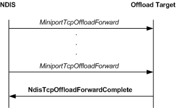

# Forwarding Data to an Offload Target

\[The TCP chimney offload feature is deprecated and should not be used.\]

The host stack forwards one or more TCP segments that it has received but not acknowledged in the following situations:

-   The host stack received the segments on a TCP connection that was being offloaded to the offload target. Because the connection was not offloaded, the offload target could not process the TCP segments at that time.

-   The host stack is in a multihomed system that received the segments on a network interface other than the one on which the TCP connection is offloaded.

-   The offload target previously indicated received packets that had IP options set,, that were fragments that needed reassembling, or both. After processing the IP options or successfully reassembling the packets, the host stack forwards the TCP segments to the offload target.

The following figure shows the call sequence for a forward operation that is performed by an offload target.

From the perspective of an offload target, a forward operation is initiated when NDIS calls the offload target's [*MiniportTcpOffloadForward*](https://msdn.microsoft.com/library/windows/hardware/ff559458) function. An offload target always completes a forward request asynchronously by calling the [**NdisTcpOffloadForwardComplete**](https://msdn.microsoft.com/library/windows/hardware/ff564597) function. To improve system performance, an offload target can create a linked list that contains [**NET\_BUFFER\_LIST**](https://msdn.microsoft.com/library/windows/hardware/ff568388) structures from multiple calls to the *MiniportTcpOffloadForward* function. The offload target can then pass such a linked list in a single call to the **NdisTcpOffloadForwardComplete** function.

For more information about forwarding data from an offload target, see [*MiniportTcpOffloadForward*](https://msdn.microsoft.com/library/windows/hardware/ff559458). For more information about completing a forward operation, see [**NdisTcpOffloadForwardComplete**](https://msdn.microsoft.com/library/windows/hardware/ff564597).

 

 

