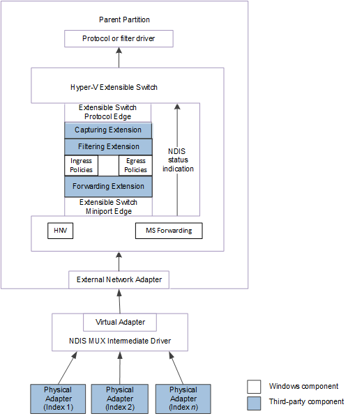
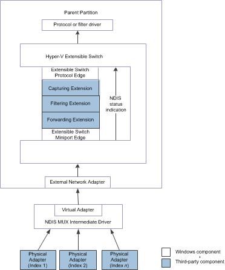

# Forwarding NDIS Status Indications from Physical Network Adapters

This topic discusses the method that is used by extensible switch forwarding extensions to forward NDIS status indications from an underlying physical adapter. One or more underlying physical adapters can be bound to the external network adapter of the Hyper-V extensible switch.

For example, the external network adapter can be bound to the virtual miniport edge of an NDIS multiplexer (MUX) intermediate driver. The MUX driver is bound to a team of one or more physical networks on the host. This configuration is known as an *extensible switch team*.

In this configuration, an extensible switch extension is exposed to every network adapter in the team. This allows the extension to manage the configuration and use of individual network adapters in the team. For example, a forwarding extension can provide support for a load balancing failover (LBFO) solution over the team by forwarding outgoing packets to individual adapters. A forwarding extension that manages an extensible switch team is known as a *teaming provider*. For more information about teaming providers, see [Teaming Provider Extensions](teaming-provider-extensions.md).

The following figure shows the Hyper-V extensible switch control path for NDIS status indications from underlying physical network adapters for NDIS 6.40 (Windows Server 2012 R2) and later.

The following figure shows the Hyper-V extensible switch control path for NDIS status indications from underlying physical network adapters for NDIS 6.30 (Windows Server 2012).

**Note**  In the extensible switch interface, NDIS filter drivers are known as *extensible switch extensions* and the driver stack is known as the *extensible switch driver stack*.

 

The extensible switch interface forwards NDIS status indications that were generated by the underlying physical adapters. If an external network adapter is bound to an extensible switch team, the NDIS status indication is originated by the virtual adapter edge of a MUX driver. Otherwise, the status indication is originated by the single physical network adapter that is bound to the external network adapter.

When an NDIS status indication arrives at the extensible switch interface, it encapsulates the indication inside an [**NDIS\_SWITCH\_NIC\_STATUS\_INDICATION**](https://msdn.microsoft.com/library/windows/hardware/hh598217) structure. Then, the miniport edge of the extensible switch issues an [**NDIS\_STATUS\_SWITCH\_NIC\_STATUS**](https://msdn.microsoft.com/library/windows/hardware/hh598205) indication that contains this structure.

Once the forwarding extension receives the NDIS status indication, it can forward the original indication data or modify the data before it forwards the indication.

**Note**  Only forwarding extensions can modify the data before forwarding the status indication. For more information about this type of extension, see [Forwarding Extension](forwarding-extensions.md).

 

A forwarding extension can modify and forward status indications from any underlying physical adapter that is bound to the external network adapter of the extensible switch. Typically, the extension issues these status indications to change the advertised hardware offload capabilities of the underlying physical adapter. For example, the extension can modify and forward status indications for the following types of hardware offloads:

-   Internet Protocol security (IPsec)

-   Virtualized machine queue (VMQ)

-   Single root I/O virtualization (SR-IOV)

If the forwarding extension is forwarding an NDIS status indication, it must set the members of the [**NDIS\_SWITCH\_NIC\_STATUS\_INDICATION**](https://msdn.microsoft.com/library/windows/hardware/hh598217) structure in the following way:

-   The **SourcePortId** member must be set to the identifier of the port to which the external network adapter is connected. The external network adapter is bound to one or more physical adapters. For more information, see [External Network Adapters](external-network-adapters.md).

-   The **SourceNicIndex** member must be set to NDIS\_SWITCH\_DEFAULT\_NIC\_INDEX. This allows the status indication to be interpreted as originating from the entire extensible switch team that is bound to the external network adapter.

-   The **DestinationPortId** member must be set to **NDIS\_SWITCH\_DEFAULT\_PORT\_ID**.

-   The **DestinationNicIndex** member must be set to **NDIS\_SWITCH\_DEFAULT\_NIC\_INDEX**.

-   The **StatusIndication** member must be set to a pointer to an [**NDIS\_STATUS\_INDICATION**](https://msdn.microsoft.com/library/windows/hardware/ff567373) structure. This structure contains the data for the encapsulated NDIS status indication.

When a forwarding extension issues the encapsulated NDIS status indication, it must follow these steps:

1.  The extension calls [*ReferenceSwitchNic*](https://msdn.microsoft.com/library/windows/hardware/hh598294) to increment a reference counter for the external network adapter. This guarantees that the extensible switch interface will not delete the network adapter connection while its reference counter is nonzero.

    When the extension calls [*ReferenceSwitchNic*](https://msdn.microsoft.com/library/windows/hardware/hh598294), it sets the *SwitchPortId* parameter to the value specified for the **SourcePortId** member. The extension also sets the *SwitchNicIndex* parameter to the value specified for the **SourceNicIndex** member.

    **Note**  If [*ReferenceSwitchNic*](https://msdn.microsoft.com/library/windows/hardware/hh598294) does not return NDIS\_STATUS\_SUCCESS, the encapsulated NDIS status indication cannot be issued.

     

2.  The extension calls [**NdisFIndicateStatus**](https://msdn.microsoft.com/library/windows/hardware/ff561824) to forward the encapsulated status notification.

    **Note**  If the extension is forwarding an encapsulated NDIS status indication, it must call [**NdisFIndicateStatus**](https://msdn.microsoft.com/library/windows/hardware/ff561824) within the context of the call to its [*FilterStatus*](https://msdn.microsoft.com/library/windows/hardware/ff549973) function.

     

3.  After [**NdisFIndicateStatus**](https://msdn.microsoft.com/library/windows/hardware/ff561824) returns, the extension calls [*DereferenceSwitchNic*](https://msdn.microsoft.com/library/windows/hardware/hh598141) to clear the reference counter for the source or destination network adapter connection. The extension sets the *SwitchPortId* and *SwitchNicIndex* parameters to the same values that it used in the call to [*ReferenceSwitchNic*](https://msdn.microsoft.com/library/windows/hardware/hh598294).

For more information on MUX drivers, see [NDIS MUX Intermediate Drivers](ndis-mux-intermediate-drivers.md).

 

 

