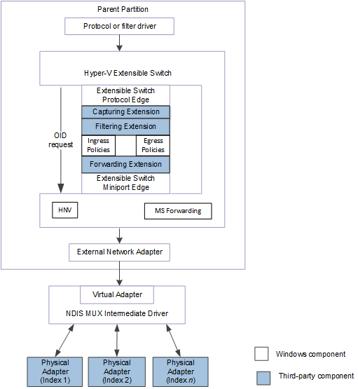
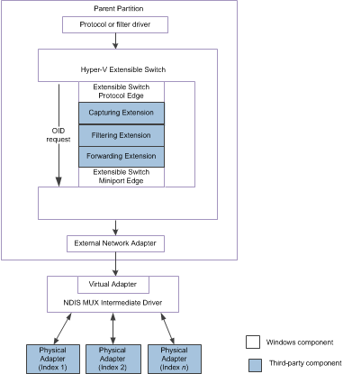

# Forwarding OID Requests to Physical Network Adapters

This topic discusses how Hyper-V extensible switch extensions forward object identifier (OID) requests for underlying physical adapters over the Hyper-V extensible switch control path. The extension can also originate OID requests to underlying physical network adapters by following the methods described in this topic.

For example, the external network adapter can be bound to the virtual miniport edge of an NDIS multiplexer (MUX) intermediate driver. The MUX driver is bound to a team of one or more physical networks on the host. This configuration is known as an *extensible switch team*.

In this configuration, an extensible switch extension is exposed to every network adapter in the team. This allows the extension to manage the configuration and use of individual network adapters in the team. For example, a forwarding extension can provide support for a load balancing failover (LBFO) solution over the team by forwarding outgoing packets to individual adapters. A forwarding extension that manages an extensible switch team is known as a *teaming provider*. For more information about teaming providers, see [Teaming Provider Extensions](teaming-provider-extensions.md).

The following figure shows an example of an extensible switch team for NDIS 6.40 (Windows Server 2012 R2) and later.

The following figure shows an example of an extensible switch team for NDIS 6.30 (Windows Server 2012).

**Note**  In the Hyper-V extensible switch interface, NDIS filter drivers are known as *extensible switch extensions* and the driver stack is known as the *extensible switch driver stack*.

 

OID requests must be encapsulated to forward the request to an underlying physical network adapter. OID requests are first encapsulated inside an [**NDIS\_SWITCH\_NIC\_OID\_REQUEST**](https://msdn.microsoft.com/library/windows/hardware/hh598214) structure. Then, the OID requests are forwarded through the extensible switch control path by an OID set request of [OID\_SWITCH\_NIC\_REQUEST](https://msdn.microsoft.com/library/windows/hardware/hh598266).

OID requests to the underlying physical adapters are issued by the following:

The extensible switch interface.  
OID requests, such as requests for hardware offloads, are issued by overlying protocol or filter drivers that run in one of the following:

-   The management operating system that runs in the Hyper-V parent partition.

-   The guest operating system that runs in the Hyper-V child partition.

When these OID requests are received by the extensible switch, they are encapsulated and forwarded over the extensible switch control path. When a forwarding extension receives the encapsulated OID request, it can forward the request to an underlying physical adapter. This ability is especially useful for configuring the extensible switch team for hardware offloads.

For example, the MUX driver advertises the common capabilities of the entire extensible switch team. However, the forwarding extension can issue OID requests to query or set the individual capabilities of adapters within the team. Then, the forwarding extension can originate an NDIS status indication from the external network adapter to notify overlying drivers about the capabilities that apply to the entire team. For more information on this procedure, see [Originating NDIS Status Indications from Physical Network Adapters](originating-ndis-status-indications-from-physical-network-adapters.md).

When the forwarding extension forwards the OID request over the control path, it is received by the external network adapter. At this point, the OID request is decapsulated and forwarded to the specified physical network adapter.

**Note**  Starting with Windows Server 2012, only hardware offload OID requests are encapsulated and forwarded in this manner. For example, offload OID requests for virtual machine queue (VMQ) or Internet Protocol security (IPsec) are encapsulated and forwarded over the extensible switch control path. For more information, see [Managing Hardware Offload OID Requests to Physical Network Adapters](managing-hardware-offload-oid-requests-to-physical-network-adapters.md).

 

A forwarding extension.  
The forwarding extension can originate its own encapsulated OID requests and forward them to an underlying physical network adapter. The forwarding extension can encapsulate standard NDIS OID requests. The forwarding extension can also encapsulate private OID requests that are defined by the independent hardware vendor (IHV) for the physical network adapters. This allows a forwarding extension that was also developed by the IHV to enable or disable proprietary attributes on individual physical adapters in the team.

In addition, the forwarding extension can originate encapsulated hardware offload OID requests to allocate resources for a specified Hyper-V child partition. For example, the forwarding extension can originate encapsulated OID requests of [OID\_RECEIVE\_FILTER\_ALLOCATE\_QUEUE](https://msdn.microsoft.com/library/windows/hardware/ff569784) to allocate a VMQ for a specified child partition. In this case, the extension encapsulates the request as originating from the extensible switch port and network adapter connection associated with the partition.

**Note**  The forwarding extension can only originate its own encapsulated hardware offload OID request if it is filtering the same OID request that was issued by overlying drivers. In this case, the extension must not forward the original OID request. Instead, the extension must call [**NdisFOidRequestComplete**](https://msdn.microsoft.com/library/windows/hardware/ff561833) to complete this request when NDIS calls its [*FilterOidRequestComplete*](https://msdn.microsoft.com/library/windows/hardware/ff549956) to complete the originated OID request.

 

Filtering or capturing extensions  
A filtering or capturing extension can originate its own encapsulated OID query requests and forward them to an underlying physical network adapter. These extensions can encapsulate standard NDIS OID query requests or private OID query requests that are defined by the independent hardware vendor (IHV) for the physical network adapters.

**Note**  Only forwarding extensions can originate encapsulated OID set requests to underlying physical adapters.

 

The forwarding extension must follow these steps when it forwards, redirects, or originates an encapsulated OID request for an underlying physical adapter:

1.  If the forwarding extension is originating an OID request, it must initialize an extension-allocated [**NDIS\_OID\_REQUEST**](https://msdn.microsoft.com/library/windows/hardware/ff566710) structure with the information related to the request.

    If the extension is forwarding an OID request, it must not change the existing [**NDIS\_OID\_REQUEST**](https://msdn.microsoft.com/library/windows/hardware/ff566710) structure referenced by the *OidRequest* parameter of the [*FilterOidRequest*](https://msdn.microsoft.com/library/windows/hardware/ff549954) function. Instead, the extension must call [**NdisAllocateCloneOidRequest**](https://msdn.microsoft.com/library/windows/hardware/ff560706) to allocate memory for a new **NDIS\_OID\_REQUEST** structure and copy all the information from the existing **NDIS\_OID\_REQUEST** structure.

2.  The extension sets the members of an extension-allocated [**NDIS\_SWITCH\_NIC\_OID\_REQUEST**](https://msdn.microsoft.com/library/windows/hardware/hh598214) structure to the following values:

    -   The **DestinationPortId** member must be set to the identifier of the extensible switch port to which the external network adapter is connected.

    -   The **DestinationNicIndex** member must be set to the nonzero index value of the underlying physical network adapter.

        For more information on these index values, see [Network Adapter Index Values](network-adapter-index-values.md).

    -   If the forwarding extension is originating a hardware offload OID request for a Hyper-V child partition, the **SourcePortId** member must be set to the identifier of the port that is used by the partition. Also, the **SourceNicIndex** member must be set to the network adapter index for the network connection to that port.

        If the forwarding extension is originating a standard or private OID request for its own purposes, the **SourcePortId** and **SourceNicIndex** members must be set to zero.

        If the forwarding extension is forwarding or redirecting a hardware offload OID request, it must retain the values of the **SourcePortId** and **SourceNicIndex** members that were set by the extensible switch interface.

    -   The **OidRequest** member must be set to a pointer to an initialized [**NDIS\_OID\_REQUEST**](https://msdn.microsoft.com/library/windows/hardware/ff566710) structure for the encapsulated OID request. The forwarding extension either allocates and initializes this structure or uses the cloned copy of the structure.

3.  The extension sets the members of an extension-allocated [**NDIS\_OID\_REQUEST**](https://msdn.microsoft.com/library/windows/hardware/ff566710) structure to the following values:

    -   The **Oid** member must be set to [OID\_SWITCH\_NIC\_REQUEST](https://msdn.microsoft.com/library/windows/hardware/hh598266).

    -   The **InformationBuffer** member must contain a pointer to a buffer that contains the generated or filtered OID request data.

    -   The **InformationBufferLength** member must contain the length, in bytes, of the buffer that contains the generated or filtered OID request data.

    The extension sets the other members to values that are valid for the [**NDIS\_OID\_REQUEST**](https://msdn.microsoft.com/library/windows/hardware/ff566710) structure.

4.  The extension calls [*ReferenceSwitchNic*](https://msdn.microsoft.com/library/windows/hardware/hh598294) to increment a reference counter for the index of the destination physical network adapter. This guarantees that the extensible switch interface will not delete the physical network adapter connection while its reference counter is nonzero.

    When the extension calls [*ReferenceSwitchNic*](https://msdn.microsoft.com/library/windows/hardware/hh598294), it sets the *SwitchPortId* parameter to the value specified for the **DestinationPortId** member. The extension also sets the *SwitchNicIndex* parameter to the value specified for the **DestinationNicIndex** member.

    **Note**  If [*ReferenceSwitchNic*](https://msdn.microsoft.com/library/windows/hardware/hh598294) does not return NDIS\_STATUS\_SUCCESS, the OID request cannot be forwarded to the destination physical network adapter.

     

5.  If the forwarding extension is originating a hardware offload OID request for a Hyper-V child partition, it also calls [*ReferenceSwitchNic*](https://msdn.microsoft.com/library/windows/hardware/hh598294) to increment a reference counter for the index of the source network adapter connection that is associated with the partition. This guarantees that the extensible switch interface will not delete the physical network adapter connection while its reference counter is nonzero.

    When the extension calls [*ReferenceSwitchNic*](https://msdn.microsoft.com/library/windows/hardware/hh598294), it sets the *SwitchPortId* parameter to the value specified for the **SourcePortId** member. The extension also sets the *SwitchNicIndex* parameter to the value specified for the **SourceNicIndex** member.

    **Note**  If [*ReferenceSwitchNic*](https://msdn.microsoft.com/library/windows/hardware/hh598294) does not return NDIS\_STATUS\_SUCCESS, the OID request cannot be forwarded to the destination physical network adapter.

     

6.  The extension calls [**NdisFOidRequest**](https://msdn.microsoft.com/library/windows/hardware/ff561830) to forward the encapsulated OID request to the specified destination extensible switch port and network adapter.

    **Note**  If the extension is forwarding a filtered OID request, it must call [**NdisFOidRequest**](https://msdn.microsoft.com/library/windows/hardware/ff561830) within the context of the call to its [*FilterOidRequest*](https://msdn.microsoft.com/library/windows/hardware/ff549954) function. If the extension is forwarding OID requests that it has generated, it calls [**NdisFIndicateStatus**](https://msdn.microsoft.com/library/windows/hardware/ff561824) while it is in the *Running*, *Restarting*, *Paused*, and *Pausing* states. For more information on these states, see [Filter Module States and Operations](filter-module-states-and-operations.md).

     

7.  When NDIS calls the [*FilterOidRequestComplete*](https://msdn.microsoft.com/library/windows/hardware/ff549956) function, the extension calls [*DereferenceSwitchNic*](https://msdn.microsoft.com/library/windows/hardware/hh598141) to clear the reference counter for the index of the destination physical network adapter.

    If the forwarding extension originated a hardware offload OID request for a Hyper-V child partition, it also calls [*DereferenceSwitchNic*](https://msdn.microsoft.com/library/windows/hardware/hh598141) to clear the reference counter for the index of the source network adapter connection for the adapter.

    In both cases, the extension sets the *SwitchPortId* and *SwitchNicIndex* parameters to the same values that it used in the call to [*ReferenceSwitchNic*](https://msdn.microsoft.com/library/windows/hardware/hh598294).

For more information on how the extension issues OID requests, see [Generating OID Requests from an NDIS Filter Driver](generating-oid-requests-from-an-ndis-filter-driver.md).

For more information on MUX drivers, see [NDIS MUX Intermediate Drivers](ndis-mux-intermediate-drivers.md).

 

 

