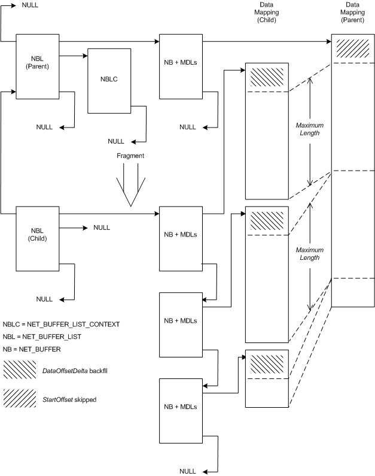

# Fragmented NET\_BUFFER\_LIST Structures

An NDIS driver can create a fragmented [**NET\_BUFFER\_LIST**](/windows-hardware/drivers/ddi/nbl/ns-nbl-net_buffer_list) structure from an existing NET\_BUFFER\_LIST structure. The fragmented structure references a set of [**NET\_BUFFER**](/windows-hardware/drivers/ddi/nbl/ns-nbl-net_buffer) structures that reference the original data; however, the data is divided into units that do not exceed a maximum size. Drivers can use this type of structure to efficiently break up large buffers into smaller buffers.

The following figure shows the relationship between a parent NET\_BUFFER\_LIST structure and a fragmented child.

The preceding figure contains a parent [**NET\_BUFFER\_LIST**](/windows-hardware/drivers/ddi/nbl/ns-nbl-net_buffer_list) structure and a child structure that was derived from that parent. The parent structure has one [**NET\_BUFFER\_LIST\_CONTEXT**](/windows-hardware/drivers/ddi/nbl/ns-nbl-net_buffer_list_context) structure and one [**NET\_BUFFER**](/windows-hardware/drivers/ddi/nbl/ns-nbl-net_buffer) structure with MDLs attached. The parent structure's parent pointer is **NULL** indicating that it is not a derived structure.

The child NET\_BUFFER\_LIST structure has three NET\_BUFFER structures with MDLs attached. The child NET\_BUFFER\_LIST structure has a pointer to the parent structure. The **NULL** where a NET\_BUFFER\_LIST\_CONTEXT structure pointer would be indicates that the child has no NET\_BUFFER\_LIST\_CONTEXT structure.

NDIS drivers call the [**NdisAllocateFragmentNetBufferList**](/windows-hardware/drivers/ddi/nblapi/nf-nblapi-ndisallocatefragmentnetbufferlist) function to create a new fragmented [**NET\_BUFFER\_LIST**](/windows-hardware/drivers/ddi/nbl/ns-nbl-net_buffer_list) structure that is based on the data in an existing NET\_BUFFER\_LIST structure. NDIS allocates new [**NET\_BUFFER**](/windows-hardware/drivers/ddi/nbl/ns-nbl-net_buffer) structures and MDLs for the fragmented NET\_BUFFER\_LIST structure. NDIS does not allocate a [**NET\_BUFFER\_LIST\_CONTEXT**](/windows-hardware/drivers/ddi/nbl/ns-nbl-net_buffer_list_context) structure for the fragmented structure. The fragment NET\_BUFFER structures and MDLs describe the same data as does the parent structure. The data is not copied.

**NdisAllocateFragmentNetBufferList** creates the fragments, starting from the beginning of the *used data space* in each parent NET\_BUFFER structure and offset by the value specified in the *StartOffset* parameter.

[**NdisAllocateFragmentNetBufferList**](/windows-hardware/drivers/ddi/nblapi/nf-nblapi-ndisallocatefragmentnetbufferlist) divides the *used data space* in each source NET\_BUFFER structure into fragments. The length of the *used data space* of each fragment is less than or equal to the value specified in the *MaximumLength* parameter. The *used data space* of the last fragment can be less than *MaximumLength* . The data offset of the new NET\_BUFFER structures is retreated by the number of bytes specified in the *DataOffsetDelta* parameter.

If there are multiple [**NET\_BUFFER**](/windows-hardware/drivers/ddi/nbl/ns-nbl-net_buffer) structures in the parent [**NET\_BUFFER\_LIST**](/windows-hardware/drivers/ddi/nbl/ns-nbl-net_buffer_list) structure (not shown in the illustration) the fragmenting process for each NET\_BUFFER structure is the same as for a single structure. For example, if the last piece of data in any parent NET\_BUFFER structure is smaller than the maximum size, NDIS does not combine such data with the data at the start of the next NET\_BUFFER structure.

NDIS drivers call the [**NdisFreeFragmentNetBufferList**](/windows-hardware/drivers/ddi/nblapi/nf-nblapi-ndisfreefragmentnetbufferlist) function to free a NET\_BUFFER\_LIST structure and all associated NET\_BUFFER structures and MDL chains that were previously allocated by calling [**NdisAllocateFragmentNetBufferList**](/windows-hardware/drivers/ddi/nblapi/nf-nblapi-ndisallocatefragmentnetbufferlist).

## Related topics

[Derived NET\_BUFFER\_LIST Structures](derived-net-buffer-list-structures.md)

 

