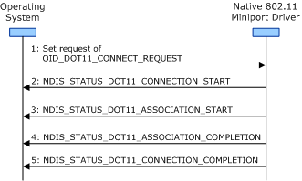

# General Connection Operation Guidelines

**Important**  The [Native 802.11 Wireless LAN](native-802-11-wireless-lan4.md) interface is deprecated in Windows 10 and later. Please use the WLAN Device Driver Interface (WDI) instead. For more information about WDI, see [WLAN Universal Windows driver model](wifi-universal-driver-model.md).

 

When performing the connection operation, the miniport driver and 802.11 station must follow these guidelines regardless of the type of basic service set (BSS) network the station is configured for:

-   The miniport driver must perform no more than one connection operation while in the operational (OP) state. For more information about this state, see [Extensible Station Operating States](extensible-station-operating-states.md).

-   The miniport driver must ensure that it has the resources available in order to make the media-specific indications required for the connection operation. The miniport driver makes the following indications during the connection operation:
    -   [NDIS\_STATUS\_DOT11\_CONNECTION\_START](https://msdn.microsoft.com/library/windows/hardware/ff567328)
    -   [NDIS\_STATUS\_DOT11\_CONNECTION\_COMPLETION](https://msdn.microsoft.com/library/windows/hardware/ff567325)
    -   [NDIS\_STATUS\_DOT11\_ASSOCIATION\_START](https://msdn.microsoft.com/library/windows/hardware/ff567321)
    -   [NDIS\_STATUS\_DOT11\_ASSOCIATION\_COMPLETION](https://msdn.microsoft.com/library/windows/hardware/ff567319)
-   The miniport driver must enclose the connection operation between [NDIS\_STATUS\_DOT11\_CONNECTION\_START](https://msdn.microsoft.com/library/windows/hardware/ff567328) and [NDIS\_STATUS\_DOT11\_CONNECTION\_COMPLETION](https://msdn.microsoft.com/library/windows/hardware/ff567325) indications.

-   The miniport driver starts the connection operation by making an [NDIS\_STATUS\_DOT11\_CONNECTION\_START](https://msdn.microsoft.com/library/windows/hardware/ff567328) indication. When it makes this indication, the driver provides information about the type of BSS network to which it is attempting to connect. If connecting to an independent BSS (IBSS) network, the driver also provides the service set identifier (SSID) and BSS identifier (BSSID) of the IBSS network.

-   The 802.11 station forms a list of candidate BSS networks following the guidelines described in [BSS Network Candidate List](bss-network-candidate-list.md). If the candidate list is empty, the 802.11 station must complete the connection operation by making an [NDIS\_STATUS\_DOT11\_CONNECTION\_COMPLETION](https://msdn.microsoft.com/library/windows/hardware/ff567325) indication with the **uStatus** member of the indication set to DOT11\_CONNECTION\_STATUS\_CANDIDATE\_LIST\_EXHAUSTED.

-   The miniport driver initiates an association operation using entries from the BSS network candidate list. The miniport driver must enclose the association operation between [NDIS\_STATUS\_DOT11\_ASSOCIATION\_START](https://msdn.microsoft.com/library/windows/hardware/ff567321) and [NDIS\_STATUS\_DOT11\_ASSOCIATION\_COMPLETION](https://msdn.microsoft.com/library/windows/hardware/ff567319) indications. For more information about the association operation, see [Association Operations](association-operations.md).

-   If configured for operations within an infrastructure network, the miniport driver must perform the association operation by following the guidelines described in [Connection Operation Guidelines for Infrastructure BSS Networks](connection-operation-guidelines-for-infrastructure-bss-networks.md).

    If configured for operations within an IBSS network, the miniport driver must perform the association operation by following the guidelines described in [Connection Operation Guidelines for Independent BSS Networks](connection-operation-guidelines-for-independent-bss-networks.md).

-   The miniport driver makes an [NDIS\_STATUS\_DOT11\_CONNECTION\_COMPLETION](https://msdn.microsoft.com/library/windows/hardware/ff567325) indication to report the status of the connection operation.

The miniport driver successfully completes the connection operation whenever any of the following happens:

-   The 802.11 station has successfully associated with an AP in an infrastructure BSS network.

-   The 802.11 station has successfully associated with at least one peer station in an existing IBSS network.

-   The 802.11 station has successfully started a new IBSS network.

If the connection operation is completed successfully, the miniport driver must remain in the operational (OP) operating state. For more information about this state, see [Extensible Station Operating States](extensible-station-operating-states.md).

**Note**  If the 802.11 station successfully connects to a BSS network, the miniport driver must not make a status indication of NDIS\_STATUS\_MEDIA\_CONNECT.

 

The miniport driver fails the connection operation whenever any of the following happens:

-   The 802.11 station has failed to associate with any AP or peer station. Examples of connection operation failures include:
    -   The 802.11 station has exhausted its list of candidate BSS networks without a successful association.
    -   All of the PHYs on the 802.11 station have been turned off during the connection operation. For example, a PHY can be turned off through a set request of [OID\_DOT11\_NIC\_POWER\_STATE](https://msdn.microsoft.com/library/windows/hardware/ff569392).
-   The operating system makes a method request of [OID\_DOT11\_RESET\_REQUEST](https://msdn.microsoft.com/library/windows/hardware/ff569409) or a set request of [OID\_DOT11\_DISCONNECT\_REQUEST](https://msdn.microsoft.com/library/windows/hardware/ff569147).

If connection operation fails, the miniport driver must return to the initialization (INIT) operating state. For more information about this state, see [Extensible Station Operating States](extensible-station-operating-states.md).

The following figure shows the sequence of events during a connection operation.

 

 

