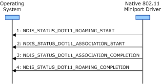

# General Roaming Operation Guidelines

**Important**  The [Native 802.11 Wireless LAN](native-802-11-wireless-lan4.md) interface is deprecated in Windows 10 and later. Please use the WLAN Device Driver Interface (WDI) instead. For more information about WDI, see [WLAN Universal Windows driver model](wifi-universal-driver-model.md).

 

The miniport driver can perform any number of roaming operations while connected to a basic service set (BSS) network. When performing the roaming operation, the miniport driver and 802.11 station must follow these guidelines regardless of the type of BSS network the station is configured for:

-   The miniport driver must have previously completed a connection operation to a BSS network and must be in the operational (OP) state. For more information about the connection operation, see [Connection Operations](connection-operations.md). For more information about the OP state, see [Extensible Station Operating States](extensible-station-operating-states.md).

-   The miniport driver must ensure that it has the resources available in order to make the media-specific indications required for the roaming operation. The miniport driver makes the following indications during the roaming operation:
    -   [NDIS\_STATUS\_DOT11\_ROAMING\_START](https://msdn.microsoft.com/library/windows/hardware/ff567360)
    -   [NDIS\_STATUS\_DOT11\_ROAMING\_COMPLETION](https://msdn.microsoft.com/library/windows/hardware/ff567359)
    -   [NDIS\_STATUS\_DOT11\_ASSOCIATION\_START](https://msdn.microsoft.com/library/windows/hardware/ff567321)
    -   [NDIS\_STATUS\_DOT11\_ASSOCIATION\_COMPLETION](https://msdn.microsoft.com/library/windows/hardware/ff567319)
-   The miniport driver must enclose the roaming operation between [NDIS\_STATUS\_DOT11\_ROAMING\_START](https://msdn.microsoft.com/library/windows/hardware/ff567360) and [NDIS\_STATUS\_DOT11\_ROAMING\_COMPLETION](https://msdn.microsoft.com/library/windows/hardware/ff567359) indications.

-   The 802.11 station forms a list of candidate BSS networks following the guidelines described in [BSS Network Candidate List](bss-network-candidate-list.md). If the candidate list is empty, the 802.11 station must not perform the roaming operation.

-   The miniport driver starts the roaming operation by making an [NDIS\_STATUS\_DOT11\_ROAMING\_START](https://msdn.microsoft.com/library/windows/hardware/ff567360) indication. When it makes this indication, the miniport driver provides information about the reason for the roaming operation. If connected to an IBSS network, the driver also provides the SSID and BSSID of the IBSS network to which the 802.11 station is roaming.

    After the miniport driver makes an [NDIS\_STATUS\_DOT11\_ROAMING\_START](https://msdn.microsoft.com/library/windows/hardware/ff567360) indication, it cannot start another roaming operation until it makes an [NDIS\_STATUS\_DOT11\_ROAMING\_COMPLETION](https://msdn.microsoft.com/library/windows/hardware/ff567359) indication.

-   The miniport driver will initiate an association operation with entries from the 802.11 station's candidate list. The miniport driver must enclose the association operation between [NDIS\_STATUS\_DOT11\_ASSOCIATION\_START](https://msdn.microsoft.com/library/windows/hardware/ff567321) and [NDIS\_STATUS\_DOT11\_ASSOCIATION\_COMPLETION](https://msdn.microsoft.com/library/windows/hardware/ff567319) indications. For more information about the association operation, see [Association Operations](association-operations.md).

-   If configured for operations within an infrastructure network, the miniport driver must perform the association operation by following the guidelines described in [Roaming Operation Guidelines for Infrastructure BSS Networks](roaming-operation-guidelines-for-infrastructure-bss-networks.md).

    If configured for operations within an IBSS network, the miniport driver must perform the association operation by following the guidelines described in [Roaming Operation Guidelines for Independent BSS Networks](roaming-operation-guidelines-for-independent-bss-networks.md).

-   The miniport driver makes an [NDIS\_STATUS\_DOT11\_ROAMING\_COMPLETION](https://msdn.microsoft.com/library/windows/hardware/ff567359) indication to report the status of the roaming operation.

The miniport driver successfully completes the roaming operation whenever any of the following happens:

-   The 802.11 station has successfully associated with an AP in an infrastructure BSS network.

-   The 802.11 station has successfully associated with at least one peer station in an IBSS network.

**Note**  If the 802.11 station successfully roams to a BSS network, the miniport driver must not make a status indication of NDIS\_STATUS\_MEDIA\_CONNECT.

 

The miniport driver fails the roaming operation whenever any of the following happens:

-   The 802.11 station has failed to associate with any AP or peer station. Examples of roaming operation failures include:
    -   The 802.11 station has exhausted its list of candidate BSS networks without a successful association.
    -   All of the PHYs on the 802.11 station have been turned off during the roaming operation. For example, a PHY can be turned off through a set request of [OID\_DOT11\_NIC\_POWER\_STATE](https://msdn.microsoft.com/library/windows/hardware/ff569392).
-   The operating system makes a method request of [OID\_DOT11\_RESET\_REQUEST](https://msdn.microsoft.com/library/windows/hardware/ff569409) or a set request of [OID\_DOT11\_DISCONNECT\_REQUEST](https://msdn.microsoft.com/library/windows/hardware/ff569147).

If the roaming operation fails, the miniport driver must remain in the OP operating state and must periodically perform other roaming operations while in that state.

The following figure shows the sequence of events during a roaming operation.

 

 

