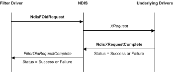

# Generating OID Requests from an NDIS Filter Driver

A filter driver can originate OID query or set requests to underlying drivers by calling the [**NdisFOidRequest**](https://msdn.microsoft.com/library/windows/hardware/ff561830) function.

The following figure illustrates an OID request that is originated by a filter driver.

After a filter driver calls the [**NdisFOidRequest**](https://msdn.microsoft.com/library/windows/hardware/ff561830) function, NDIS calls the request function of the next underlying driver. For more information about how a miniport driver handles OID requests, see [OID Requests for an Adapter](miniport-adapter-oid-requests.md).

To complete synchronously, [**NdisFOidRequest**](https://msdn.microsoft.com/library/windows/hardware/ff561830) returns NDIS\_STATUS\_SUCCESS or an error status. To complete asynchronously, **NdisFOidRequest** returns NDIS\_STATUS\_PENDING.

To determine what information was successfully handled by an underlying driver, filter drivers that issue OID requests must check the value in the **SupportedRevision** member in the NDIS\_OID\_REQUEST structure after the OID request returns. For more information about NDIS version information, see [Specifying NDIS Version Information](specifying-ndis-version-information.md).

If [**NdisFOidRequest**](https://msdn.microsoft.com/library/windows/hardware/ff561830) returns NDIS\_STATUS\_PENDING, NDIS calls the [*FilterOidRequestComplete*](https://msdn.microsoft.com/library/windows/hardware/ff549956) function after the underlying drivers complete the OID request. In this case, NDIS passes the results of the request at the *OidRequest* parameter of *FilterOidRequestComplete*. NDIS passes the final status of the request at the *Status* parameter of *FilterOidRequestComplete*.

If [**NdisFOidRequest**](https://msdn.microsoft.com/library/windows/hardware/ff561830) returns NDIS\_STATUS\_SUCCESS, it returns the results of a query request in the [**NDIS\_OID\_REQUEST**](https://msdn.microsoft.com/library/windows/hardware/ff566710) structure at the *OidRequest* parameter. In this case, NDIS does not call the [*FilterOidRequestComplete*](https://msdn.microsoft.com/library/windows/hardware/ff549956) function.

A driver can call [**NdisFOidRequest**](https://msdn.microsoft.com/library/windows/hardware/ff561830) when it is in the *Restarting*, *Running*, *Pausing*, or *Paused* state.

**Note**  A filter driver should keep track of OID requests that it originates and make sure that it does not call the [**NdisFOidRequestComplete**](https://msdn.microsoft.com/library/windows/hardware/ff561833) function when such requests are complete.

 

 

 

