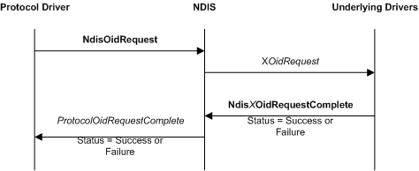

# Generating OID Requests from an NDIS Protocol Driver

To originate an OID request to underlying drivers, a protocol calls the [**NdisOidRequest**](https://msdn.microsoft.com/library/windows/hardware/ff563710) function.

The following figure illustrates an OID request that is originated by a protocol driver.

After a protocol driver calls the [**NdisOidRequest**](https://msdn.microsoft.com/library/windows/hardware/ff563710) function, NDIS calls the request function of the next underlying driver. For more information about how a miniport driver handles OID requests, see [OID Requests for an Adapter](miniport-adapter-oid-requests.md). For more information about how a filter driver handles OID requests, see [Filter Module OID Requests](filter-module-oid-requests.md).

To complete synchronously, **NdisOidRequest** returns NDIS\_STATUS\_SUCCESS or an error status. To complete asynchronously, **NdisOidRequest** returns NDIS\_STATUS\_PENDING.

If **NdisOidRequest** returns NDIS\_STATUS\_PENDING, NDIS calls the [**ProtocolOidRequestComplete**](https://msdn.microsoft.com/library/windows/hardware/ff570264) function after the underlying drivers complete the OID request. In this case, NDIS passes the results of the request at the *OidRequest* parameter of *ProtocolOidRequestComplete*. NDIS passes the final status of the request at the *Status* parameter of *ProtocolOidRequestComplete*.

If **NdisOidRequest** returns NDIS\_STATUS\_SUCCESS, it returns the results of a query request in the [**NDIS\_OID\_REQUEST**](https://msdn.microsoft.com/library/windows/hardware/ff566710) structure at the *OidRequest* parameter. In this case, NDIS does not call the *ProtocolOidRequestComplete* function.

To determine what information was successfully handled by an underlying driver, protocol drivers that issue OID requests must check the value in the **SupportedRevision** member in the NDIS\_OID\_REQUEST structure after the OID request returns. For more information about NDIS version information, see [Specifying NDIS Version Information](specifying-ndis-version-information.md).

If the underlying driver should associate the OID request with a subsequent status indication, the protocol driver should set the **RequestId** member in the NDIS\_OID\_REQUEST structure. When the underlying driver makes a status indication, it sets the **RequestId** member in the [**NDIS\_STATUS\_INDICATION**](https://msdn.microsoft.com/library/windows/hardware/ff567373) structure to the value that is provided in the OID request.

A driver can call **NdisOidRequest** when a binding is in the *Restarting*, *Running*, *Pausing*, or *Paused* state.

 

 

