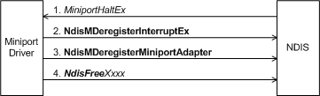

# Miniport Driver Halt Handler

An NDIS miniport driver must supply a [*MiniportHaltEx*](https://msdn.microsoft.com/library/windows/hardware/ff559388) function to [**NdisMRegisterMiniportDriver**](https://msdn.microsoft.com/library/windows/hardware/ff563654).

*MiniportHaltEx* should undo everything that [*MiniportInitializeEx*](https://msdn.microsoft.com/library/windows/hardware/ff559389) did. For example, the NDIS miniport driver might:

-   Free ports. (For more information, see [Freeing an NDIS Port](freeing-an-ndis-port.md).)

-   Release all of the hardware resources that [*MiniportInitializeEx*](https://msdn.microsoft.com/library/windows/hardware/ff559389) claimed.

-   Free interrupt resources by calling [**NdisMDeregisterInterruptEx**](https://msdn.microsoft.com/library/windows/hardware/ff563575).

-   Free any memory that [*MiniportInitializeEx*](https://msdn.microsoft.com/library/windows/hardware/ff559389) allocated.

-   Stop the NIC, unless the [*MiniportShutdownEx*](https://msdn.microsoft.com/library/windows/hardware/ff559449) function has already restored the NIC to its initial state.

The following diagram illustrates unloading a miniport driver.

*MiniportHaltEx* should complete the operations that are necessary to unload the driver before returning. If the miniport driver has any outstanding receive indications (that is, received network data that it has indicated up to NDIS but which NDIS has not yet returned), *MiniportHaltEx* must not return until such data is returned to the miniport driver's [*MiniportReturnNetBufferLists*](https://msdn.microsoft.com/library/windows/hardware/ff559437) function.

The preceding figure shows a set of calls that could be made by a *MiniportHaltEx* function. These calls are only a subset of the calls that could be made. The actual set of calls depends on previous actions of the miniport driver. The miniport driver can make these same calls in *MiniportInitializeEx* if it cannot successfully initialize the network adapter because of hardware problems or because it cannot acquire a resource that it needs. In such a case, *MiniportInitializeEx* should unload the driver by undoing its previous actions. Otherwise, *MiniportHaltEx* will undo the actions of *MiniportInitializeEx*.

The following list describes the calls that are required to reverse certain actions that the miniport driver might take:

-   If the miniport driver registered an interrupt, it should call [**NdisMDeregisterInterruptEx**](https://msdn.microsoft.com/library/windows/hardware/ff563575).

-   If the miniport driver set up a timer or timers, it should call [**NdisCancelTimerObject**](https://msdn.microsoft.com/library/windows/hardware/ff561624) for each timer that it created. If a call to **NdisCancelTimerObject** fails, the timer might have already fired. In this case, the miniport driver should wait for the timer handler to complete before returning from *MiniportHaltEx*.

-   If the miniport driver allocated any memory with [**NdisAllocateMemoryWithTagPriority**](https://msdn.microsoft.com/library/windows/hardware/ff561606), it should call [**NdisFreeMemory**](https://msdn.microsoft.com/library/windows/hardware/ff562577) to free that memory.

-   If the miniport driver allocated any memory with [**NdisMAllocateSharedMemory**](https://msdn.microsoft.com/library/windows/hardware/ff562782), or [**NdisMAllocateSharedMemoryAsyncEx**](https://msdn.microsoft.com/library/windows/hardware/ff562784), it should call [**NdisMFreeSharedMemory**](https://msdn.microsoft.com/library/windows/hardware/ff563589) to free that memory.

-   If the miniport driver allocated and initialized storage for a pool of packet descriptors with [**NdisAllocateNetBufferPool**](https://msdn.microsoft.com/library/windows/hardware/ff561611), it should call [**NdisFreeNetBufferPool**](https://msdn.microsoft.com/library/windows/hardware/ff562592) to free that storage.

-   If the miniport driver allocated or reserved any hardware resources, these should be returned. For example, if the miniport driver mapped an I/O port range on a NIC, it should release the ports by calling [**NdisMDeregisterIoPortRange**](https://msdn.microsoft.com/library/windows/hardware/ff563577).

## Related topics

[Adapter States of a Miniport Driver](adapter-states-of-a-miniport-driver.md)

[Freeing an NDIS Port](freeing-an-ndis-port.md)

[Halting a Miniport Adapter](halting-a-miniport-adapter.md)

[Miniport Adapter States and Operations](miniport-adapter-states-and-operations.md)

[Miniport Driver Reset and Halt Functions](https://msdn.microsoft.com/library/windows/hardware/ff564064)

 

 

