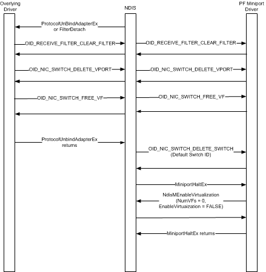

# Halting a PF Miniport Driver

This topic discusses the steps that are involved with halting the miniport driver for a PCI Express (PCIe) Physical Function (PF) on an adapter that supports single root I/O virtualization (SR-IOV). These steps are shown in the following figure.

This topic contains the following information:

-   [Actions Performed by NDIS and Overlying Drivers Before *MiniportHaltEx* is Called](#overlying-drivers)

-   [Actions Performed by the PF Miniport Driver When *MiniportHaltEx* is Called](#miniport-driver)

## Actions Performed by NDIS and Overlying Drivers Before *MiniportHaltEx* is Called

Before NDIS calls the PF miniport driver's [*MiniportHaltEx*](https://msdn.microsoft.com/library/windows/hardware/ff559388) function, it first does the following:

-   NDIS unbinds all protocol drivers that have previously bound to the underlying PF miniport driver. NDIS does this by calling the protocol driver's [*ProtocolUnbindAdapterEx*](https://msdn.microsoft.com/library/windows/hardware/ff570278) function.

-   NDIS detaches all filter drivers that have previously bound to the underlying PF miniport driver. NDIS does this by calling the filter driver's [*FilterDetach*](https://msdn.microsoft.com/library/windows/hardware/ff549918) function.

When an overlying protocol or filter driver is being unbound or detached from the PF miniport driver, it must follow these steps:

1.  The driver must issue an object identifier (OID) set request of [OID\_RECEIVE\_FILTER\_CLEAR\_FILTER](https://msdn.microsoft.com/library/windows/hardware/ff569785) to clear any receive filters that it previously set. The driver sets these filters on the default virtual port (VPort) or any nondefault VPorts of the NIC switch on the network adapter. The driver sets these filters by issuing OID method requests of [OID\_RECEIVE\_FILTER\_SET\_FILTER](https://msdn.microsoft.com/library/windows/hardware/ff569795) to the PF miniport driver.

2.  The driver must issue an OID set request of [OID\_NIC\_SWITCH\_DELETE\_VPORT](https://msdn.microsoft.com/library/windows/hardware/hh451818) to delete any nondefault VPorts that it previously created on the NIC switch. The driver sets these VPorts by issuing OID method requests of [OID\_NIC\_SWITCH\_CREATE\_VPORT](https://msdn.microsoft.com/library/windows/hardware/hh451816) to the PF miniport driver.

3.  The driver must issue an OID set request of [OID\_NIC\_SWITCH\_FREE\_VF](https://msdn.microsoft.com/library/windows/hardware/hh451822) to free the resources for any PCIe Virtual Functions (VFs) that it previously allocated on the NIC switch. The driver allocates resources for the VF by issuing OID method requests of [OID\_NIC\_SWITCH\_ALLOCATE\_VF](https://msdn.microsoft.com/library/windows/hardware/hh451814) to the PF miniport driver.

    For more information, see [Freeing Resources for a Virtual Function](freeing-resources-for-a-virtual-function.md).

    **Note**  When resources for the VF are freed, NDIS calls the [*MiniportHaltEx*](https://msdn.microsoft.com/library/windows/hardware/ff559388) function of the VF miniport driver. For more information, see [Halting a VF Miniport Driver](halting-a-vf-miniport-driver.md).

     

After all receive filters, nondefault VPorts, and VFs have been deleted from the NIC switch, NDIS follows these steps:

-   NDIS deletes all NIC switches by issuing OID set requests of [OID\_NIC\_SWITCH\_DELETE\_SWITCH](https://msdn.microsoft.com/library/windows/hardware/hh451817) to the PF miniport driver. For more information on how a NIC switch is deleted, see [Deleting a NIC Switch](deleting-a-nic-switch.md).

    **Note**  Starting with Windows Server 2012, the SR-IOV interface only supports the default NIC switch on the network adapter.

     

-   After all NIC switches have been successfully deleted, NDIS calls the [*MiniportHaltEx*](https://msdn.microsoft.com/library/windows/hardware/ff559388) function of the PF miniport driver.

## Actions Performed by the PF Miniport Driver When *MiniportHaltEx* is Called

When NDIS calls *MiniportHaltEx*, the PF miniport driver must follow these steps:

1.  If the PF miniport driver supports the static creation of NIC switches and all the NIC switches have been deleted, the driver must disable the virtualization on the adapter by calling [**NdisMEnableVirtualization**](https://msdn.microsoft.com/library/windows/hardware/hh451481) with *EnableVirtualization* parameter set to FALSE and the *NumVFs* parameter set to zero.

    [**NdisMEnableVirtualization**](https://msdn.microsoft.com/library/windows/hardware/hh451481) clears the **NumVFs** member and the **VF Enable** bit in the SR-IOV Extended Capability structure in the PCIe configuration space of the network adapter's PF.

    **Note**  If the PF miniport driver supports dynamic creation and configuration of NIC switches, it must call [**NdisMEnableVirtualization**](https://msdn.microsoft.com/library/windows/hardware/hh451481) when the driver handles the OID set request of [OID\_NIC\_SWITCH\_DELETE\_SWITCH](https://msdn.microsoft.com/library/windows/hardware/hh451817). This OID request is issued before *MiniportHaltEx* is called.

     

2.  The PF miniport driver performs the other tasks associated with a miniport halt operation. For more information, see [Halting a Miniport Adapter](halting-a-miniport-adapter.md).

 

 

