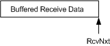

# Handling Buffered Receive Data During and After an Offload Operation

\[The TCP chimney offload feature is deprecated and should not be used.\]

When the host stack initiates the offload of a TCP connection, there might be undelivered receive data on the connection. This data is data that the host stack has received off the wire, processed, and acknowledged but that it has not delivered to a client application--perhaps because no preposted receive buffers were available from the client application.

When offloading a TCP connection in this situation, the host stack specifies a pointer to a buffer that contains the outstanding receive data. This pointer is in the **BufferedData** member of the [**TCP\_OFFLOAD\_STATE\_DELEGATED**](https://msdn.microsoft.com/library/windows/hardware/ff570939) structure, and the buffer that is referenced by this pointer contains a linked list of [**NET\_BUFFER\_LIST**](https://msdn.microsoft.com/library/windows/hardware/ff568388) structures.

As shown in the following figure, the buffered receive data that is supplied by the host is always the most recent bytes that are received by the host stack on the TCP connection that is being offloaded. The buffered receive data, therefore, is to the left of the *RcvNxt* value that is supplied by the host in the delegated TCP state for the connection.

Before completing the offload of the TCP connection, the offload target must copy the receive data into its own buffer. If the offload target cannot allocate memory for its own buffer, it should fail the offload request for the connection by writing a value of NDIS\_STATUS\_FAILURE in the **Status** member of the [**NDIS\_MINIPORT\_OFFLOAD\_BLOCK\_LIST**](https://msdn.microsoft.com/library/windows/hardware/ff566469) that is associated with the connection. If the offload target indicates that it has successfully offloaded the TCP connection, the host stack frees the buffer that contains the receive data.

After offloading the TCP connection, the offload target must wait until receive requests are posted to its [*MiniportTcpOffloadReceive*](https://msdn.microsoft.com/library/windows/hardware/ff559460) function. After such receive requests have been posted, the offload target copies the buffered data into the posted receive requests and completes the requests by calling the [**NdisTcpOffloadReceiveComplete**](https://msdn.microsoft.com/library/windows/hardware/ff564599) function. If the posted receive requests are not large enough to contain all of the buffered data, the offload target calls the [**NdisTcpOffloadReceiveHandler**](https://msdn.microsoft.com/library/windows/hardware/ff564606) function to indicate the additional buffered data. The offload target must indicate such additional buffered data before indicating any other data that it receives on the connection. For more information about the algorithm that the offload target uses to process received data, see [Delivery Algorithm](delivery-algorithm.md).

 

 

