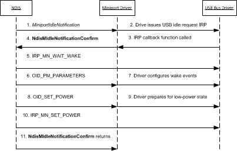

# Handling the NDIS Selective Suspend Idle Notification

NDIS starts a selective suspend operation if one of the following events occurs:

-   The network adapter has been inactive for longer than an idle time-out period. The duration of this time-out period is specified by the value of the **\*SSIdleTimeout** standardized INF keyword. For more information about this keyword, see [Standardized INF Keywords for NDIS Selective Suspend](standardized-inf-keywords-for-ndis-selective-suspend.md).

    For more information about how NDIS determines that a network adapter is idle, see [How NDIS Detects Idle Network Adapters](how-ndis-detects-idle-network-adapters.md).

-   The system that is compliant with the Always On Always Connected (AOAC) technology is being transitioned to a Connected Standby state.

Through the selective suspend operation, the network adapter is transitioned to a low-power state. NDIS begins this operation by calling the [*MiniportIdleNotification*](https://msdn.microsoft.com/library/windows/hardware/hh464092) handler function to issue an idle notification to the miniport driver.

The miniport driver may need to perform bus-dependent actions when it handles the idle notification. The following figure shows the steps that are involved with handling an idle notification by a miniport driver for a USB network adapter.

This topic includes the following information about how to handle an NDIS selective suspend idle notification:

[Guidelines for Handling the Call to *MiniportIdleNotification*](#guidelines-for-handling-the-call-to-miniportidlenotification)

[Guidelines for the Call to **NdisMIdleNotificationConfirm**](#guidelines-for-the-call-to-ndismidlenotificationconfirm)

[Canceling and Completing an NDIS Selective Suspend Idle Notification](#canceling-and-completing-an-ndis-selective-suspend-idle-notification)

## Guidelines for Handling the Call to *MiniportIdleNotification*

NDIS and the miniport driver follow these steps when NDIS calls [*MiniportIdleNotification*](https://msdn.microsoft.com/library/windows/hardware/hh464092):

1.  NDIS calls the [*MiniportIdleNotification*](https://msdn.microsoft.com/library/windows/hardware/hh464092) handler function to notify the driver that the underlying network adapter seems to be idle. NDIS sets the *ForceIdle* parameter of the *MiniportIdleNotification* handler function to one of the following values:

    -   NDIS sets the *ForceIdle* parameter to **FALSE** when the network adapter has been inactive for longer than the idle time-out period.

    -   NDIS sets the *ForceIdle* parameter to **TRUE** when a system that is compliant with the Always On Always Connected (AOAC) technology is transitioning to a Connected Standby state.

2.  When [*MiniportIdleNotification*](https://msdn.microsoft.com/library/windows/hardware/hh464092) is called, the miniport driver can veto the idle notification and the selective suspend operation by returning NDIS\_STATUS\_BUSY. For example, the driver could veto the idle notification if the driver detects activity on the network adapter.

    If the miniport driver vetoes the idle notification, NDIS restarts the monitor of activity on the network adapter. If the adapter becomes inactive again within the idle time-out period, NDIS calls [*MiniportIdleNotification*](https://msdn.microsoft.com/library/windows/hardware/hh464092).

    **Note**  The miniport driver must not veto the idle notification if the *ForceIdle* parameter is set to **TRUE**. In this case, the driver must continue with the selective suspend operation.

3.  If the miniport driver does not veto the idle notification, it must perform any bus-specific operations to prepare the network adapter for a selective suspend operation. For example, the miniport driver for a USB network adapter performs the following steps to determine whether the network adapter can transition to a low-power state:

    1.  The miniport driver calls [**IoCallDriver**](https://msdn.microsoft.com/library/windows/hardware/ff548336) to issue an I/O request packet (IRP) for a USB idle request ([**IOCTL\_INTERNAL\_USB\_SUBMIT\_IDLE\_NOTIFICATION**](https://msdn.microsoft.com/library/windows/hardware/ff537270)) to the underlying USB bus driver. In this IRP, the miniport driver must specify a callback and completion routine.

        The USB bus driver does not immediately complete the IRP. The IRP is left in a pending state through the low-power transition. The bus driver completes the IRP later when any of the following events occur:

        -   The miniport driver cancels the IRP.

        -   A system power state change is required.

        -   The device is removed from the USB hub.

    2.  After the USB bus driver determines that it can put the network adapter in a low-power state, it calls the miniport driver's IRP callback routine. This call confirms that the network adapter can transition to a low-power state.

        For guidelines on how to write a callback routine for the USB idle request IRP, see [Implementing a USB Idle Request IRP Callback Routine](implementing-a-usb-idle-request-irp-callback-routine.md).

4.  After the miniport driver completes the preparation of the network adapter for a selective suspend operation, it calls [**NdisMIdleNotificationConfirm**](https://msdn.microsoft.com/library/windows/hardware/hh451492). In this call, the miniport driver specifies the lowest power state that the network adapter can transition to.

    Depending on the bus requirements for selective suspend operations, the miniport driver calls [**NdisMIdleNotificationConfirm**](https://msdn.microsoft.com/library/windows/hardware/hh451492) either synchronously in the context of the call to [*MiniportIdleNotification*](https://msdn.microsoft.com/library/windows/hardware/hh464092) or asynchronously after *MiniportIdleNotification* returns. For example, the miniport driver for a USB network adapter calls **NdisMIdleNotificationConfirm** within the context of the callback routine for the USB idle request. The USB bus driver calls the callback routine either synchronously in the context of the call to [**IoCallDriver**](https://msdn.microsoft.com/library/windows/hardware/ff548336) or asynchronously after *MiniportIdleNotification* returns.

5.  If the network adapter can be transitioned to a low-power state, the miniport driver returns NDIS\_STATUS\_PENDING from the call to [*MiniportIdleNotification*](https://msdn.microsoft.com/library/windows/hardware/hh464092).

    **Note**  The miniport driver returns NDIS\_STATUS\_PENDING because the idle notification is not completed until the driver calls [**NdisMIdleNotificationComplete**](https://msdn.microsoft.com/library/windows/hardware/hh451491). The miniport driver must not return NDIS\_STATUS\_SUCCESS from [*MiniportIdleNotification*](https://msdn.microsoft.com/library/windows/hardware/hh464092).

The miniport driver should perform the following operations until the network adapter is suspended and transitioned to a low-power state:

-   The miniport driver should process received packets and indicate them to NDIS by calling [**NdisMIndicateReceiveNetBufferLists**](https://msdn.microsoft.com/library/windows/hardware/ff563598).

-   The miniport driver should process completed send packets and indicate them to NDIS by calling [**NdisMSendNetBufferListsComplete**](https://msdn.microsoft.com/library/windows/hardware/ff563668).

    **Note**  NDIS will not call the driver's [*MiniportSendNetBufferLists*](https://msdn.microsoft.com/library/windows/hardware/ff559440) function to send packets if [*MiniportIdleNotification*](https://msdn.microsoft.com/library/windows/hardware/hh464092) returns NDIS\_STATUS\_PENDING.

## Guidelines for the Call to **NdisMIdleNotificationConfirm**

NDIS and the miniport driver follow these steps when the miniport driver calls [**NdisMIdleNotificationConfirm**](https://msdn.microsoft.com/library/windows/hardware/hh451492):

1.  NDIS issues [**IRP\_MN\_WAIT\_WAKE**](https://msdn.microsoft.com/library/windows/hardware/ff551766) to the underlying bus driver. This IRP enables the bus driver to wake the network adapter in response to an external wake-up signal.

2.  NDIS issues an object identifier (OID) set request of [OID\_PM\_PARAMETERS](https://msdn.microsoft.com/library/windows/hardware/ff569768) to the miniport driver. This OID request is associated with an [**NDIS\_PM\_PARAMETERS**](https://msdn.microsoft.com/library/windows/hardware/ff566759) structure that specifies the settings under which the network adapter generates a wake-up event.

    The miniport driver must follow these guidelines when it processes the members of the [**NDIS\_PM\_PARAMETERS**](https://msdn.microsoft.com/library/windows/hardware/ff566759) structure:

    -   If the *ForceIdle* parameter of the [*MiniportIdleNotification*](https://msdn.microsoft.com/library/windows/hardware/hh464092) handler function was set to FALSE, NDIS only sets the NDIS\_PM\_SELECTIVE\_SUSPEND\_ENABLED flag in the **WakeUpFlags** member of the [**NDIS\_PM\_PARAMETERS**](https://msdn.microsoft.com/library/windows/hardware/ff566759) structure. In this case, the network adapter can signal a wake-up event when one of the following events occur:

        -   The network adapter receives a packet that matches a receive packet filter. The adapter is configured to use these filters through OID set requests of [OID\_GEN\_CURRENT\_PACKET\_FILTER](https://msdn.microsoft.com/library/windows/hardware/ff569575).

        -   The network adapter detects other external events that require processing by the networking driver stack, such as when the link state changes to either media disconnect or media connected.

    -   If the *ForceIdle* parameter of the [*MiniportIdleNotification*](https://msdn.microsoft.com/library/windows/hardware/hh464092) handler function was set to **TRUE**, NDIS does not set the NDIS\_PM\_SELECTIVE\_SUSPEND\_ENABLED flag in the **WakeUpFlags** member of the [**NDIS\_PM\_PARAMETERS**](https://msdn.microsoft.com/library/windows/hardware/ff566759) structure. In this case, NDIS sets other members in the **NDIS\_PM\_PARAMETERS** structure for wake-up events not related to NDIS selective suspend.

        **Note**  NDIS sets the *ForceIdle* parameter to **TRUE** only when a system that is compliant with the Always On Always Connected (AOAC) technology is transitioning to a Connected Standby state.

        The driver completes the OID request with NDIS\_STATUS\_SUCCESS.

        **Note**  If NDIS sets the NDIS\_PM\_SELECTIVE\_SUSPEND\_ENABLED flag in the **WakeUpFlags** member of [**NDIS\_PM\_PARAMETERS**](https://msdn.microsoft.com/library/windows/hardware/ff566759) structure, it issues the OID set request of [OID\_PM\_PARAMETERS](https://msdn.microsoft.com/library/windows/hardware/ff569768) directly to the miniport driver. This allows NDIS to bypass the processing by filter drivers in the networking driver stack.

3.  After the OID set request of [OID\_PM\_PARAMETERS](https://msdn.microsoft.com/library/windows/hardware/ff569768) is completed successfully, NDIS issues an OID set request [OID\_PNP\_SET\_POWER](https://msdn.microsoft.com/library/windows/hardware/ff569780) to the miniport driver.

    When it handles this OID set request, the driver prepares the network adapter to transition to the low-power state that is specified in the OID request. The driver must complete all pending operations in the following way:

    -   The miniport driver waits for all previously indicated receive packets to be returned through calls to [*MiniportReturnNetBufferLists*](https://msdn.microsoft.com/library/windows/hardware/ff559437).

    -   The miniport driver waits for send requests processed by the hardware to finish. After the requests are completed, the miniport driver must call [**NdisMSendNetBufferListsComplete**](https://msdn.microsoft.com/library/windows/hardware/ff563668).

    -   The miniport driver completes all pending send requests by calling [**NdisMSendNetBufferListsComplete**](https://msdn.microsoft.com/library/windows/hardware/ff563668).

    -   The miniport driver must cancel all pending NDIS timers and work items. After these are canceled, the driver must wait for the completion of these timers and work items.

    -   The miniport driver must put the network adapter in a quiescent state. For example, the driver must cancel all hardware timers.

    The miniport driver configures the underlying network adapter to enable the specified wake-up events that were previously specified in the OID set request of [OID\_PM\_PARAMETERS](https://msdn.microsoft.com/library/windows/hardware/ff569768). After the network adapter is prepared for the low-power transition, the miniport driver completes the OID set request of [OID\_PNP\_SET\_POWER](https://msdn.microsoft.com/library/windows/hardware/ff569780) with NDIS\_STATUS\_SUCCESS.

4.  NDIS issues an [**IRP\_MN\_SET\_POWER**](https://msdn.microsoft.com/library/windows/hardware/ff551744) to the underlying bus driver. This IRP requests that the network adapter be transitioned to a low-power state.

    **Note**  During a selective suspend operation, the network adapter will be transitioned to the device power state that was specified in the call to [**NdisMIdleNotificationConfirm**](https://msdn.microsoft.com/library/windows/hardware/hh451492). The miniport driver specifies this device power state in the *IdlePowerState* parameter of this function.

After the IRP is completed, NDIS returns from the call to [**NdisMIdleNotificationConfirm**](https://msdn.microsoft.com/library/windows/hardware/hh451492).

## Canceling and Completing an NDIS Selective Suspend Idle Notification

After the idle notification is issued, it can be canceled and completed in the following ways:

-   NDIS can cancel the outstanding idle notification if the following conditions are true:

    -   An overlying protocol or filter driver issues either a send packet request or an OID request to the miniport driver.

    -   The underlying adapter signals a wake-up event, such as receiving a packet that matches a wake-on-LAN (WOL) pattern or detecting a change in its media connection status.

    NDIS cancels the idle notification by calling [*MiniportCancelIdleNotification*](https://msdn.microsoft.com/library/windows/hardware/hh464088). When this handler function is called, the miniport driver cancels any bus-specific IRPs that it may have previously issued for the idle notification. Finally, the miniport driver calls [**NdisMIdleNotificationComplete**](https://msdn.microsoft.com/library/windows/hardware/hh451491) to complete the idle notification.

    For more information about how NDIS cancels the idle notification, see [Canceling the NDIS Selective Suspend Idle Notification](canceling-the-ndis-selective-suspend-idle-notification.md).

-   After the network adapter is in a low-power state, the miniport driver can complete the idle notification itself to resume the adapter to a full-power state. The reasons for doing this are specific to the design and requirements of the driver and adapter. The miniport driver completes the idle notification by calling [**NdisMIdleNotificationComplete**](https://msdn.microsoft.com/library/windows/hardware/hh451491).

    For more information about how the miniport driver completes the idle notification, see [Completing the NDIS Selective Suspend Idle Notification](completing-the-ndis-selective-suspend-idle-notification.md).