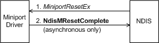

# Miniport Driver Hardware Reset

A miniport driver must register a [*MiniportResetEx*](https://msdn.microsoft.com/library/windows/hardware/ff559432) function with [**NdisMRegisterMiniportDriver**](https://msdn.microsoft.com/library/windows/hardware/ff563654).

*MiniportResetEx* can complete synchronously or asynchronously with a call to [**NdisMResetComplete**](https://msdn.microsoft.com/library/windows/hardware/ff563663)(see the following figure).

*MiniportResetEx* should:

-   Disable further interrupts.

-   Clear out the data that is associated with any sends in progress. For example, on a ring buffer for a bus-master direct memory access (DMA) device, the pointers to send buffers should be cleared. Deserialized and connection-oriented miniport drivers must return NDIS\_STATUS\_REQUEST\_ABORTED for any queued send requests.

-   Restore the hardware state and the miniport driver's internal state to the state that existed before the reset operation.

The miniport driver is responsible for restoring the hardware state of the device except for multicast addresses, packet filters, task offload settings, and wake up patterns. These setting are restored by either the miniport driver or NDIS. The miniport driver determines who is responsible for restoring these settings by returning a Boolean value in the *AddressingReset* parameter.

If the miniport driver returns **FALSE** in the *AddressingReset* parameter, the miniport driver restores its multicast addresses, packet filters, task offload settings, and wake up patterns to their initial state. If the miniport driver returns **TRUE** in *AddressingReset*, NDIS calls a connectionless miniport driver's [*MiniportOidRequest*](https://msdn.microsoft.com/library/windows/hardware/ff559416) function or a connection-oriented miniport driver's [**MiniportCoOidRequest**](https://msdn.microsoft.com/library/windows/hardware/ff559362) function to set the following configuration settings:

-   The network packet filter through a set request of [OID\_GEN\_CURRENT\_PACKET\_FILTER](https://msdn.microsoft.com/library/windows/hardware/ff569575).

-   The multicast address list through a set request of [OID\_802\_3\_MULTICAST\_LIST](https://msdn.microsoft.com/library/windows/hardware/ff569073).

-   Task offload encapsulation settings through a set request of [OID\_OFFLOAD\_ENCAPSULATION](https://msdn.microsoft.com/library/windows/hardware/ff569762).

-   Power management wake-up patterns through a set request of [OID\_PNP\_ADD\_WAKE\_UP\_PATTERN](https://msdn.microsoft.com/library/windows/hardware/ff569773).
    **Note**  Starting with NDIS 6.20, wake-up patterns set through [OID\_PM\_ADD\_WOL\_PATTERN](https://msdn.microsoft.com/library/windows/hardware/ff569764) must be restored by the miniport driver.

     

## Related topics

[Adapter States of a Miniport Driver](adapter-states-of-a-miniport-driver.md)

[Miniport Adapter States and Operations](miniport-adapter-states-and-operations.md)

[Miniport Driver Reset and Halt Functions](https://msdn.microsoft.com/library/windows/hardware/ff564064)

 

 

