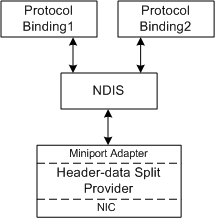
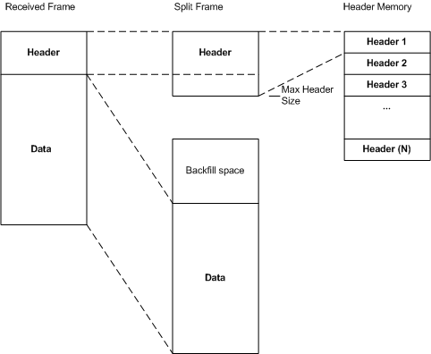

# Header-Data Split Architecture

A header-data split provider improves network performance by splitting the headers and data in received Ethernet frames into separate buffers. A header-data split provider includes a network interface card (NIC) and an NDIS 6.1 or later miniport driver that services the NIC.

The following figure shows the header-data split architecture.

The miniport driver receives configuration information from NDIS to set up the NIC for header-data split receive operations. Also, the miniport driver exposes the NIC's services to NDIS for run-time operations such as send and receive operations.

A NIC that is capable of header-data split operations receives Ethernet frames and splits the headers and data into separate receive buffers.

The miniport driver uses the normal NDIS receive functions to indicate the received data to NDIS. Also, the driver must assign exactly one [**NET\_BUFFER**](https://msdn.microsoft.com/library/windows/hardware/ff568376) structure to a [**NET\_BUFFER\_LIST**](https://msdn.microsoft.com/library/windows/hardware/ff568388) structure when indicating received data. For more information, see [Indicating Received Ethernet Frames](indicating-received-ethernet-frames.md).

For header-data split, the [**NET\_BUFFER**](https://msdn.microsoft.com/library/windows/hardware/ff568376) structures in the receive indications split the received Ethernet frame by using separate memory descriptor lists (MDLs) for the header and the data. Also, the [**NET\_BUFFER\_LIST**](https://msdn.microsoft.com/library/windows/hardware/ff568388) structure contains header-data split information in the NET\_BUFFER\_LIST information.

The following figure shows the received frame, the split buffers, and the memory layout of the header buffers.

The header buffers should all be in a contiguous block of storage.

An *upper-layer protocol* is an IP transport protocol such as TCP, UDP, or ICMP.

**Note**  IPsec is not considered an upper-layer protocol for the purposes of defining header-data split requirements. For more information about splitting IPsec frames, see [Splitting IPsec Frames](splitting-ipsec-frames.md).

 

 

 

