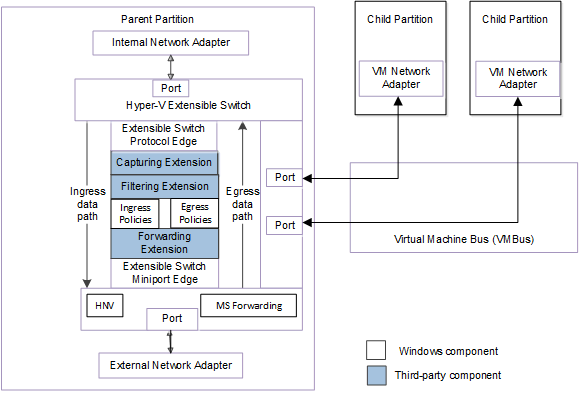
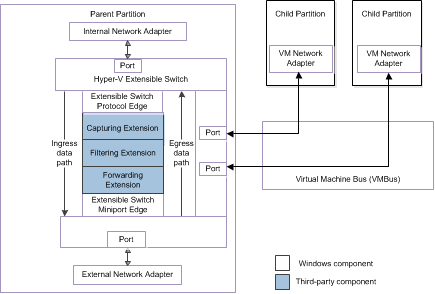

# Hyper-V Extensible Switch Components

Starting with Windows Server 2012, the Hyper-V extensible switch supports an interface that allows NDIS filter drivers (known as *Hyper-V extensible switch extensions*) to bind within the extensible switch driver stack. This allows extensions to monitor, modify, and forward packets to extensible switch ports. This also allows extensions to drop, redirect, or originate packets to ports that are used by the Hyper-V partitions.

Extensions can be provisioned with policies that apply to packet traffic over an individual extensible switch port or the switch itself. This allows the extension to allow a packet to be sent or deny a packet from being sent.

The following figure shows the components of the extensible switch interface for NDIS 6.40 (Windows Server 2012 R2) and later.

The following figure shows the components of the extensible switch interface for NDIS 6.30 (Windows Server 2012).

This section includes the following topics that describe the extensible switch components:

[Hyper-V Extensible Switch Extensions](hyper-v-extensible-switch-extensions.md)

[Hyper-V Extensible Switch Ports](hyper-v-extensible-switch-ports.md)

[Hyper-V Extensible Switch Network Adapters](hyper-v-extensible-switch-network-adapters.md)

[Hyper-V Extensible Switch Port and Network Adapter States](hyper-v-extensible-switch-port-and-network-adapter-states.md)

 

 

