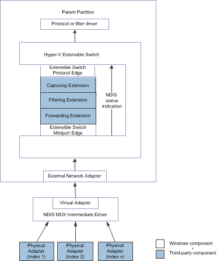

# Hyper-V Extensible Switch Control Path for NDIS Status Indications

This topic discusses the control path that NDIS status indications from an underlying physical adapter move across. One or more underlying physical adapters can be teamed with the Hyper-V extensible switch external network adapter.

For example, the extensible switch external network adapter can be bound to the virtual miniport edge of an NDIS multiplexer (MUX) intermediate driver. The MUX intermediate driver itself can be bound to a team of one or more physical networks on the host. This configuration is known as an *extensible switch team*. For more information about extensible switch teams, see [Types of Physical Network Adapter Configurations](types-of-physical-network-adapter-configurations.md).

In this configuration, the extensible switch extensions are exposed to every network adapter in the extensible switch team. This allows the forwarding extension in the extensible switch driver stack to manage the configuration and use of individual network adapters in the team. For example, the extension can provide support for a load balancing failover (LBFO) solution over the team by forwarding outgoing packets to individual adapters. Such an extension is known as a *teaming provider*. For more information about teaming providers, see [Teaming Provider Extensions](teaming-provider-extensions.md).

**Note**  Operations of this sort can only be performed by a forwarding extension. For more information about this type of driver, see [Forwarding Extensions](forwarding-extensions.md).

 

The following figure shows the extensible switch control path for NDIS status indications issued by an underlying extensible switch team for NDIS 6.40 (Windows Server 2012 R2) and later.

The following figure shows the extensible switch control path for NDIS status indications issued by an underlying extensible switch team for NDIS 6.30 (Windows Server 2012).

**Note**  In the extensible switch interface, NDIS filter drivers are known as *extensible switch extensions* and the driver stack is known as the *extensible switch driver stack*.

 

The extensible switch supports NDIS status indications from the underlying physical adapter or extensible switch team in the following ways:

-   When an NDIS status indication arrives at the extensible switch interface, it encapsulates the indication inside an [**NDIS\_SWITCH\_NIC\_STATUS\_INDICATION**](https://msdn.microsoft.com/library/windows/hardware/hh598217) structure. Then, the miniport edge of the extensible switch issues an [**NDIS\_STATUS\_SWITCH\_NIC\_STATUS**](https://msdn.microsoft.com/library/windows/hardware/hh598205) indication that contains this structure.

    When a forwarding extension receives this indication, it can duplicate the indication to change the encapsulated data. This allows the forwarding extension to change the indicated status or capabilities of the underlying extensible switch team.

-   A forwarding extension that operates as a teaming provider can participate in the configuration of the adapter team for hardware offloads by initiating [**NDIS\_STATUS\_SWITCH\_NIC\_STATUS**](https://msdn.microsoft.com/library/windows/hardware/hh598205) indications that are related to the offload technology.

    For example, the provider can initiate an [**NDIS\_STATUS\_SWITCH\_NIC\_STATUS**](https://msdn.microsoft.com/library/windows/hardware/hh598205) indication with an encapsulated [**NDIS\_STATUS\_RECEIVE\_FILTER\_CURRENT\_CAPABILITIES**](https://msdn.microsoft.com/library/windows/hardware/hh439814) indication to modify the offload capabilities for the virtual machine queue (VMQ) on the adapter team.

-   Teaming providers can also initiate an [**NDIS\_STATUS\_SWITCH\_NIC\_STATUS**](https://msdn.microsoft.com/library/windows/hardware/hh598205) indication to modify other network adapter configurations other than an extensible switch team.

    For example, the extension can initiate an [**NDIS\_STATUS\_SWITCH\_NIC\_STATUS**](https://msdn.microsoft.com/library/windows/hardware/hh598205) with an encapsulated [**NDIS\_STATUS\_SWITCH\_PORT\_REMOVE\_VF**](https://msdn.microsoft.com/library/windows/hardware/hh598206) indication. This indication removes the binding between a virtual machine (VM) network adapter and a PCI Express (PCIe) virtual function (VF). The VF is exposed by an underlying physical network adapter that supports the single root I/O virtualization (SR-IOV) interface.

    After this binding is removed, packets are delivered through an extensible switch port instead of directly between the VM network adapter and the VF of the underlying SR-IOV physical adapter. This allows the extensible switch port policies to be applied to packets that are received or sent over the extensible switch port.

**Note**  The extensible switch extension must follow the same guidelines for filtering NDIS status indications that applies to all NDIS filter drivers. For more information, see [Filter Module Status Indications](filter-module-status-indications.md).

 

For more information on how forwarding extensions can initiate [**NDIS\_STATUS\_SWITCH\_NIC\_STATUS**](https://msdn.microsoft.com/library/windows/hardware/hh598205) indications, see [Managing NDIS Status Indications from Physical Network Adapters](managing-ndis-status-indications-from-physical-network-adapters.md).

 

 

