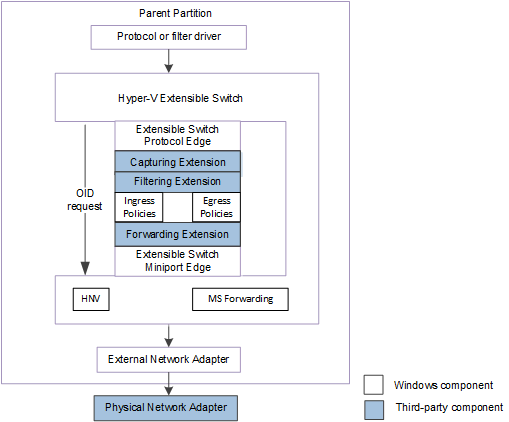
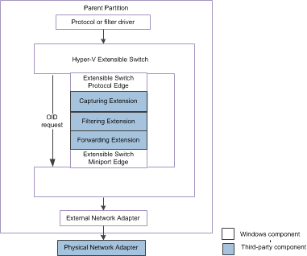

# Hyper-V Extensible Switch Control Path for OID Requests

This topic discusses the control path that Hyper-V extensible switch object identifier (OID) requests move across.

The following figure shows the extensible switch control path for OID requests for NDIS 6.40 (Windows Server 2012 R2) and later.

The following figure shows the extensible switch control path for OID requests for NDIS 6.30 (Windows Server 2012).

**Note**  In the extensible switch interface, NDIS filter drivers are known as *extensible switch extensions* and the driver stack is known as the *extensible switch driver stack*.

 

Extensible switch extensions, such as filtering and forwarding extensions, are responsible for allowing or rejecting packet traffic based on port or switch policies. In order for these extensions to apply policy decisions, these extensions must be able to do the following:

-   Receive the necessary information from the extensible switch interface about the new or updated configuration and state of the extensible switch, its ports, and its network adapter connections.

-   Receive the necessary information from the extensible switch interface about the new or updated properties for a switch or port policy.

-   Issue OID requests to the extensible switch interface to obtain the current configuration of the extensible switch, its ports, and its network adapter connections.

The extensible switch interface notifies underlying extensions about changes to its component configuration and policy parameters by issuing extensible switch OID set requests. These requests are issued by the protocol edge of the extensible switch to notify underlying extension about these changes. These OID requests move through the extensible switch driver stack to the underlying miniport edge of the extensible switch.

The miniport edge of the extensible switch is responsible for completing the OID requests. However, with some extensible switch OID requests, an underlying extension can fail an OID request in order to veto a notification. For example, when the protocol edge of the extensible switch notifies the extensions about a new port that will be created, it issues an OID set request of [OID\_SWITCH\_PORT\_CREATE](https://msdn.microsoft.com/library/windows/hardware/hh598272). An underlying filtering or forwarding extension can veto the port creation by completing the OID request with STATUS\_DATA\_NOT\_ACCEPTED. For more information on this procedure, see [Receiving OID Requests about Hyper-V Extensible Switch Configuration Changes](receiving-oid-requests-about-hyper-v-extensible-switch-configuration-changes.md).

**Note**  If the extension does not veto an extensible switch OID request, it should monitor the status when the request is completed. The extension should do this to determine whether the OID request was vetoed by underlying extensions in the extensible switch control path or by the extensible switch interface.

 

**Note**  Stack restart requests using [**NdisFRestartFilter**](https://msdn.microsoft.com/library/windows/hardware/ff562611) will not complete while an extensible switch OID request is pending. For this reason, an extension that is waiting for a stack restart must complete any ongoing OID requests.

 

Most of the extensible switch OID requests can only be issued by the extensible switch interface. However, some extensible switch OID requests can be issued by an extension to obtain information about the configuration of the extensible switch, its ports, and its network adapter connections. For more information, see [Querying the Hyper-V Extensible Switch Configuration](querying-the-hyper-v-extensible-switch-configuration.md).

 

 

