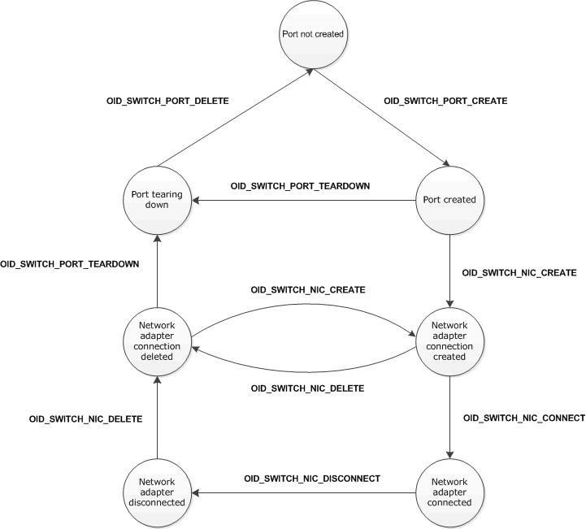

# Hyper-V Extensible Switch Port and Network Adapter States

The Hyper-V extensible switch interface manages the lifetime of the following components:

Hyper-V Extensible Switch Ports  
Each network adapter connection to the extensible switch is represented by a port. Ports are created when a Hyper-V child partition is configured to connect to an instance of an extensible switch. Depending on the switch type, ports are also created for the external and internal network adapter connections. For more information about switch types, see [Overview of the Hyper-V Extensible Switch](overview-of-the-hyper-v-extensible-switch.md).

Each port is used to hold the configuration for the network interface connection. If the configuration for the network interface connection is removed or the child partition is stopped, the port is torn down and deleted.

For more information about this component, see [Hyper-V Extensible Switch Ports](hyper-v-extensible-switch-ports.md).

Hyper-V Extensible Switch Network Adapters  
These are virtual network adapters that connect to the extensible switch port. These virtual network adapters are exposed within the Hyper-V child and parent partitions. This includes the virtual machine (VM) network adapter exposed in a child partition and the external network adapter that is teamed with the underlying physical network adapter.

Each network adapter connection requires a corresponding extensible switch port. The port must have been created before the network adapter connection is brought up. Similarly, the network adapter connection must be deleted before the port can be torn down and deleted.

**Note**  In some situations, extensible switch ports could be created and deleted without ever having a network adapter connection.

 

For example, when a Hyper-V child partition is started, the extensible switch interface creates a port before the VM network adapter is exposed within the guest operating system. After the VM network adapter is exposed and enumerated, the extensible switch interface creates a network connection between the VM network adapter and the extensible switch port. If the child partition is stopped, the extensible switch interface first deletes the network connection and then deletes the extensible switch port.

For more information about this component, see [Hyper-V Extensible Switch Network Adapters](hyper-v-extensible-switch-network-adapters.md).

When the extensible switch interface creates, deletes, or changes the configuration of these components, it issues object identifier (OID) set requests down the extensible switch driver stack. This operation is performed so that underlying extensible switch extensions can be notified about the state of the component and its configuration. Each OID set request results in a state transition for these components.

When an extension is bound and enabled on an extensible switch instance, it can issue OIDs to discover the existing port and network adapter connection configuration of the switch.

The following diagram shows the various states for the extensible switch port and network adapter connection components. The diagram also shows the OID set requests that cause the state transition for the component.

The following list describes the various states of the extensible switch port and network adapter connection components:

*Port not created*  
In this state, an extensible switch port does not exist on the extensible switch. OID requests that target a previously created port cannot be issued after the port has entered this state.

*Port created*  
When the extensible switch interface issues an OID set request of [OID\_SWITCH\_PORT\_CREATE](https://msdn.microsoft.com/library/windows/hardware/hh598272), the port is created on the extensible switch. In this state, the extensible switch interface and extension can issue OID requests that target the port.

For more information about OID traffic through the extensible switch driver stack, see [Hyper-V Extensible Switch Control Path](hyper-v-extensible-switch-control-path.md).

**Note**  An underlying extension can fail the OID set request and veto the port creation. The extension does this by completing the OID request with STATUS\_DATA\_NOT\_ACCEPTED. If this is done, the port is not created on the extensible switch. For more information on this procedure, see [Hyper-V Extensible Switch Ports](hyper-v-extensible-switch-ports.md).

 

*Network adapter connection created*  
When the extensible switch interface issues an OID set request of [OID\_SWITCH\_NIC\_CREATE](https://msdn.microsoft.com/library/windows/hardware/hh598263), the network adapter connection to the port is created on the extensible switch. In this state, the extensible switch interface can do the following:

-   Issue OID requests that target the network adapter connection.

-   Forward packet traffic to or from the network adapter connection.

It is also possible for a new adapter to connect to an existing port without going through a port teardown and create sequence.

In this state, the extension must forward these packets and OID requests through the extensible switch extension stack. However, the extension cannot originate or redirect packets or OID requests to other network adapter connections on the extensible switch.

**Note**  In this state, the extension must not issue OID requests or originate packet traffic to the network adapter connection.

 

For more information about OID traffic through the extensible switch driver stack, see [Hyper-V Extensible Switch Control Path](hyper-v-extensible-switch-control-path.md).

For more information about packet traffic through the extensible switch driver stack, see [Hyper-V Extensible Switch Data Path](hyper-v-extensible-switch-data-path.md).

**Note**  An underlying extension can fail the OID set request and veto the creation of the network adapter connection. If so, the connection is not created on the extensible switch port. For more information on this procedure, see [Hyper-V Extensible Switch Network Adapters](hyper-v-extensible-switch-network-adapters.md).

 

*Network adapter connected*  
When the extensible switch interface issues an OID set request of [OID\_SWITCH\_NIC\_CONNECT](https://msdn.microsoft.com/library/windows/hardware/hh598262), the network adapter is fully connected to the extensible switch port. In this state, the extension can now do the following:

-   Issue OID requests that target the network adapter connection.

-   Originate packet traffic to the network adapter connection.

-   Redirect packet traffic to the network adapter connection. For example, the extension can redirect packets from one network adapter connection to another connection on the extensible switch.

    **Note**  Only forwarding extensions can perform this operation. For more information, see [Forwarding Extensions](forwarding-extensions.md).

     

*Network adapter disconnected*  
When the extensible switch interface issues an OID set request of [OID\_SWITCH\_NIC\_DISCONNECT](https://msdn.microsoft.com/library/windows/hardware/hh598265), the network adapter is being disconnected from the extensible switch port. For example, this OID request is issued when the child partition, which exposed a VM network adapter, is stopped or the external network adapter is disabled.

In this state, the extensible switch extension can no longer originate packets or OID requests that target the connection. Also, forwarding extensions can no longer redirect packets to the connection.

**Note**  Pending packets and OID requests that were issued by the extensible switch interface before the connection became disconnected may still be delivered to the extension. However, the extension must forward the packets and OID requests without making any modifications.

 

*Network adapter connection deleted*  
After all packet traffic and OID requests that target the network adapter connection are completed, the extensible switch interface issues an OID set request of [OID\_SWITCH\_NIC\_DELETE](https://msdn.microsoft.com/library/windows/hardware/hh598264) to delete the connection from the extensible switch.

In this state, the extensible switch interface will no longer issue packets or OID requests that target the connection.

*Port tearing down*  
When the extensible switch interface issues an OID set request of [OID\_SWITCH\_PORT\_TEARDOWN](https://msdn.microsoft.com/library/windows/hardware/hh598279), the extensible switch port is being torn down in preparation to being deleted.

In this state, the extensible switch extension can no longer originate OID requests that target the port.

**Note**  Pending OID requests that were issued by the extensible switch interface before the port started its tear down process may still be delivered to the extension. However, the extension must forward the OID requests without making any modifications.

 

After all pending OID requests that target the port are completed, the extensible switch interface issues an OID set request of [OID\_SWITCH\_PORT\_DELETE](https://msdn.microsoft.com/library/windows/hardware/hh598273). This causes the port to transition to a *Port not created* state.

The extension can call an extensible switch handler function to increment or decrement a reference counter on a port or network adapter connection component. While a component's reference counter is nonzero, the extensible switch interface cannot delete the component.

The extension can call [*ReferenceSwitchPort*](https://msdn.microsoft.com/library/windows/hardware/hh598295) or [*DereferenceSwitchPort*](https://msdn.microsoft.com/library/windows/hardware/hh598142) to increment or decrement a reference counter for an extensible switch port. These calls can be made after the port has reached the *Port created* state. These calls must not be made after the port has reached the *Port tearing down* or *Port not created* states.

The extension can call [*ReferenceSwitchNic*](https://msdn.microsoft.com/library/windows/hardware/hh598294) or [*DereferenceSwitchNic*](https://msdn.microsoft.com/library/windows/hardware/hh598141) to increment or decrement a reference counter for an extensible switch network adapter connection. These calls can be made after the connection has reached the *Network adapter connected* state. These calls must not be made after the connection has reached the *Network adapter disconnected* or *Network adapter deleted* states.

The following table describes the operations that are allowed based on the state of the extensible switch port or network adapter connection components.

<table>
<colgroup>
<col width="33%" />
<col width="33%" />
<col width="33%" />
</colgroup>
<thead>
<tr class="header">
<th align="left">Component state</th>
<th align="left">Calls to <a href="https://msdn.microsoft.com/library/windows/hardware/hh598295" data-raw-source="[&lt;em&gt;ReferenceSwitchPort&lt;/em&gt;](https://msdn.microsoft.com/library/windows/hardware/hh598295)"><em>ReferenceSwitchPort</em></a> or <a href="https://msdn.microsoft.com/library/windows/hardware/hh598142" data-raw-source="[&lt;em&gt;DereferenceSwitchPort&lt;/em&gt;](https://msdn.microsoft.com/library/windows/hardware/hh598142)"><em>DereferenceSwitchPort</em></a> allowed?</th>
<th align="left">Calls to <a href="https://msdn.microsoft.com/library/windows/hardware/hh598294" data-raw-source="[&lt;em&gt;ReferenceSwitchNic&lt;/em&gt;](https://msdn.microsoft.com/library/windows/hardware/hh598294)"><em>ReferenceSwitchNic</em></a> or <a href="https://msdn.microsoft.com/library/windows/hardware/hh598141" data-raw-source="[&lt;em&gt;DereferenceSwitchNic&lt;/em&gt;](https://msdn.microsoft.com/library/windows/hardware/hh598141)"><em>DereferenceSwitchNic</em></a> allowed?</th>
</tr>
</thead>
<tbody>
<tr class="odd">
<td align="left">
Port not created
</td>
<td align="left">
No
</td>
<td align="left">
No
</td>
</tr>
<tr class="even">
<td align="left">
Port created
</td>
<td align="left">
Yes
</td>
<td align="left">
No
</td>
</tr>
<tr class="odd">
<td align="left">
Network adapter connection created
</td>
<td align="left">
Yes
</td>
<td align="left">
No
</td>
</tr>
<tr class="even">
<td align="left">
Network adapter connected
</td>
<td align="left">
Yes
</td>
<td align="left">
Yes
</td>
</tr>
<tr class="odd">
<td align="left">
Network adapter disconnected
</td>
<td align="left">
Yes
</td>
<td align="left">
No
</td>
</tr>
<tr class="even">
<td align="left">
Network adapter connection deleted
</td>
<td align="left">
Yes
</td>
<td align="left">
No
</td>
</tr>
<tr class="odd">
<td align="left">
Port tearing down
</td>
<td align="left">
No
</td>
<td align="left">
No
</td>
</tr>
</tbody>
</table>

 

<table style="width:100%;">
<colgroup>
<col width="14%" />
<col width="14%" />
<col width="14%" />
<col width="14%" />
<col width="14%" />
<col width="14%" />
<col width="14%" />
</colgroup>
<thead>
<tr class="header">
<th align="left">Component state</th>
<th align="left">OID requests from extensible switch allowed for port?</th>
<th align="left">OID requests from extensions allowed for port?</th>
<th align="left">OID requests from extensible switch allowed for network adapter connection?</th>
<th align="left">OID requests from extensions allowed for network adapter connection?</th>
<th align="left">Packet traffic from extensible switch allowed over network adapter connection?</th>
<th align="left">Packet traffic from extensions allowed over network adapter connection?</th>
</tr>
</thead>
<tbody>
<tr class="odd">
<td align="left">
Port not created
</td>
<td align="left">
No
</td>
<td align="left">
No
</td>
<td align="left">
No
</td>
<td align="left">
No
</td>
<td align="left">
No
</td>
<td align="left">
No
</td>
</tr>
<tr class="even">
<td align="left">
Port created
</td>
<td align="left">
Yes
</td>
<td align="left">
Yes
</td>
<td align="left">
No
</td>
<td align="left">
No
</td>
<td align="left">
No
</td>
<td align="left">
No
</td>
</tr>
<tr class="odd">
<td align="left">
Network adapter connection created
</td>
<td align="left">
Yes
</td>
<td align="left">
Yes
</td>
<td align="left">
Yes
</td>
<td align="left">
No
</td>
<td align="left">
Yes
</td>
<td align="left">
No
</td>
</tr>
<tr class="even">
<td align="left">
Network adapter connected
</td>
<td align="left">
Yes
</td>
<td align="left">
Yes
</td>
<td align="left">
Yes
</td>
<td align="left">
Yes
</td>
<td align="left">
Yes
</td>
<td align="left">
Yes
</td>
</tr>
<tr class="odd">
<td align="left">
Network adapter disconnected
</td>
<td align="left">
Yes
</td>
<td align="left">
Yes
</td>
<td align="left">
Yes
</td>
<td align="left">
No
</td>
<td align="left">
Yes
</td>
<td align="left">
No
</td>
</tr>
<tr class="even">
<td align="left">
Network adapter connection deleted
</td>
<td align="left">
Yes
</td>
<td align="left">
Yes
</td>
<td align="left">
No
</td>
<td align="left">
No
</td>
<td align="left">
No
</td>
<td align="left">
No
</td>
</tr>
<tr class="odd">
<td align="left">
Port tearing down
</td>
<td align="left">
Yes
</td>
<td align="left">
No
</td>
<td align="left">
No
</td>
<td align="left">
No
</td>
<td align="left">
No
</td>
<td align="left">
No
</td>
</tr>
</tbody>
</table>

 

 

 

