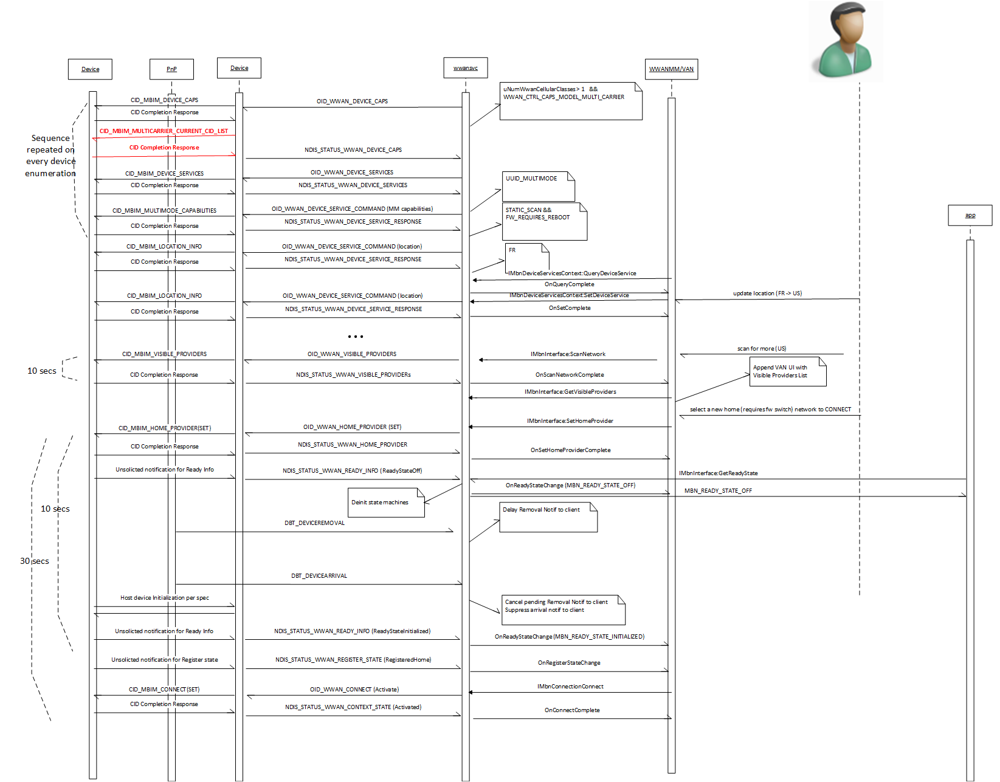

# IHV Guidance for Implementing Multimode and Multicarrier Capable MB Devices

This topic provides information about implementing support for multiple Radio Access Technologies (RAT) and multiple operators in Windows. It supplements the [USB NCM Mobile Broadband Interface Model (MBIM) V1.0 specification](http://go.microsoft.com/fwlink/p/?linkid=320791) that outlines the CIDs required for supporting the multimode multicarrier scenario.

The information in this topic applies to:

-   Windows 8

## Supporting multimode devices with firmware switching

This topic provides guidance to IHVs for implementing support for multiple Radio Access Technologies (RAT) and multiple operators in Windows. A short summary of the most relevant sections of the spec is provided below.

A multimode network has multiple RATs or cellular classes. A multicarrier device is able to support multiple network providers within the same device. One of the many networks supported can be a multimode network.

In many places in this document it is required that multicarrier providers reported by a multicarrier device as part of CID processing must be set-able as home providers. This section describes how to determine if a provider is settable as a home provider. The ability to set a provider as a home provider may depend on many factors that are device dependent such as being visible, having firmware support for the provider, and having a SIM or equivalent to register with the provider. There may be additional factors. The device should ensure that the device requirements are met for a multicarrier provider before reporting it as a settable home provider

## 10.4.1 CID\_MBIM\_DEVICE\_CAPS

The capable device will report multiple supported cellular classes in bmCellularClass of MBIM\_DEVICE\_CAPS as specified in Table 10-13 of the specification. It will also report support for multiple carriers via the MBIMCtrlCapsMultiCarrier Mask in MBIM\_CTRL\_CAPS (Table 10-13).

Single-carrier multi-mode devices must behave like GSM devices. Such devices must not set any CDMA related capabilities in their MBIM\_DEVICE\_CAPS\_INFO.

## 10.4.6 CID\_MBIM\_HOME\_PROVIDER

The home provider can be set as specified in **10.3.6.4.**

## 10.4.8 CID\_MBIM\_VISIBLE\_PROVIDERS

The visible providers CID contain an Action field that specifies whether the host is expecting:

1.  Value 0, where device performs a full scan in the context of current home provider.
2.  Value 1, where device is being queried to locate visible multicarrier providers that are settable as home providers. The device may choose to accomplish this via a full scan, partial scan, or static list. The multicarrier preferred providers should be tagged as MBIM\_PROVIDER\_STATE\_PREFERRED\_MULTICARRIER in the visible providers result as specified in Table 10-34 of the specification.

When devices report a static list of visible multicarrier providers based on location information, programmed using CID\_MBIM\_LOCATION\_INFO, the list should only contain providers valid for that location. As an extension of the above rule, devices should not report the currently registered provider if the location represented by its MCC (Mobile Country Code) is different than the location currently programmed in the device.

## 10.4.9 CID\_MBIM\_REGISTER\_STATE

The device indicates the current cellular class using the dwCurrentCellularClass field of MBIM\_REGISTRATION\_STATE in Table 10-48 of the specification.

## 10.4.30 CID\_MBIM\_DEVICE\_SERVICES

Multicarrier devices are required to report the UUID\_MULTICARRIER (described below) device service in response to this CID.

Single-carrier multimode devices are not required to report UUID\_MULTICARRIER device service in response to this CID.

## 10.4.39 CID\_MBIM\_MULTICARRIER\_PROVIDERS

The device uses this CID to report the current and previously added preferred multicarrier providers. This CID is supported when device supports MBIMCtrlCapsMultiCarrier. When the host sets a multicarrier preferred provider, it is not required that the provider is settable as home provider. But when the list is queried by the host, the device should only return multicarrier preferred providers that are settable as home providers.

The following figure provides a sequence diagram of the steps involved in switching a device from its current mode based on a location hint specified by the host. The operation requires the use of a device service described below to get/set additional information from the device. One specific requirement is that the device should ensure that the host has had a chance to recover the pending notification from the device prior to it falling off the bus. The diagram also specifies the time bounds and performance expectations of the various operations.

## MULTI-CARRIER DEVICE SERVICE

The IHV device will implement and report the following device service when queried by CID\_MBIM\_DEVICE\_SERVICES. The existing well-known services are defined in the NCM MBIM spec in section 10.1. It is extended it to define the following service.

<table>
<colgroup>
<col width="33%" />
<col width="33%" />
<col width="33%" />
</colgroup>
<thead>
<tr class="header">
<th align="left">Service Name</th>
<th align="left">UUID</th>
<th align="left">UUID Value</th>
</tr>
</thead>
<tbody>
<tr class="odd">
<td align="left">
Multi-carrier
</td>
<td align="left">
UUID_MULTICARRIER
</td>
<td align="left">
8b569648- 628d-4653-9b9f- 1025404424e1
</td>
</tr>
</tbody>
</table>

 

Specifically, the following CIDs are defined for UUID\_MULTICARRIER device service.

<table>
<colgroup>
<col width="12%" />
<col width="12%" />
<col width="12%" />
<col width="12%" />
<col width="12%" />
<col width="12%" />
<col width="12%" />
<col width="12%" />
</colgroup>
<thead>
<tr class="header">
<th align="left">CID</th>
<th align="left">Command Code</th>
<th align="left">Query</th>
<th align="left">Set</th>
<th align="left">Event</th>
<th align="left">Set InformationBuffer payload</th>
<th align="left">Query InformationBuffer payload</th>
<th align="left">Completion InformationBuffer payload</th>
</tr>
</thead>
<tbody>
<tr class="odd">
<td align="left">
CID_MBIM_MULTICARRIER_CAPABILITIES
</td>
<td align="left">
1
</td>
<td align="left">
Y
</td>
<td align="left">
N
</td>
<td align="left">
N
</td>
<td align="left">
N/A
</td>
<td align="left">
N/A
</td>
<td align="left">
MBIM_MULTICARRIER_CAPABILITIES
</td>
</tr>
<tr class="even">
<td align="left">
CID_MBIM_LOCATION_INFO
</td>
<td align="left">
2
</td>
<td align="left">
Y
</td>
<td align="left">
Y
</td>
<td align="left">
N
</td>
<td align="left">
MBIM_LOCATION_INFO
</td>
<td align="left">
N/A
</td>
<td align="left">
MBIM_LOCATION_INFO
</td>
</tr>
<tr class="odd">
<td align="left">
CID_MBIM_MULTICARRIER_CURRENT_CID_LIST
</td>
<td align="left">
3
</td>
<td align="left">
Y
</td>
<td align="left">
N
</td>
<td align="left">
N
</td>
<td align="left">
N/A
</td>
<td align="left">
UUID
</td>
<td align="left">
MBIM_MULTICARRIERMODE_CURRENT_CID_LIST
</td>
</tr>
</tbody>
</table>

 

## CID\_MBIM\_MULTICARRIER\_CAPABILITIES

The command returns information about a MB device's multi-carrier capabilities. A device that requires a firmware reboot, and correspondingly a device removal/arrival should provide the host with a hint using the appropriate flag to enable the host to provide the appropriate user experience.

Query = **InformationBuffer on MBIM\_COMMAND\_MSG not used. MBIM\_MULTICARRIER\_CAPABILITIES returned in InformationBuffer MBIM\_COMMAND\_DONE**

Set = **Unsupported**

Unsolicited Event = **Unsupported**

<table>
<colgroup>
<col width="33%" />
<col width="33%" />
<col width="33%" />
</colgroup>
<thead>
<tr class="header">
<th align="left">MBIM_MC_FLAGS_NONE</th>
<th align="left">0h</th>
<th align="left">No flags set</th>
</tr>
</thead>
<tbody>
<tr class="odd">
<td align="left">
MBIM_MC_FLAGS_STATIC_SCAN
</td>
<td align="left">
1h
</td>
<td align="left">
Indicates that the results reported for visible providers in scan results aren’t obtained from a full network scan. The result may be obtained from a hardcoded list.
</td>
</tr>
<tr class="even">
<td align="left">
MBIM_MC_FLAGS_¬¬FW_REQUIRES_REBOOT
</td>
<td align="left">
2h
</td>
<td align="left">
Indicates that the device requires powering cycle and rebooting to switch firmware.
</td>
</tr>
</tbody>
</table>

 

<table>
<colgroup>
<col width="25%" />
<col width="25%" />
<col width="25%" />
<col width="25%" />
</colgroup>
<thead>
<tr class="header">
<th align="left">Offset</th>
<th align="left">Size</th>
<th align="left">Field</th>
<th align="left">Description</th>
</tr>
</thead>
<tbody>
<tr class="odd">
<td align="left">
0
</td>
<td align="left">
4
</td>
<td align="left">
dwCapabilities
</td>
<td align="left">
Returns the capabilities from MBIM_MULTICARRIER_FLAGS
</td>
</tr>
</tbody>
</table>

 

## CID\_MBIM\_LOCATION\_INFO

The command is used to set/query the current location information of the host. This is useful to the device if it needs to filter the list of static (no physical scan) visible providers to the ones relevant to the current user location.

Query = **InformationBuffer on MBIM\_COMMAND\_MSG not used. MBIM\_LOCATION\_INFO returned in InformationBuffer MBIM\_COMMAND\_DONE**

Set = **InformationBuffer on MBIM\_COMMAND\_MSG contains MBIM\_LOCATION\_INFO**

Unsolicited Event = **Unsupported**

The country code specified by the host will be based on the Geographical Location GEOID available on Windows. For more information, see [Table of Geographical Locations (Windows)](https://msdn.microsoft.com/library/windows/desktop/dd374073).

<table>
<colgroup>
<col width="25%" />
<col width="25%" />
<col width="25%" />
<col width="25%" />
</colgroup>
<thead>
<tr class="header">
<th align="left">Offset</th>
<th align="left">Size</th>
<th align="left">Field</th>
<th align="left">Description</th>
</tr>
</thead>
<tbody>
<tr class="odd">
<td align="left">
0
</td>
<td align="left">
4
</td>
<td align="left">
Country
</td>
<td align="left">
Geographical Location based on GEOID.
</td>
</tr>
</tbody>
</table>

 

## CID\_MBIM\_MULTICARRIER\_CURRENT\_CID\_LIST

This command is used to query the CIDs currently supposed by a device service.

Query = **InformationBuffer on MBIM\_COMMAND\_MSG is a UUID for the device service. MBIM\_MULTICARRIERMODE\_CURRENT\_CID\_LIST returned in InformationBuffer MBIM\_COMMAND\_DONE**

Set = **Unsupported**

Unsolicited Event = **Unsupported**

<table>
<colgroup>
<col width="20%" />
<col width="20%" />
<col width="20%" />
<col width="20%" />
<col width="20%" />
</colgroup>
<thead>
<tr class="header">
<th align="left">Offset</th>
<th align="left">Size</th>
<th align="left">Field</th>
<th align="left">Type</th>
<th align="left">Description</th>
</tr>
</thead>
<tbody>
<tr class="odd">
<td align="left">
0
</td>
<td align="left">
4
</td>
<td align="left">
CidCount
</td>
<td align="left">
UINT32
</td>
<td align="left">
Number of CIDs supported for this device service.
</td>
</tr>
<tr class="even">
<td align="left">
4
</td>
<td align="left">

</td>
<td align="left">
DataBuffer
</td>
<td align="left">
DATABUFFER
</td>
<td align="left">
CidList: List of CIDs supported for this device service. There must be CID Count number of entries in this list. Each CID is of type UINT32.
</td>
</tr>
</tbody>
</table>

 

 

 

