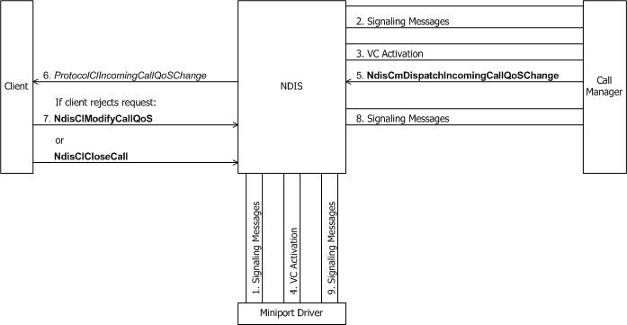
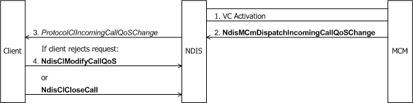

# Incoming Request to Change Call Parameters

A call manager or MCM driver is alerted to an incoming request from a remote party to change the call parameters on an active VC by signaling messages from the network. Whether a call manager or MCM driver supports dynamic QoS changes on active calls depends on the signaling protocol.

The following figure shows an incoming request through a call manager to change call parameters.

The following figure shows an incoming request through an MCM driver to change call parameters.

After receiving an incoming request to change call parameters, a call manager passes appropriately modified call parameters to [**NdisCmActivateVc**](/windows-hardware/drivers/ddi/ndis/nf-ndis-ndiscmactivatevc) to notify the underlying miniport driver of the proposed QoS change. An MCM driver passes modified call parameters to [**NdisMCmActivateVc**](/windows-hardware/drivers/ddi/ndis/nf-ndis-ndismcmactivatevc)(see [Activating a VC](activating-a-vc.md)). If the underlying miniport driver accepts the changed call parameters, a call manager then calls [**NdisCmDispatchIncomingCallQosChange**](/windows-hardware/drivers/ddi/ndis/nf-ndis-ndiscmdispatchincomingcallqoschange)(see Incoming Request to Change Call Parameters). An MCM driver calls [**NdisMCmDispatchIncomingCallQosChange**](/windows-hardware/drivers/ddi/ndis/nf-ndis-ndismcmdispatchincomingcallqoschange)(see Incoming Request to Change Call Parameters). The call manager or MCM driver passes an *NdisVcHandle* and a buffered [**CO\_CALL\_PARAMETERS**](/previous-versions/windows/hardware/network/ff545384(v=vs.85)) structure to **Ndis(M)CmDispatchIncomingCallQoSChange**.

A call to **Ndis(M)CmDispatchIncomingCallQoSChange** causes NDIS to call the client's [*ProtocolClIncomingCallQoSChange*](/windows-hardware/drivers/ddi/ndis/nc-ndis-protocol_cl_incoming_call_qos_change) function. NDIS passes a *ProtocolVcContext* handle that identifies the VC and the modified call parameters in a buffered CO\_CALL\_PARAMETERS structure to *ProtocolClIncomingCallQoSChange*.

The client accepts the proposed modifications to the call parameters for the VC by doing nothing, except possibly updating any state it maintains about the QoS for the VC, and returning control. If the proposed modifications are unacceptable, the client can attempt to renegotiate the call parameters with [**NdisClModifyCallQoS**](/windows-hardware/drivers/ddi/ndis/nf-ndis-ndisclmodifycallqos) if allowed by the signaling protocol (see [Client-Initiated Request to Change Call Parameters](client-initiated-request-to-change-call-parameters.md)). Otherwise, the client rejects the proposed QoS change by tearing down the call with [**NdisClCloseCall**](/windows-hardware/drivers/ddi/ndis/nf-ndis-ndisclclosecall)(see [Client-Initiated Request to Close a Call](client-initiated-request-to-close-a-call.md)).

After **ProtocolClIncomingCallQoS** returns, the call manager or MCM driver communicates the client's acceptance or rejection of the proposed change to the remote party that originated the request.

 

