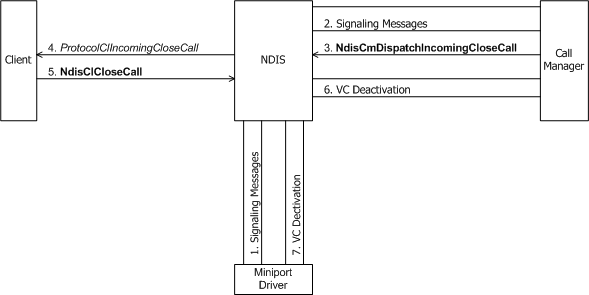
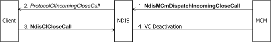

# Incoming Request to Close a Call

When the remote client closes a call, the local call manager or MCM driver must indicate this incoming request to the local client. To indicate such a request, a call manager calls [**NdisCmDispatchIncomingCloseCall**](https://msdn.microsoft.com/library/windows/hardware/ff561670) with the *CloseStatus* set to NDIS\_STATUS\_SUCCESS (see the following figure).

An MCM driver calls [**NdisMCmDispatchIncomingCloseCall**](https://msdn.microsoft.com/library/windows/hardware/ff563541) to indicate an incoming request to close a call (see the following figure).

A call manager or MCM driver also can call **Ndis(M)CmDispatchIncomingCloseCall**:

-   From its [**ProtocolCmIncomingCallComplete**](https://msdn.microsoft.com/library/windows/hardware/ff570245) function if it determines that the connection-oriented client is requesting an unacceptable change in call parameters in response to an incoming call previously that is indicated by the call manager or MCM driver (see [Incoming Request to Change Call Parameters](incoming-request-to-change-call-parameters.md)).

-   If abnormal network conditions force the call manager to tear down active calls.

The call to **Ndis(M)CmDispatchIncomingCloseCall** causes NDIS to call the [**ProtocolClIncomingCloseCall**](https://msdn.microsoft.com/library/windows/hardware/ff570230) function of the connection-oriented client on that connection. *ProtocolClIncomingCloseCall* should carry out any protocol-determined operations, such as notifying its own client or clients that the connection is being broken. If the call to be closed is a multipoint VC created by the client, *ProtocolClIncomingCloseCall* must call [**NdisClDropParty**](https://msdn.microsoft.com/library/windows/hardware/ff561629) one or more times until only a single party remains on the VC (see [Dropping a Party from a Multipoint Call](dropping-a-party-from-a-multipoint-call.md)).

*ProtocolClIncomingCloseCall* must then call [**NdisClCloseCall**](https://msdn.microsoft.com/library/windows/hardware/ff561627)(with the handle to the last party on the VC if the VC is a multipoint VC created by the client) to acknowledge that the client will no longer attempt to send or expect to receive data on this particular VC. If the call manager or MCM driver created this VC, *ProtocolClIncomingCloseCall* should return control after it calls **NdisClCloseCall**. The call manager or MCM driver must also deactivate the VC (see [Deactivating a VC](deactivating-a-vc.md)).

If the client originally created this VC for an outgoing call and *CloseStatus* is NDIS\_STATUS\_SUCCESS, *ProtocolClIncomingCloseCall* can optionally tear down the VC with [**NdisCoDeleteVc**](https://msdn.microsoft.com/library/windows/hardware/ff561698)(see [Deleting a VC](deleting-a-vc.md)) or reuse the VC for another call. If *CloseStatus* is not NDIS\_STATUS\_SUCCESS, *ProtocolClIncomingCloseCall* must call **NdisCoDeleteVc**.

If the call manager or MCM driver originally created this VC for an incoming call, the call manager or MCM driver can optionally [delete the VC](deleting-a-vc.md) by respectively calling **NdisCoDeleteVc** or [**NdisMCmDeleteVc**](https://msdn.microsoft.com/library/windows/hardware/ff562819).

 

 

