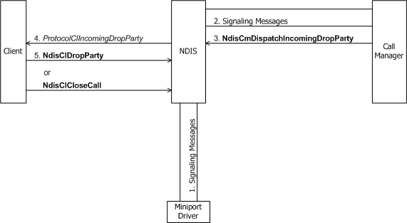
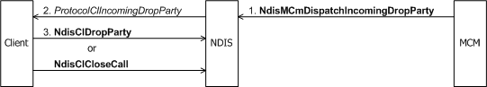

# Incoming Request to Drop a Party from a Multipoint Call

A call manager or MCM driver is alerted to an incoming request from a remote party to drop that party from a multipoint call by signaling messages from the network. A call manager or MCM driver can also signal an incoming request to drop a party if it detects network problems that prevent further data transfers on the VC.

If the party that is being dropped from the call is not the last party on the VC, a call manager calls [**NdisCmDispatchIncomingDropParty**](https://msdn.microsoft.com/library/windows/hardware/ff561672). An MCM driver calls [**NdisMCmDispatchIncomingDropParty**](https://msdn.microsoft.com/library/windows/hardware/ff563542). If the party that is being dropped is the last party on the VC, a call manager calls [**NdisCmDispatchIncomingCloseCall**](https://msdn.microsoft.com/library/windows/hardware/ff561670), and an MCM driver calls [**NdisMCmDispatchIncomingCloseCall**](https://msdn.microsoft.com/library/windows/hardware/ff563541)(see [Incoming Request to Close a Call](incoming-request-to-close-a-call.md)).

A call to **Ndis(M)CmDispatchIncomingDropParty** causes NDIS to call the client's [**ProtocolClIncomingDropParty**](https://msdn.microsoft.com/library/windows/hardware/ff570231) function.

The following shows an incoming request through a call manager to drop a party through a multipoint call.

The next figure shows an incoming request through an MCM driver to drop a party through a multipoint call.

*ProtocolClIncomingDropParty* should carry out any protocol-determined operations for dropping the party from the client's multipoint VC. If the party that is being dropped is not the last party on the VC, *ProtocolClIncomingDropParty* must call **NdisClDropParty**(see [Dropping a Party from a Multipoint Call](dropping-a-party-from-a-multipoint-call.md)). If the party being dropped is the last party on the VC, *ProtocolClIncomingDropParty* must call **NdisClCloseCall**(see [Client-Initiated Request to Close a Call](client-initiated-request-to-close-a-call.md)).

 

 

