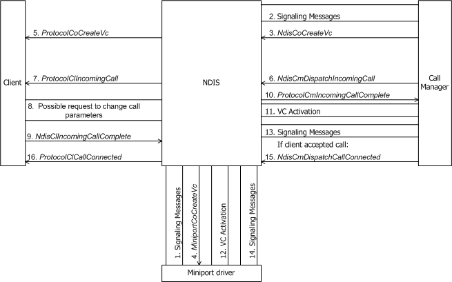
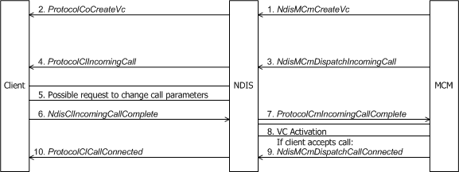

# Indicating an Incoming Call

A call manager or MCM driver is alerted to an incoming call by signaling messages from the network. From these signaling messages, the call manager or MCM driver extracts the call parameters for the call, including the SAP to which the incoming call is addressed.

The following figure shows an MCM driver indicating an incoming call.

The following figure shows a call manager indicating an incoming call.

If the incoming call parameters are unacceptable to the call manager or MCM driver, it can attempt to negotiate a change in these parameters with the remote party if such negotiation is allowed by the signaling protocol. Alternatively, the client to which the incoming call is directed could attempt to negotiate the call parameters after receiving the call indication from the call manager or MCM driver (see [Client-Initiated Request to Change Call Parameters](client-initiated-request-to-change-call-parameters.md)). If the call manager or MCM driver cannot negotiate acceptable call parameters for the call with the remote party, it might refuse the call. The signaling protocol determines what is possible in such cases.

Before indicating an incoming call to a client, the call manager or MCM driver must identify the SAP to which the call is directed. The SAP must have been previously [registered](registering-a-sap.md) by a client. The call manager or MCM driver must also initiate the [creation of a VC](creating-a-vc.md) and initiate the [activation of this VC](activating-a-vc.md).

The call manager or MCM driver then indicates the incoming call to the client that registered the SAP to which the incoming call is directed. A call manager indicates an incoming call with [**NdisCmDispatchIncomingCall**](https://msdn.microsoft.com/library/windows/hardware/ff561664). An MCM driver indicates an incoming call with [**NdisMCmDispatchIncomingCall**](https://msdn.microsoft.com/library/windows/hardware/ff562830).

In the call to **Ndis(M)CmDispatchIncomingCall**, the call manager or MCM driver passes the following:

-   An *NdisSapHandle* that identifies the SAP to which the incoming call is addressed.

-   An *NdisVcHandle* that identifies the virtual circuit for the incoming call.

-   A pointer to a structure of type [**CO\_CALL\_PARAMETERS**](https://msdn.microsoft.com/library/windows/hardware/ff545384), which contains the call parameters for the call.

The call to **Ndis(M)CmDispatchIncomingCall** causes NDIS to call the client's [**ProtocolClIncomingCall**](https://msdn.microsoft.com/library/windows/hardware/ff570228) function, within which the client either accepts or rejects the requested connection. *ProtocolClIncomingCall* should validate the SAP, VC, and call parameters.

*ProtocolClIncomingCall* can complete synchronously or it can return NDIS\_STATUS\_PENDING and complete asynchronously with [**NdisClIncomingCallComplete**](https://msdn.microsoft.com/library/windows/hardware/ff561632). A call to **NdisClIncomingCallComplete** causes NDIS to call the call manager's or MCM driver's [**ProtocolCmIncomingCallComplete**](https://msdn.microsoft.com/library/windows/hardware/ff570245) function.

The NDIS\_STATUS code that is returned by a synchronous completion of *ProtocolClIncomingCall* or supplied to **NdisClIncomingCallComplete** indicates the client's acceptance or rejection of the incoming call. The client also returns the call parameters for the call in a buffered CO\_CALL\_PARAMETERS structure. If the client finds the call parameters unacceptable, it can, if allowed by the signaling protocol, request a change in the call parameters by setting the **Flags** member in the CO\_CALL\_PARAMETERS structure with CALL\_PARAMETERS\_CHANGED and by supplying the revised call parameters in a buffered CO\_CALL\_PARAMETERS structure.

If the client accepts the incoming call, the call manager or MCM driver should send signaling messages to indicate to the calling entity that the call has been accepted. Otherwise, the call manager or MCM driver should send signaling messages to indicate that the call has been rejected. If the client is requesting a change in call parameters, the call manager or MCM driver sends signaling messages to request a change in call parameters.

If the client accepted the call, or if the client's requested change in call parameters was accepted by the remote party, a call manager calls [**NdisCmDispatchCallConnected**](https://msdn.microsoft.com/library/windows/hardware/ff561661), and an MCM driver calls [**NdisMCmDispatchCallConnected**](https://msdn.microsoft.com/library/windows/hardware/ff562826). The call to **Ndis(M)CmDispatchCallConnected** causes NDIS to call the client's *ProtocolClCallConnected* function.

If the client rejected the call and the call manager or MCM driver has already activated a VC for the incoming call, the call manager or MCM driver calls **Ndis(M)CmDeactivateVc** to deactivate the VC if the VC is activated. The call manager or MCM driver can then initiate [deletion of the VC](deleting-a-vc.md) by calling [**NdisCoDeleteVc**](https://msdn.microsoft.com/library/windows/hardware/ff561698) in the case of the call manager or [**NdisMCmDeleteVc**](https://msdn.microsoft.com/library/windows/hardware/ff562819) in the case of the MCM driver.

If the client accepted the call but the end-to-end connection was not successfully established (because, for example, the remote party tore down the call), the call manager or MCM driver will not call **Ndis(M)CmDispatchCallConnected**. Instead, it will call **Ndis(M)CmDispatchIncomingCloseCall**, which causes NDIS to call the client's *ProtocolClIncomingCloseCall* function. The client must then call [**NdisClCloseCall**](https://msdn.microsoft.com/library/windows/hardware/ff561627) to complete the teardown of the call. The call manager or MCM driver then calls **Ndis(M)CmDeactivateVC** to [deactivate the VC](deactivating-a-vc.md) that it created for the incoming call. The call manager or MCM driver can then initiate [deletion of the VC](deleting-a-vc.md) by calling [**NdisCoDeleteVc**](https://msdn.microsoft.com/library/windows/hardware/ff561698) in the case of the call manager or [**NdisMCmDeleteVc**](https://msdn.microsoft.com/library/windows/hardware/ff562819) in the case of the MCM driver.

 

 

