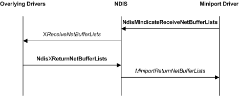

# Indicating Received Data from a Miniport Driver

The following figure illustrates a miniport driver receive indication.

Miniport drivers call the [**NdisMIndicateReceiveNetBufferLists**](https://msdn.microsoft.com/library/windows/hardware/ff563598) function to indicate the receipt of data from the network. The **NdisMIndicateReceiveNetBufferLists** function passes the indicated list of [**NET\_BUFFER\_LIST**](https://msdn.microsoft.com/library/windows/hardware/ff568388) structures up the stack to overlying drivers.

If a miniport driver sets the **NDIS\_RECEIVE\_FLAGS\_RESOURCES** flag in the *ReceiveFlags* parameter of [**NdisMIndicateReceiveNetBufferLists**](https://msdn.microsoft.com/library/windows/hardware/ff563598), this indicates that the miniport driver must regain ownership of the [**NET\_BUFFER\_LIST**](https://msdn.microsoft.com/library/windows/hardware/ff568388) structures immediately. In this case, NDIS does not call the miniport driver's [*MiniportReturnNetBufferLists*](https://msdn.microsoft.com/library/windows/hardware/ff559437) function to return the **NET\_BUFFER\_LIST** structures. The miniport driver regains ownership immediately after **NdisMIndicateReceiveNetBufferLists** returns.

If a miniport driver does not set the **NDIS\_RECEIVE\_FLAGS\_RESOURCES** flag in the *ReceiveFlags* parameter of [**NdisMIndicateReceiveNetBufferLists**](https://msdn.microsoft.com/library/windows/hardware/ff563598), NDIS returns the indicated [**NET\_BUFFER\_LIST**](https://msdn.microsoft.com/library/windows/hardware/ff568388) structures to the miniport driver's [*MiniportReturnNetBufferLists*](https://msdn.microsoft.com/library/windows/hardware/ff559437) function. In this case, the miniport driver relinquishes ownership of the indicated structures until NDIS returns them to *MiniportReturnNetBufferLists*.

 

 

