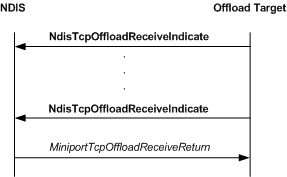

# Indicating Received Data from an Offload Target

\[The TCP chimney offload feature is deprecated and should not be used.\]

The following figure shows the call sequence for a receive indication that is performed by an offload target.

If no preposted receive requests (buffers that are supplied by a client application) are available for an offloaded connection, an offload target calls the [**NdisTcpOffloadReceiveHandler**](https://msdn.microsoft.com/library/windows/hardware/ff564606) function to indicate that received data is available for consumption by the client application. The [delivery algorithm](delivery-algorithm.md) specifies when an offload target should deliver received data through indications. For more information about indicating received data, see **NdisTcpOffloadReceiveHandler**.

NDIS calls the [*MiniportTcpOffloadReceiveReturn*](https://msdn.microsoft.com/library/windows/hardware/ff559462) function to return ownership of [**NET\_BUFFER\_LIST**](https://msdn.microsoft.com/library/windows/hardware/ff568388) structures and associated structures that the offload target passed in one or more previous calls to the **NdisTcpOffloadReceiveHandler** function. For more information about processing returned NET\_BUFFER\_LIST structures, see *MiniportTcpOffloadReceiveReturn*.

 

 

