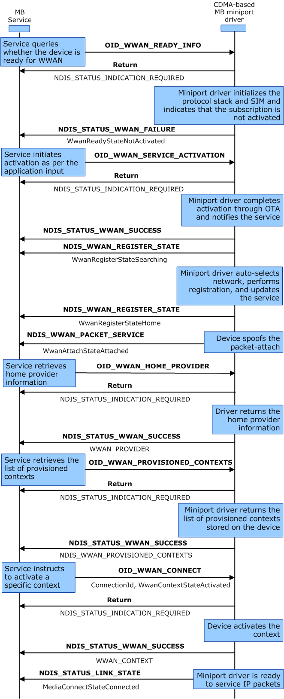

# Initialization of a CDMA Packet Device with a Provisioned Context

The following diagram illustrates the optimal user experience for CDMA-based devices. The out-of-box experience does not require user configuration. This scenario assumes that the CDMA-based account has not been activated. Unlike GSM-based devices, a CDMA-based device automatically starts registration with the network after activation is complete. The labels in bold are OID identifiers or transactional flow control, and the labels in regular text are the important flags within the OID structure.

To initialize a CDMA-based packet device with a provisioned context, implement the following steps:

1.  The MB Service sends an asynchronous (non-blocking) [OID\_WWAN\_READY\_INFO](https://msdn.microsoft.com/library/windows/hardware/ff569833) to the miniport driver. The miniport driver responds with a provisional acknowledgment (NDIS\_STATUS\_INDICATION\_REQUIRED) that it has received the request, and that it will send a notification with the requested information in the future.

2.  The miniport driver sends NDIS\_STATUS\_WWAN\_FAILURE to the MB Service.

3.  The MB Service sends an asynchronous (non-blocking) [OID\_WWAN\_SERVICE\_ACTIVATION](https://msdn.microsoft.com/library/windows/hardware/ff569835) to the miniport driver. The miniport driver responds with a provisional acknowledgment (NDIS\_STATUS\_INDICATION\_REQUIRED) that it has received the request, and that it will send a notification with the requested information in the future.

4.  The miniport driver sends NDIS\_STATUS\_WWAN\_SUCCESS to the MB Service.

5.  The miniport driver sends [**NDIS\_STATUS\_WWAN\_REGISTER\_STATE**](https://msdn.microsoft.com/library/windows/hardware/ff567857) to the MB Service.

6.  The miniport driver sends [**NDIS\_STATUS\_WWAN\_REGISTER\_STATE**](https://msdn.microsoft.com/library/windows/hardware/ff567857) to the MB Service.

7.  The miniport driver sends [**NDIS\_STATUS\_WWAN\_PACKET\_SERVICE**](https://msdn.microsoft.com/library/windows/hardware/ff567850) to the MB Service.

8.  The MB Service sends an asynchronous (non-blocking) [OID\_WWAN\_HOME\_PROVIDER](https://msdn.microsoft.com/library/windows/hardware/ff569826) to the miniport driver. The miniport driver responds with a provisional acknowledgment (NDIS\_STATUS\_INDICATION\_REQUIRED) that it has received the request, and that it will send a notification with the requested information in the future.

9.  The miniport driver sends NDIS\_STATUS\_WWAN\_SUCCESS to the MB Service.

10. The MB Service sends an asynchronous (non-blocking) [OID\_WWAN\_PROVISIONED\_CONTEXTS](https://msdn.microsoft.com/library/windows/hardware/ff569831) to the miniport driver. The miniport driver responds with a provisional acknowledgement (NDIS\_STATUS\_INDICATION\_REQUIRED) that it has received the request, and that it will send a notification with the requested information in the future.

11. The miniport driver sends NDIS\_STATUS\_WWAN\_SUCCESS to the MB Service.

12. The MB Service sends an asynchronous (non-blocking) [OID\_WWAN\_PROVISIONED\_CONTEXTS](https://msdn.microsoft.com/library/windows/hardware/ff569831) to the miniport driver. The miniport driver responds with a provisional acknowledgment (NDIS\_STATUS\_INDICATION\_REQUIRED) that it has received the request, and it will send a notification with the requested information in the future.

13. The miniport driver sends NDIS\_STATUS\_WWAN\_SUCCESS to the MB Service.

14. The miniport driver sends [**NDIS\_STATUS\_LINK\_STATE**](https://msdn.microsoft.com/library/windows/hardware/ff567391) to the MB Service.

 

 

