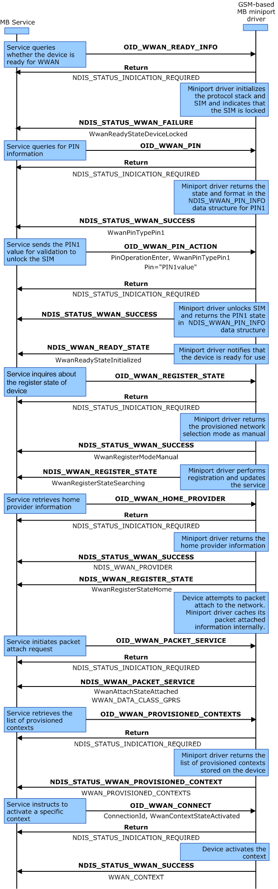

# Initialization of SIM-Locked GPRS Device with a User-Defined Context

The following diagram illustrates the scenario in which the user enters a SIM PIN and manually configures an access point name string. The labels in bold are OID identifiers or transactional flow control, and the labels in regular text are the important flags within the OID structure.

To initialize a GSM-based device with PIN1 locked, implement the following steps:

1.  The MB Service sends an asynchronous (non-blocking) [OID\_WWAN\_READY\_INFO](https://msdn.microsoft.com/library/windows/hardware/ff569833) query request to the miniport driver to identify the ready state of the device. The miniport driver responds with a provisional acknowledgment (NDIS\_STATUS\_INDICATION\_REQUIRED) that it has received the request, and that it will send a notification with the requested information in the future.

2.  The miniport driver sends an NDIS\_STATUS\_WWAN\_FAILURE notification to the MB Service to indicate to the MB Service that the subscriber identity module (SIM) is locked.

3.  The MB Service sends an asynchronous (non-blocking) [OID\_WWAN\_PIN](https://msdn.microsoft.com/library/windows/hardware/ff569828) query request to the miniport driver. The miniport driver responds with a provisional acknowledgment (NDIS\_STATUS\_INDICATION\_REQUIRED) that it has received the request, and that it will send a notification with the requested information in the future.

4.  The miniport driver sends an NDIS\_STATUS\_WWAN\_SUCCESS notification to the MB Service.

5.  The MB Service sends an asynchronous (non-blocking) [OID\_WWAN\_PIN](https://msdn.microsoft.com/library/windows/hardware/ff569828) set request to the miniport driver. The miniport driver responds with a provisional acknowledgment (NDIS\_STATUS\_INDICATION\_REQUIRED) that it has received the request, and that it will send a notification with the requested information in the future.

6.  The miniport driver sends an NDIS\_STATUS\_WWAN\_SUCCESS notification to the MB Service.

7.  The miniport driver sends an [**NDIS\_STATUS\_WWAN\_READY\_INFO**](https://msdn.microsoft.com/library/windows/hardware/ff567856) notification to the MB Service that indicates to the MB Service that the state of the MB device is **WwanReadyStateInitialized**.

8.  The MB Service sends an asynchronous (non-blocking) [OID\_WWAN\_REGISTER\_STATE](https://msdn.microsoft.com/library/windows/hardware/ff569834) query request to the miniport driver. The miniport driver responds with a provisional acknowledgment (NDIS\_STATUS\_INDICATION\_REQUIRED) that it has received the request, and it will send a notification with the requested information in the future.

9.  The miniport driver sends an NDIS\_STATUS\_WWAN\_SUCCESS notification to the MB Service.

10. The miniport driver sends an [**NDIS\_STATUS\_WWAN\_REGISTER\_STATE**](https://msdn.microsoft.com/library/windows/hardware/ff567857) notification to the MB Service.

11. The MB Service sends an asynchronous (non-blocking) [OID\_WWAN\_HOME\_PROVIDER](https://msdn.microsoft.com/library/windows/hardware/ff569826) query request to the miniport driver. The miniport driver responds with a provisional acknowledgment (NDIS\_STATUS\_INDICATION\_REQUIRED) that it has received the request, and it will send a notification with the requested information in the future.

12. The miniport driver sends an NDIS\_STATUS\_WWAN\_SUCCESS notification to the MB Service.

13. The miniport driver sends an [**NDIS\_STATUS\_WWAN\_REGISTER\_STATE**](https://msdn.microsoft.com/library/windows/hardware/ff567857) notification to the MB Service.

14. The MB Service sends an asynchronous (non-blocking) [OID\_WWAN\_PACKET\_SERVICE](https://msdn.microsoft.com/library/windows/hardware/ff569827) request to the miniport driver. The miniport driver responds with a provisional acknowledgment (NDIS\_STATUS\_INDICATION\_REQUIRED) that it has received the request, and that it will send a notification with the requested information in the future.

15. The miniport driver sends an [**NDIS\_STATUS\_WWAN\_PACKET\_SERVICE**](https://msdn.microsoft.com/library/windows/hardware/ff567850) notification to the MB Service.

16. The MB Service sends an asynchronous (non-blocking) [OID\_WWAN\_PROVISIONED\_CONTEXTS](https://msdn.microsoft.com/library/windows/hardware/ff569831) query request to the miniport driver. The miniport driver responds with a provisional acknowledgment (NDIS\_STATUS\_INDICATION\_REQUIRED) that it has received the request, and it will send a notification with the requested information in the future.

17. The miniport driver sends [**NDIS\_STATUS\_WWAN\_PROVISIONED\_CONTEXTS**](https://msdn.microsoft.com/library/windows/hardware/ff567854) to the MB Service.

18. The MB Service sends an asynchronous (non-blocking) [OID\_WWAN\_PROVISIONED\_CONTEXTS](https://msdn.microsoft.com/library/windows/hardware/ff569831) set request to the MB Service. The miniport driver responds with a provisional acknowledgment (NDIS\_STATUS\_INDICATION\_REQUIRED) that it has received the request, and it will send a notification with the requested information in the future.

19. The miniport driver sends NDIS\_STATUS\_WWAN\_SUCCESS to the MB Service.

 

 

