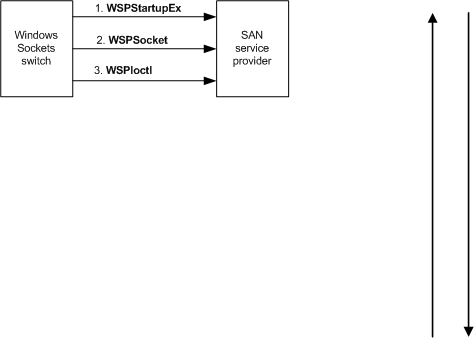

# Initializing a SAN Service Provider

The Windows Sockets switch initializes a SAN service provider as described in the following figure.

After Windows loads the Windows Sockets switch DLL into an application's process, the following sequence of events occur.

**To initialize a SAN service provider**

1.  The switch detects and loads the TCP/IP provider and then queries the list of SAN service providers in the registry to detect all of those providers, as described in [Installing a SAN Service Provider](installing-a-san-service-provider.md). The switch calls each detected provider's [**WSPStartupEx**](https://msdn.microsoft.com/library/windows/hardware/ff566321) function to initiate use of that provider.

2.  In the **WSPStartupEx** call, the switch passes a pointer to a [**WSAPROTOCOL\_INFOW**](https://msdn.microsoft.com/library/windows/hardware/ff565963) structure that contains the TCP/IP provider's protocol information. The TCP/IP provider's protocol indicates to the SAN service provider that it has been initialized by the switch rather than by other layered service providers or the Windows Sockets interface. The switch passes the TCP/IP provider's protocol information instead of the SAN service provider's transport information, as suggested in the Windows Sockets service provider Interface (SPI) section of the Microsoft Windows SDK documentation.

    Because a SAN service provider can detect that it is initialized by the switch, it can expose the appropriate set of entry-point functions to the switch. If the SAN service provider is initialized directly by an application, it can expose another set of entry-point functions to that application. If a SAN service provider is layered under the switch, that provider must adhere to the extensions and behavior described in this section.

3.  A SAN service provider's proxy driver obtains the list of IP addresses assigned to each NIC under its control as described in [Registering for SAN NIC Notifications](registering-for-san-nic-notifications.md). The SAN service provider uses a private interface to retrieve this list from its proxy driver. The switch calls a SAN service provider's [**WSPSocket**](https://msdn.microsoft.com/library/windows/hardware/ff566319) function to create a socket. The switch uses this socket to retrieve the complete list of IP addresses assigned to the NICs under control of the SAN service provider's proxy driver. The switch retrieves this list as described in [Receiving and Translating NIC Addresses](receiving-and-translating-nic-addresses.md). Based on this list and the lists of other SAN service providers, the switch builds a table that maps local IP subnets to SAN service providers.

4.  The Windows Sockets switch must retrieve pointers to the SAN service provider's entry-point functions that extend Windows Sockets service provider Interface (SPI) for use with SANs. To retrieve each of these extended functions, the Windows Sockets switch calls a SAN service provider's [**WSPIoctl**](https://msdn.microsoft.com/library/windows/hardware/ff566296) function and passes the SIO\_GET\_EXTENSION\_FUNCTION\_POINTER command code along with the GUID whose value identifies one of these extended functions.

    For a complete description of these functions, see [Windows Sockets SPI Extensions for SANs](windows-sockets-spi-extensions-for-sans.md).

5.  The switch can create threads to support listening sockets as well as nonblocking connect requests, as described in [Setting Up a SAN Connection](setting-up-a-san-connection.md).

 

 

