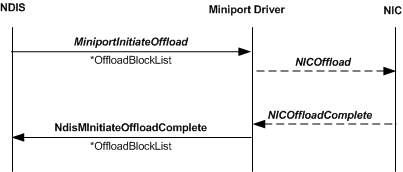

# Initiate Offload Call Sequence

\[The TCP chimney offload feature is deprecated and should not be used.\]

From the perspective of an offload target, an offload of TCP chimney state is initiated when NDIS calls the offload target's [*MiniportInitiateOffload*](https://msdn.microsoft.com/library/windows/hardware/ff559393) function. The *MiniportInitiateOffload* function inputs the following parameters:

-   A handle in *MiniportAdapterContext* that references the adapter instance.

-   A pointer in *OffloadBlockList* that points to an [**NDIS\_MINIPORT\_OFFLOAD\_BLOCK\_LIST**](https://msdn.microsoft.com/library/windows/hardware/ff566469) structure. This structure can be a stand-alone structure or the root node of a linked list of NDIS\_MINIPORT\_OFFLOAD\_BLOCK\_LIST structures that form an [offload state tree](offload-state-tree.md).

The [*MiniportInitiateOffload*](https://msdn.microsoft.com/library/windows/hardware/ff559393) function stores the pointer in *OffloadBlockList* and then returns. The offload target always completes the offload operation asynchronously by calling [**NdisMInitiateOffloadComplete**](https://msdn.microsoft.com/library/windows/hardware/ff563604).

The following figure shows the initiate offload call sequence.

The offload target's internal offload function, which is labeled "NicOffload" in the preceding figure, offloads the state from the state tree that is pointed to by the pointer that is in *OffloadBlockList* . After the internal offload is complete, the offload target writes a completion status to each NDIS\_MINIPORT\_OFFLOAD\_BLOCK\_LIST structure in the state tree and calls the **NdisMInitiateOffloadComplete** function, passing the pointer in *OffloadBlockList* back to the host stack.

 

 

