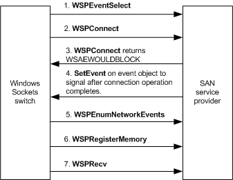

# Initiating a Connection

After the Windows Sockets switch receives a **WSPConnect** call that was initiated by an application, the switch compares the destination address of the connect request with addresses in the switch's table of IP subnets that SAN service providers serve. If one of those subnets includes this destination address, the switch calls the [**WSPSocket**](https://msdn.microsoft.com/library/windows/hardware/ff566319) and [**WSPBind**](https://msdn.microsoft.com/library/windows/hardware/ff566268) functions of the corresponding SAN service provider to create and bind a socket, as described in [Creating and Binding SAN Sockets](creating-and-binding-san-sockets.md). The switch processes the application's connect request using the SAN socket. If the destination address of the connect request is not on a SAN subnet, or if the SAN service provider fails to create and bind a socket, the switch uses the TCP/IP provider to establish the connection.

The following figure shows an overview of how the Windows Sockets switch requests a connection with a remote peer. The sequence and sections that follow describe the connection request in more detail.

After creating and binding the SAN socket, the switch executes a connect request, using the SAN socket in *nonblocking mode*, as described in the following procedure.

**To execute a connect request**

1.  The switch calls the SAN service provider's [**WSPEventSelect**](https://msdn.microsoft.com/library/windows/hardware/ff566287) function. In this call, the switch passes the FD\_CONNECT code and the event object to be associated with that code. The call to **WSPEventSelect** requests notification of connection events and informs the SAN service provider that any subsequent [**WSPConnect**](https://msdn.microsoft.com/library/windows/hardware/ff566275) call executes in nonblocking mode.

2.  After the **WSPEventSelect** function returns, the switch calls the SAN service provider's **WSPConnect** function. In this call, the switch passes the destination address in the format of one of the [WSK address families](https://msdn.microsoft.com/library/windows/hardware/ff571151). The SAN service provider's proxy driver maps this destination address to a native address and attempts to establish the connection.

3.  If the SAN service provider's **WSPConnect** function can complete or fail the connection operation immediately, it returns the appropriate success or failure code. If the SAN service provider's **WSPConnect** function cannot complete a connection request immediately, the SAN service provider's connection operation proceeds asynchronously in another thread. The SAN service provider's **WSPConnect** function returns with the error WSAEWOULDBLOCK to indicate that the socket is marked as nonblocking and that the connection operation cannot be completed immediately.

4.  After the connection operation completes, the SAN service provider calls the Win32 **SetEvent** function to signal the event object that was previously registered in the **WSPEventSelect** call.

5.  After the event object is signaled, the switch calls the SAN service provider's [**WSPEnumNetworkEvents**](https://msdn.microsoft.com/library/windows/hardware/ff566284) function to obtain the result of the connection operation.

**Note**  
After the switch establishes a connection through a SAN service provider, the switch can no longer use the TCP/IP provider for that connection. SAN service providers must fully implement all functionality required to service an established connection.

 

### Destroying the SAN Socket

If the SAN service provider's **WSPConnect** function fails, the switch calls the SAN service provider's [**WSPCloseSocket**](https://msdn.microsoft.com/library/windows/hardware/ff566273) function to destroy the SAN socket. The switch then calls the TCP/IP service provider's **WSPConnect** function to forward the connection operation to the TCP/IP service provider unless the SAN service provider returned one of the following error codes as the result of its connection operation:

**WSAECONNRESET**  
Indicates that no application is listening on the specified port at the destination address

**WSAECONNREFUSED**  
Indicates that the remote application actively refused the connection request

**WSAEHOSTUNREACH**  
Indicates that the destination address does not exist

These preceding error codes guarantee that an attempt to establish the connection through TCP/IP will also fail. A SAN service provider must not return one of these error codes if it cannot make that guarantee. For example, if a target computer that does not support Windows Sockets Direct exists on the SAN but can only communicate through NDIS, the SAN service provider cannot return WSAEHOSTUNREACH as the result of a failed SAN connection request to this target because a connection request through the TCP/IP provider might succeed. In this case, the SAN service provider should return WSAETIMEDOUT.

### Session Negotiation

After the switch establishes a connection through a SAN service provider, the switch calls the SAN service provider's [**WSPRegisterMemory**](https://msdn.microsoft.com/library/windows/hardware/ff566311) extension function to preregister the memory for the buffer array that is to receive incoming messages. The switch next calls the SAN service provider's [**WSPRecv**](https://msdn.microsoft.com/library/windows/hardware/ff566309) function to post one or more buffers to receive incoming message data from the remote peer. The switch then negotiates a session with its remote peer by exchanging a pair of messages that contain initial flow control information. After the switch negotiates a session, it completes the **WSPConnect** call that the application initiated. The application can then begin sending and receiving data on the connection. For more information, see [Accepting Connection Requests](accepting-connection-requests.md).

After a connection is established over a SAN socket, the switch does not call the SAN service provider's **WSPConnect** function. The switch internally handles applications that initiate a call to the switch's **WSPConnect** function to poll for connection requests.

 

 

