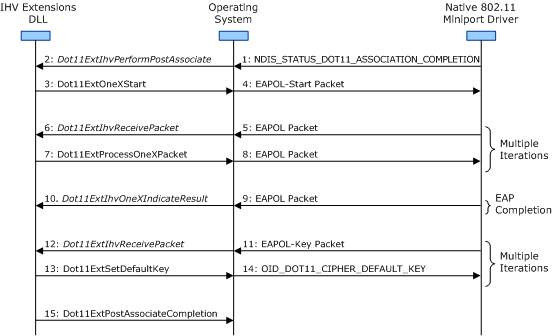

# Interface to the Native 802.11 802.1X Module

 

After the operating system receives an NDIS\_STATUS\_DOT11\_ASSOCIATION\_COMPLETION indication from the Native 802.11 miniport driver, it calls the [*Dot11ExtIhvPerformPostAssociate*](/windows-hardware/drivers/ddi/wlanihv/nc-wlanihv-dot11extihv_perform_post_associate) function to initiate a post-association operation by the IHV Extensions DLL.

While it performs the post-association operation or after the operation has completed, the IHV Extensions DLL can use the extensible authentication protocol (EAP) algorithms that are supported by the operating system to authenticate the user with the access point (AP). In this situation, the IHV Extensions DLL interfaces with the 802.1X module of the Native 802.11 framework for the processing of EAP packets that are sent by the AP in the EAP over LAN (EAPOL) format.

For more information about the EAPOL format, refer to Clause 7 of the IEEE 802.1X-2001 standard.

For more information about the 802.1X module and the Native 802.11 framework, see [Native 802.11 Software Architecture](/previous-versions/windows/hardware/wireless/native-802-11-software-architecture).

When interfacing the 802.1X module for user authentication, the IHV Extensions DLL must follow these guidelines:

-   For Windows Vista, the IHV Extensions DLL can initiate 802.1X authentication operations through the 802.1X module only for infrastructure basic service set (BSS) network connections.

-   The IHV Extensions DLL must register with the operating system to receive EAPOL packets. In this situation, the DLL must call the [**Dot11ExtSetEtherTypeHandling**](/windows-hardware/drivers/ddi/wlanihv/nc-wlanihv-dot11ext_set_ethertype_handling) function and add the IEEE EAPOL EtherType (0x888E) to the list of registered EtherTypes that are passed in through the *pusRegistration* parameter. After the EtherType is registered, the operating system forwards received EAPOL packets to the IHV Extensions DLL through calls to the [*Dot11ExtIhvReceivePacket*](/windows-hardware/drivers/ddi/wlanihv/nc-wlanihv-dot11extihv_receive_packet) IHV Handler function.

    For more information about registering EtherTypes, see [IEEE EtherType Handling](ieee-ethertype-handling.md).

-   While it is performing the post-association operation, the IHV Extensions DLL initiates the 802.1X authentication operation by calling the [**Dot11ExtStartOneX**](/windows-hardware/drivers/ddi/wlanihv/nc-wlanihv-dot11ext_onex_start) function. When this function is called, the operating system does the following:

    -   Display the properties page for the configuration of the 802.1X authentication. This information includes the EAP algorithm used for the authentication.
    -   Prompt the user for credentials.
    -   Send an EAPOL-Start packet to the AP to initiate the 802.1X authentication.

    The IHV Extensions DLL can call **Dot11ExtStartOneX** either within the call to [*Dot11ExtIhvPerformPostAssociate*](/windows-hardware/drivers/ddi/wlanihv/nc-wlanihv-dot11extihv_perform_post_associate) or after the function call returns.

-   The IHV Extensions DLL can call the [**Dot11ExtStartOneX**](/windows-hardware/drivers/ddi/wlanihv/nc-wlanihv-dot11ext_onex_start) function only after the Native 802.11 miniport driver has completed an association operation with the AP. In this situation, the IHV Extensions DLL must not call the **Dot11ExtStartOneX** function under any of the following conditions:
    -   Before the operating system calls [*Dot11ExtIhvPerformPostAssociate*](/windows-hardware/drivers/ddi/wlanihv/nc-wlanihv-dot11extihv_perform_post_associate). The operating system calls this function after the miniport driver has successfully completed an association operation. For more information about this operation, see [Association Operations](/previous-versions/windows/hardware/wireless/association-operations).
    -   After the operating system calls [*Dot11ExtIhvStopPostAssociate*](/windows-hardware/drivers/ddi/wlanihv/nc-wlanihv-dot11extihv_stop_post_associate). The operating system calls this function after the miniport driver has completed a disassociation operation with the AP. For more information about this operation, see [Disassociation Operations](/previous-versions/windows/hardware/wireless/disassociation-operations).
    -   After the operating system calls [*Dot11ExtIhvAdapterReset*](/windows-hardware/drivers/ddi/wlanihv/nc-wlanihv-dot11extihv_adapter_reset). The operating system calls this function after the miniport driver has completed a disconnection operation with the basic service set (BSS) network. For more information about this operation, see [Disconnection Operations](/previous-versions/windows/hardware/wireless/disconnection-operations).
-   While the 802.1X authentication operation is in progress, the IHV Extensions DLL can cancel the operation by calling [**Dot11ExtStopOneX**](/windows-hardware/drivers/ddi/wlanihv/nc-wlanihv-dot11ext_onex_stop).

-   While the 802.1X authentication operation is in progress, the IHV Extensions DLL must call [**Dot11ExtProcessOneXPacket**](/windows-hardware/drivers/ddi/wlanihv/nc-wlanihv-dot11ext_process_onex_packet) to forward EAPOL packets to the operating system for processing.
    **Note**  The IHV Extensions DLL is responsible for processing EAPOL-Key packets received from the AP. The DLL must not pass these packets to the operating system through calls to [**Dot11ExtProcessOneXPacket**](/windows-hardware/drivers/ddi/wlanihv/nc-wlanihv-dot11ext_process_onex_packet).

     

-   When the 802.1X authentication operation completes, the operating system calls the [*Dot11ExtIhvOneXIndicateResult*](/windows-hardware/drivers/ddi/wlanihv/nc-wlanihv-dot11extihv_onex_indicate_result) IHV Handler function. After this function is called, the IHV Extensions DLL is responsible for processing all EAPOL packets received from the AP, such as the EAPOL-Key packets used for derivation of the cipher keys.

-   If the 802.1X authentication operation completed successfully, the operating system passes the MPPE-Send-Key value to the [**DOT11\_MSONEX\_RESULT\_PARAMS**](/windows-hardware/drivers/ddi/wlanihv/ns-wlanihv-_dot11_msonex_result_params) structure pointed to by the *pDot11MsOneXResultParams* parameter of [*Dot11ExtIhvOneXIndicateResult*](/windows-hardware/drivers/ddi/wlanihv/nc-wlanihv-dot11extihv_onex_indicate_result). The MPPE-Send-Key value pointed to by the **pbMPPESendKey** member of DOT11\_MSONEX\_RESULT\_PARAMS is derived through the authentication process and is used by the IHV Extensions DLL when sending EAPOL-Key packets to the AP. This key is encrypted and should be decrypted by calling the **CryptUnprotectData** function that is documented in the Windows SDK.

-   The algorithm that is used to derive the cipher keys is dependent upon the implementation of the independent hardware vendor (IHV). The IHV Extensions DLL can support standard key derivation algorithms, such as the algorithm defined in Clause 8.5 of the IEEE 802.11i-2004 standard, as well as it can support a proprietary key derivation algorithm.

-   After it derives the keys, the IHV Extensions DLL can call the following functions to download the cipher keys to the Native 802.11 miniport driver, which manages the wireless LAN (WLAN) adapter.

    -   [**Dot11ExtSetDefaultKey**](/windows-hardware/drivers/ddi/wlanihv/nc-wlanihv-dot11ext_set_default_key)

    -   [**Dot11ExtSetDefaultKeyId**](/windows-hardware/drivers/ddi/wlanihv/nc-wlanihv-dot11ext_set_default_key_id)

    -   [**Dot11ExtSetKeyMappingKey**](/windows-hardware/drivers/ddi/wlanihv/nc-wlanihv-dot11ext_set_key_mapping_key)

-   The IHV Extensions DLL completes the post-association operation by calling the [**Dot11ExtPostAssociateCompletion**](/windows-hardware/drivers/ddi/wlanihv/nc-wlanihv-dot11ext_post_associate_completion) function. After the post-association operation completes, the IHV Extensions DLL can initiate another 802.1X authentication operation if the DLL determines that the user must be reauthenticated.

The following figure shows the sequence of events when the IHV Extensions DLL initiates an 802.1X authentication operation during a post-association operation.

 

 
