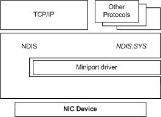
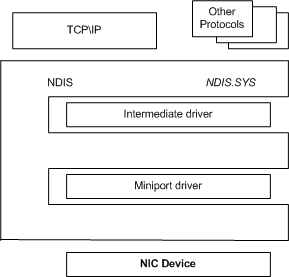
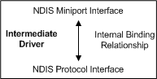

# Introduction to NDIS Intermediate Drivers

NDIS driver stacks must include miniport drivers and protocol drivers and can also include intermediate drivers. Because intermediate drivers are optional, you must understand the relationships between miniport drivers, protocol drivers, and NDIS before addressing intermediate drivers.

Miniport drivers control NIC devices and communicate with the lower edge of protocol drivers. Protocol drivers implement protocols, such as TCP/IP, and are above the miniport drivers in the driver stack. NDIS provides services to simplify development and maintenance of miniport drivers and protocol drivers.

The relationships between miniport drivers, protocol drivers, and NDIS are illustrated in the following figure.

NDIS miniport drivers and protocol drivers are bound together through standard NDIS interfaces.

NDIS intermediate drivers include a protocol driver interface at their upper edge and a miniport driver interface at their lower edge. The intermediate driver's protocol interface allows it to load above a driver with a miniport driver interface. Therefore, intermediate drivers can load above miniport drivers or other intermediate drivers. The intermediate driver's miniport interface allows it to load below a driver with a protocol lower edge interface. Therefore, intermediate drivers can load below protocol drivers or below other intermediate drivers.

The relationships between miniport drivers, protocol drivers, intermediate drivers, and NDIS are illustrated in the following figure.

The intermediate driver miniport interface is called a virtual miniport. It is virtual in that it does not control a physical device directly. Instead, it relies on an underlying miniport driver to communicate with the physical device.

Bindings between the intermediate driver and other drivers are called external bindings. NDIS controls external bindings. The upper edge of the virtual miniport binds with the next-higher driver, which can be a protocol driver or another intermediate driver. The lower edge of the intermediate driver protocol binds to the next lower driver, which can be another intermediate driver or an underlying miniport driver.

The lower edge of the virtual miniport and the upper edge of the intermediate driver protocol do not require external bindings. Instead, the intermediate driver binds its virtual miniport and its protocol internally. These internal bindings, which are implementation specific, are not controlled by NDIS.

The following figure illustrates the internal bindings between the virtual miniport and the intermediate driver protocol.

There are two types of NDIS intermediate drivers: filter intermediate drivers and MUX intermediate drivers. The following topics describe these driver types:

[NDIS Filter Intermediate Drivers](ndis-filter-intermediate-drivers.md)

[NDIS MUX Intermediate Drivers](ndis-mux-intermediate-drivers.md)

 

 

