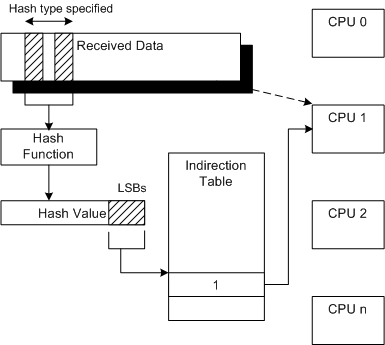
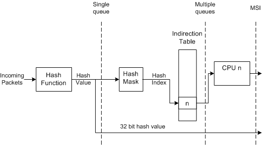

# Introduction to Receive Side Scaling

Receive side scaling (RSS) is a network driver technology that enables the efficient distribution of network receive processing across multiple CPUs in multiprocessor systems.

**Note**  Because hyper-threaded CPUs on the same core processor share the same execution engine, the effect is not the same as having multiple core processors. For this reason, RSS does not use hyper-threaded processors.

 

To process received data efficiently, a miniport driver's receive interrupt service function schedules a deferred procedure call (DPC). Without RSS, a typical DPC indicates all received data within the DPC call. Therefore, all of the receive processing that is associated with the interrupt runs on the CPU where the receive interrupt occurs. For an overview of non-RSS receive processing, see [Non-RSS Receive Processing](non-rss-receive-processing.md).

With RSS, the NIC and miniport driver provide the ability to schedule receive DPCs on other processors. Also, the RSS design ensures that the processing that is associated with a given connection stays on an assigned CPU. The NIC implements a hash function and the resulting hash value provides the means to select a CPU.

The following figure illustrates the RSS mechanism for determining a CPU.

A NIC uses a hashing function to compute a hash value over a defined area (hash type) within the received network data. The defined area can be noncontiguous.

A number of least significant bits (LSBs) of the hash value are used to index an indirection table. The values in the indirection table are used to assign the received data to a CPU. For more detailed information about the indirection table, see [RSS Configuration](rss-configuration.md).

With message signaled interrupt (MSI) support, a NIC can also interrupt the associated CPU. For more information about NDIS support for MSIs, see [NDIS MSI-X](ndis-msi-x.md).

RSS can improve network system performance by reducing:

-   Processing delays by distributing receive processing from a NIC across multiple CPUs.

    This helps to ensure that no CPU is heavily loaded while another CPU is idle.

-   Spin lock overhead by increasing the probability that software algorithms that share data execute on the same CPU.

    Spin lock overhead occurs, for example, when a function executing on CPU0 possesses a spin lock on data that a function running on CPU1 must access. CPU1 spins (waits) until CPU0 releases the lock.

-   Reloading of caches and other resources by increasing the probability that software algorithms that share data execute on the same CPU.

    Such reloading occurs, for example, when a function that is executing and accessing shared data on CPU0, executes on CPU1 in a subsequent interrupt.

To achieve these performance improvements in a secure environment, RSS provides the following mechanisms:

-   Distributed processing

    RSS distributes the processing of receive indications from a given NIC in DPCs to multiple CPUs.

-   In-order processing

    RSS preserves the order of delivery of received data packets. For each network connection, RSS processes receive indications on an associated CPU. For more information about RSS receive processing, see [Indicating RSS Receive Data](indicating-rss-receive-data.md).

-   Dynamic load balancing

    RSS provides a means to rebalance the network processing load between CPUs as host system load varies. To rebalance the load, overlying drivers can change the indirection table. For more information about specifying indirection tables, hash types, and hashing functions, see [RSS Configuration](rss-configuration.md).

-   Send-side scaling

    RSS enables driver stacks to process send and receive-side data for a given connection on the same CPU. Typically, an overlying driver (for example, TCP) sends part of a data block and waits for an acknowledgment before sending the balance of the data. The acknowledgment then triggers subsequent send requests. The RSS indirection table identifies a particular CPU for the receive data processing. By default, the send processing runs on the same CPU if it is triggered by the receive acknowledgment. A driver can also specify the CPU (for example, if a timer is used).

-   Secure hash

    RSS includes a signature that provides added security. This signature protects the system from malicious remote hosts that might attempt to force the system into an unbalanced state.

-   MSI-X support

    RSS, with support for MSI-X, runs the interrupt service routine (ISR) on the same CPU that later executes the DPC. This reduces spin lock overhead and reloading of caches.

The following figure illustrates the levels of hardware support for RSS.

There are three possible levels of hardware support for RSS:

Hash calculation with a single queue  
The NIC calculates the hash value and the miniport driver assigns received packets to queues that are associated with CPUs. For more information, see [RSS with a Single Hardware Receive Queue](rss-with-a-single-hardware-receive-queue.md).

Hash calculation with multiple receive queues  
The NIC assigns the received data buffers to queues that are associated with CPUs. For more information, see [RSS with Hardware Queuing](rss-with-hardware-queuing.md).

Message Signaled Interrupts (MSIs)  
The NIC interrupts the CPU that should handle the received packets. For more information, see [RSS with Message Signaled Interrupts](rss-with-message-signaled-interrupts.md).

The NIC always passes on the 32-bit hash value.

 

 

