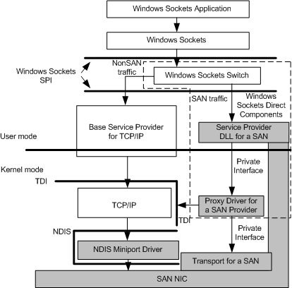

# Introduction to System Area Networks

A *system area network (SAN)* is a high-performance, connection-oriented network that can link a cluster of computers. A SAN delivers high bandwidth (1 Gbps or greater) with low latency. A SAN is typically switched by hubs that support eight or more nodes. The cable lengths between nodes on a SAN range from a few meters to a few kilometers.

Unlike existing network technologies such as Ethernet and ATM, a SAN offers a reliable transport service; that is, a SAN guarantees to deliver uncorrupted data in the same order in which it was sent. Connection endpoints in a SAN are not required to use the TCP/IP protocol stack to transfer data unless traffic must be routed between subnets. SAN-local communication can use a native SAN transport, bypassing the TCP/IP protocol stack.

A SAN network interface controller (NIC), a transport driver for the SAN NIC, or a combination of both exposes a private transport interface. However, because most networking applications are written to use TCP/IP through Windows Sockets, they cannot use a SAN directly. The [Windows Sockets Direct](windows-sockets-direct.md) components shown in the following figure let these applications benefit from using a SAN transparently without requiring modification. Windows Sockets Direct is part of:

-   Microsoft Windows 2000 Datacenter Server

-   Microsoft Windows 2000 Advanced Server SP2

-   Microsoft Windows 2000 Server Appliance Kit SP2

-   Microsoft Windows Server 2003

The following figure shows the architecture required to support a SAN. The shaded areas represent components that a SAN NIC vendor supplies to enable using a SAN.

The following is a description of the components shown in this figure.

**Windows Sockets application**   
Application that interfaces with Windows Sockets for network services.

**Windows Sockets**   
The Windows Sockets interface (Ws2\_32.dll).

**Windows Sockets SPI**   
The Windows Sockets service provider interface (SPI).

**Windows Sockets switch**  
The Windows Sockets switches between use of the standard TCP/IP service provider and particular SAN service providers.

**TCP/IP service provider**  
A user-mode DLL and associated kernel-mode proxy driver that comprise the standard base Windows Sockets service provider for TCP/IP. The proxy driver exposes a TDI interface.

**TCP/IP**  
The standard TCP/IP protocol driver.

**SAN service provider**  
The user-mode DLL portion of the SAN service provider.

**Proxy driver for a SAN service provider**  
The kernel-mode proxy driver of the SAN service provider.

**NDIS miniport driver**  
The NDIS miniport driver that supports communication to the SAN NIC using the standard TCP/IP protocol driver.

**SAN transport**  
A reliable transport service, which can be fully implemented in the NIC, fully implemented in software, or implemented in a combination of both hardware and software.

**SAN NIC**  
The physical SAN network interface controller (NIC).

  
A kernel-mode provider for a particular SAN. (Reserved for future use.)

 

 

