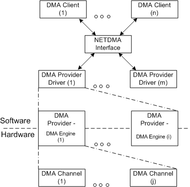

# Introduction to the NetDMA Interface

**Note**  The NetDMA interface is not supported in Windows 8 and later.

 

The NetDMA interface provides generic access to direct memory access (DMA) engines that can perform memory-to-memory data transfers with little CPU involvement.

To fully use the theoretical bandwidth of high-performance NICs, you need to reduce the amount of CPU processing for network traffic. Copying data from NIC receive buffers into application buffers requires substantial CPU processing.

If you use a DMA engine to transfer data from one memory location to another, the CPU can perform other tasks while the DMA engine transfers the data. The NetDMA interface is designed to limit the amount of CPU processing that is associated with configuring the DMA engine and managing DMA transfers at run time. To enable client applications to complete many DMA transfers with a single request, the NetDMA interface allows client applications to specify a linked list of DMA descriptors in DMA copy requests.

The NetDMA interface helps to give you design freedom when you implement DMA engines. NetDMA client applications use the same software interface, regardless of the underlying DMA hardware. The NetDMA interface leaves the programming of hardware to the NetDMA provider drivers.

The following figure shows the NetDMA architecture.

The following list defines the components that appear in the preceding figure:

DMA channel  
A DMA channel manages the operations on a set of DMA descriptors. DMA channels cannot be shared among multiple DMA clients. Each DMA channel should have a set of control and status registers that can be used independently from other DMA channels. The number of DMA channels that a DMA engine supports is limited only by the hardware.

DMA engine  
The hardware that performs memory-to-memory DMA transfers. A DMA engine must be able to support a linked list of DMA descriptors and the associated DMA operations, including DMA start, append, suspend, resume and abort, and so on. Every DMA engine is associated with a physical device object (PDO) that the PCI bus enumerates. Each DMA engine includes at least one DMA channel. The NetDMA interface does not define specific requirements for the register set in the hardware or the commands that a driver uses to program the DMA engine.

DMA provider  
A logical representation of the software and hardware that are associated with a single DMA engine. A NetDMA provider abstracts the actual hardware implementation of the DMA engine and provides the logical connection for a DMA engine's services to a client application. A single NetDMA provider driver can manage multiple NetDMA providers.

DMA provider driver  
A kernel-mode Microsoft Windows Driver Model (WDM) device driver that manages NetDMA providers. The characteristics of the NetDMA providers that the NetDMA provider driver manages do not have to be the same. Multiple NetDMA provider drivers can coexist in the system that the NetDMA interface manages.

NetDMA interface  
A kernel-mode interface that is implemented as a kernel-mode export driver. The NetDMA interface provides:

-   A generic interface for NetDMA provider drivers to register NetDMA provider services.

-   A generic interface for DMA clients to find and use the NetDMA provider services.

DMA.client  
A kernel mode driver, such as the TCP/IP protocol ( Tcpip.sys), that uses the NetDMA memory-to-memory DMA services of a NetDMA provider. DMA clients access NetDMA providers through the NetDMA interface. Multiple DMA clients can coexist in the driver set that the NetDMA interface manages.

 

 

