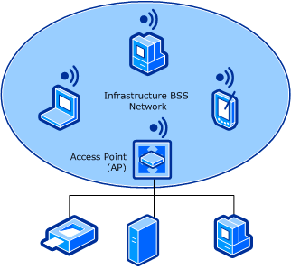

# Introduction to Wireless LAN Networks

**Important**  The [Native 802.11 Wireless LAN](native-802-11-wireless-lan4.md) interface is deprecated in Windows 10 and later. Please use the WLAN Device Driver Interface (WDI) instead. For more information about WDI, see [WLAN Universal Windows driver model](wifi-universal-driver-model.md).

 

A wireless LAN (WLAN) provides network connectivity between devices, also known as stations, by using radio as the communication medium. Devices that communicate over the WLAN conform to the interfaces and procedures defined through the IEEE 802.11 standards. For more information about these standards, see [Background Reading on 802.11](background-reading-on-802-11.md).

The basic building block of the WLAN network is the 802.11 basic service set (BSS). A BSS defines a coverage area where all stations within the BSS remain fully connected.

There are two BSS network topologies:

**Infrastructure BSS Networks**   
In this topology, all stations within the BSS communicate with each other through an access point (AP). In this situation, the AP establishes the BSS network. In addition, an infrastructure BSS can consist of more than one interconnected APs that establishes an extended service set (ESS) network.

Each AP within the BSS network provides 802.11 authentication and authorization services for access to the BSS network, as well as privacy services for the encryption of data sent through the BSS network.

In addition, each AP can act as a bridge between the wireless and wired LANs, allowing stations on either LAN to communicate with each other.

The following figure shows the infrastructure BSS network topology.

**Independent BSS (IBSS) Networks**   
In this topology, all stations within the BSS communicate directly with each other. In this situation, one station creates, or starts, the BSS network and other stations join the BSS network

IBSS networks, which are also known as "ad hoc" networks, provide limited support for 802.11 authentication, authorization, and privacy services for the BSS network.

The following figure shows the independent BSS network topology.

 

 

