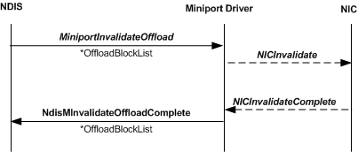

# Invalidate Offload Sequence

\[The TCP chimney offload feature is deprecated and should not be used.\]

When the host stack sends an invalidate offload request to NDIS, NDIS calls the offload target's [**MiniportInvalidateOffload**](https://msdn.microsoft.com/library/windows/hardware/ff559406) function. The *MiniportInvalidateOffload* function inputs the following parameters:

-   A handle in the *MiniportAdapterContext* parameter that references the adapter instance.

-   A pointer in the *OffloadBlockList* parameter that points to an [**NDIS\_MINIPORT\_OFFLOAD\_BLOCK\_LIST**](https://msdn.microsoft.com/library/windows/hardware/ff566469) structure. This structure can be stand-alone or the root of a linked list of NDIS\_MINIPORT\_OFFLOAD\_BLOCK\_LIST structures that form the framework of an [offload state tree](offload-state-tree.md).

The *MiniportInvalidateOffload* function stores the pointer that is in *OffloadBlockList* and then returns. The offload target always completes the invalidate operation asynchronously by calling the [**NdisMInvalidateOffloadComplete**](https://msdn.microsoft.com/library/windows/hardware/ff563609) function.

The following figure shows the invalidate offload call sequence.

Note that the tree that is passed to the *MiniportInvalidateOffload* function contains only NDIS\_MINIPORT\_OFFLOAD\_BLOCK\_LIST structures. The tree does not contain any [offload state structures](offload-state-structures.md). That is, there are no such structures following the NDIS\_MINIPORT\_OFFLOAD\_BLOCK\_LIST structures in memory.

The NDIS\_MINIPORT\_OFFLOAD\_BLOCK\_LIST structures in the tree indicate the state to be invalidated. A non-NULL value in the **MiniportOffloadContext** member points to a memory location that contains a PVOID value that was supplied by the offload target when the state was offloaded. (For more information about the **MiniportOffloadContext** member, see [Storing and Referencing Offloaded State](storing-and-referencing-offloaded-state.md).) This PVOID value references the miniport offload context in which the offload target stores the state to be invalidated.

 

 

