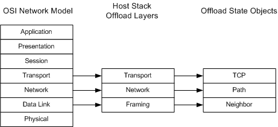

# Layers of Offload State

\[The TCP chimney offload feature is deprecated and should not be used.\]

As the following figure shows, the host stack offloads three layers of protocol state to an offload target.

Neighbor state  
The neighbor state is supplied by the framing layer (OSI layer 2) of the host stack. This state contains the destination medium access control (MAC) address of the next hop (neighbor) and information that the offload target uses to maintain the neighbor state.

Path state  
The path state is supplied by the network layer (OSI layer 3) of the host stack. This state is essentially a route (destination) cache entry that contains the source and destination IP addresses of an Internet path and the path maximum transmission unit (MTU).

TCP connection state  
The TCP state is supplied by the transport layer (OSI layer 4) of the host stack. This state contains all of the necessary TCP parameters for a specific TCP connection.

 

 

