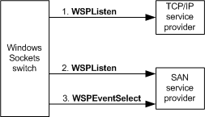

# Listening for Connections on a SAN

The following figure shows an overview of how the Windows Sockets switch sets a SAN socket to acknowledge and queue--that is, listen for--incoming connection requests from a remote peer. The topics that follow describe the listening process in more detail.

When the Windows Sockets switch receives a **WSPListen** call that was initiated by an application, the switch always calls the TCP/IP provider's **WSPListen** function first to set the TCP/IP provider's socket to acknowledge and queue incoming connection requests. If the application's socket is bound to the IP address of a SAN NIC or to the wildcard IP address, the switch also uses the appropriate SAN service provider to create and bind an additional socket. For more information, see [Creating and Binding SAN Sockets](creating-and-binding-san-sockets.md).

### Listening for Incoming Connection Requests

After requesting a SAN service provider to create and bind the SAN socket, the switch calls the [**WSPListen**](https://msdn.microsoft.com/library/windows/hardware/ff566297) function of the SAN service provider to cause the SAN socket to listen for incoming connections and to specify a limit on the number of incoming connection requests that the SAN service provider can queue.

### Setting Up to Accept Incoming Connections

The switch accepts incoming connections only in nonblocking mode. The switch calls the SAN service provider's [**WSPEventSelect**](https://msdn.microsoft.com/library/windows/hardware/ff566287) function to put a socket in nonblocking mode and to request notification of incoming connection events. In this call, the switch passes the FD\_ACCEPT code and the event object to be associated with that code. After the SAN service provider receives a connection request on its socket that was previously established for listening, the SAN service provider calls the Win32 **SetEvent** function to signal the associated event object. The switch listens for incoming connection events in a dedicated thread and accepts or rejects the connection after the event object is signaled. For more information, see [Accepting Connection Requests](accepting-connection-requests.md).

### Indicating Refusal of a Connection Request to a Remote Peer

If a connection request arrives and the SAN service provider's backlog of connection requests is full, the SAN service provider should immediately indicate to the remote peer that it refuses the connection request. In this case, the SAN service provider does not signal the event object to inform the switch to accept or reject the connection request. The SAN service provider on the remote peer must then fail its connection operation that was initiated by a **WSPConnect** call with the WSAECONNREFUSED error code.

 

 

