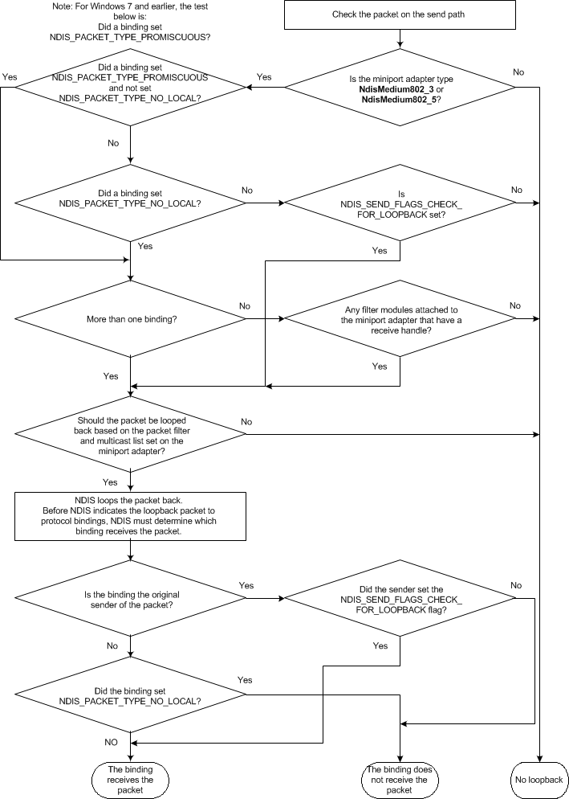

# Looping Back NDIS Packets

If the NDIS\_NBL\_FLAGS\_IS\_LOOPBACK\_PACKET flag in the **NblFlags** member of the [**NET\_BUFFER\_LIST**](https://msdn.microsoft.com/library/windows/hardware/ff568388) structure is set, the packet is a loopback packet. Protocol drivers and filter drivers can check this flag to determine if a packet is a loopback packet.

NDIS loops packets back if all of the following three conditions are satisfied:

1.  The underlying miniport adapter media type is **NdisMedium802\_3** or **NdisMedium802\_5**.

2.  Any one of the following three conditions is satisfied:
    1.  A protocol binding set the NDIS\_PACKET\_TYPE\_PROMISCUOUS setting with the [OID\_GEN\_CURRENT\_PACKET\_FILTER](https://msdn.microsoft.com/library/windows/hardware/ff569575) OID to specify its packet filter (and, for Windows 8 and later, did not set NDIS\_PACKET\_TYPE\_NO\_LOCAL in the same OID) and either of the following is true:

        -   There is more than one binding to the miniport adapter.
        -   There is a filter module attached to the miniport adapter and the filter module registered a receive handler.

    2.  A protocol binding set the NDIS\_PACKET\_TYPE\_ALL\_LOCAL setting with the [OID\_GEN\_CURRENT\_PACKET\_FILTER](https://msdn.microsoft.com/library/windows/hardware/ff569575) OID to specify its packet filter and either of the following is true.
        -   There is more than one binding to the miniport adapter.
        -   There is a filter module attached to the miniport adapter and the filter module registered a receive handler.

    3.  The caller sets the NDIS\_SEND\_FLAGS\_CHECK\_FOR\_LOOPBACK flag in the *SendFlags* parameter of the [**NdisSendNetBufferLists**](https://msdn.microsoft.com/library/windows/hardware/ff564535) function.

3.  The packet is acceptable as determined by the packet filter set with the [OID\_GEN\_CURRENT\_PACKET\_FILTER](https://msdn.microsoft.com/library/windows/hardware/ff569575) OID for the miniport adapter. The following are some examples:
    -   If the packet is a direct packet, the destination address in the packet must match the MAC address of the miniport adapter.
    -   If the packet is a multicast packet, the packet filter must have NDIS\_PACKET\_TYPE\_ALL\_MULTICAST set or the destination address matches one of the multicast address in the miniport adapter's multicast address list and the packet filter has NDIS\_PACKET\_TYPE\_MULTICAST set.
    -   If the packet is a broadcast packet, the miniport adapter's packet filter must have NDIS\_PACKET\_TYPE\_BROADCAST set.
    -   The miniport adapter's packet filter has NDIS\_PACKET\_TYPE\_PROMISCUOUS or NDIS\_PACKET\_TYPE\_ALL\_LOCAL set.

A protocol binding receives loopback packets if either of the following is true:

1.  The protocol binding is the original sender of the packet and NDIS\_SEND\_FLAGS\_CHECK\_FOR\_LOOPBACK is set.

2.  The protocol binding does not set NDIS\_PACKET\_TYPE\_NO\_LOCAL in the packet filter.

A protocol binding will not receive loopback packets if either of the following is true:

1.  The protocol binding sets NDIS\_PACKET\_TYPE\_NO\_LOCAL in the packet filter and it is not the original sender for the packet.

2.  The protocol binding is the original sender but NDIS\_SEND\_FLAGS\_CHECK\_FOR\_LOOPBACK is not set in the *SendFlags* parameter in a call to the [**NdisSendNetBufferLists**](https://msdn.microsoft.com/library/windows/hardware/ff564535) function.

The following figure shows the loopback algorithm logic flow.

 

 

