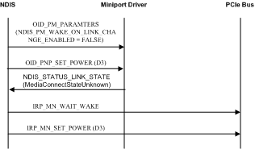
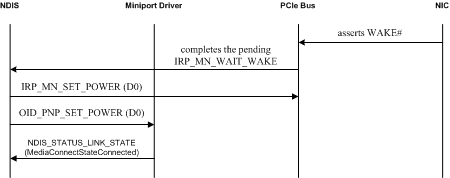

# Low Power for Wake on LAN

The wake on LAN (WOL) feature wakes the computer from a low power state when a network adapter detects a WOL event.

A miniport driver reports network adapter WOL capabilities during initialization. For more information about reporting WOL capabilities, see [Reporting Power Management Capabilities](reporting-power-management-capabilities.md).

Note that the lower power on the media disconnect (D3 on disconnect) feature is canceled when the computer enters a sleep state in order to prevent waking the computer when the link state is externally cycled; that is, when a switch is turned off and on. For more information about D3 on disconnect, see [Low Power on Media Disconnect](low-power-on-media-disconnect.md).

The following figure illustrates the sequence of events that occurs to set a network adapter to a low power state.

When NDIS puts a network adapter in a low power state, the following sequence occurs:

1.  NDIS uses [OID\_PM\_PARAMETERS](./oid-pm-parameters.md) to enable wake on LAN and to disable wake on media connect. NDIS\_PM\_WAKE\_ON\_LINK\_CHANGE\_ENABLED is cleared in the **WakeUpFlags** member.

2.  NDIS uses [OID\_PNP\_SET\_POWER](./oid-pnp-set-power.md) to notify the miniport driver of the new power state (D3).

3.  The miniport driver may indicate an unknown media connect state using the [**NDIS\_STATUS\_LINK\_STATE**](./ndis-status-link-state.md) status indication. The **MediaConnectStateUnknown** value is set in the **MediaConnectState** member of the [**NDIS\_LINK\_STATE**](/windows-hardware/drivers/ddi/ntddndis/ns-ntddndis-_ndis_link_state) structure. For more information, see the [**NDIS\_STATUS\_LINK\_STATE**](./ndis-status-link-state.md) documentation.

4.  NDIS sends the PCI Express (PCIe) bus an [**IRP\_MN\_WAIT\_WAKE**](../kernel/irp-mn-wait-wake.md) IRP to wait for a WOL event.

5.  NDIS sends the PCIe bus an [**IRP\_MN\_SET\_POWER**](../kernel/irp-mn-set-power.md) IRP to set the bus to the D3 state.

The following figure illustrates the sequence of events that occurs to restore full power to a network adapter after a WOL event.

When the network adapter is waking the computer the following sequence occurs:

1.  The network adapter wakes the system by asserting WAKE\# on the PCIe bus or PME\# on the PCI bus.

2.  The bus completes the pending [**IRP\_MN\_WAIT\_WAKE**](../kernel/irp-mn-wait-wake.md) IRP. The IRP is pending completion from the last step in the power down sequence.

3.  NDIS sets the bus to full power (D0) with the [**IRP\_MN\_SET\_POWER**](../kernel/irp-mn-set-power.md) IRP.

4.  NDIS notifies the miniport driver that the network adapter is at full power (D0) with the OID set request of [OID\_PNP\_SET\_POWER](./oid-pnp-set-power.md).

5.  The network adapter notifies NDIS of a media connect event with the [**NDIS\_STATUS\_LINK\_STATE**](./ndis-status-link-state.md) status indication. The **MediaConnectStateConnected** value is set in the **MediaConnectState** member of the [**NDIS\_LINK\_STATE**](/windows-hardware/drivers/ddi/ntddndis/ns-ntddndis-_ndis_link_state) structure.

Starting with NDIS 6.30, if the miniport driver supports [**NDIS\_STATUS\_PM\_WAKE\_REASON**](./ndis-status-pm-wake-reason.md) status indications, it must issue this status notification if the network adapter wakes the system. The driver issues this status notification while it is handling the OID set request of [OID\_PNP\_SET\_POWER](./oid-pnp-set-power.md) for the transition to a full-power (D0) state.

For more information, see [NDIS Wake Reason Status Indications](overview-of-ndis-wake-reason-statue-indications.md).

 

