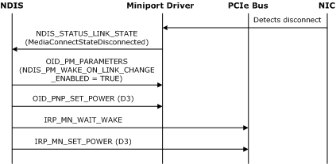
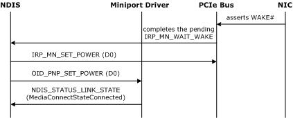

# Low Power on Media Disconnect

The low power on media disconnect (D3 on disconnect) feature saves power by placing a network adapter in a low-power state (D3) when the media is disconnected. When the media is reconnected, the network adapter is brought back up to the full-power state (D0).

NDIS uses the D3 on disconnect feature under these conditions:

-   The network adapter hardware must be able to generate a wake event on media connect.

-   The miniport driver must report the wake event capability of the network adapter in the **MinLinkChangeWakeUp** member of the [**NDIS\_PM\_CAPABILITIES**](https://msdn.microsoft.com/library/windows/hardware/ff566748) structure.

-   The value of **MinLinkChangeWakeUp** must correspond to the value of the **DeviceWake** member of the [**DEVICE\_CAPABILITIES**](https://msdn.microsoft.com/library/windows/hardware/ff543095) structure that is reported by the [**IRP\_MN\_QUERY\_CAPABILITIES**](https://msdn.microsoft.com/library/windows/hardware/ff551664) IRP.

-   The miniport driver must register as an NDIS 6.20 driver or later version.

-   The network adapter must be an Ethernet PCI adapter.

-   The wake event capability must be enabled by the **\*DeviceSleepOnDisconnect** standard INF file keyword.

-   The computer chipset must be able to correctly propagate the wake event while the computer is fully powered. NDIS validates this by querying the DEVPKEY\_PciDevice\_S0WakeupSupported PCI property.

Note that D3 on disconnect is only available while the computer is fully powered in the working state (S0). This feature is canceled when the computer enters a sleep state to prevent waking the computer when the link state is externally cycled; that is, when a switch is turned off and on. For more information about the setting the low-power state when a computer enters a sleep state, see [Low Power for Wake on LAN](low-power-for-wake-on-lan.md).

A miniport driver reports D3 on disconnect capabilities during initialization. For more information about reporting D3 on disconnect capabilities, see [Reporting Power Management Capabilities](reporting-power-management-capabilities.md).

The **\*DeviceSleepOnDisconnect** standard INF file keyword specifies whether the device has enabled or disabled support for D3 on disconnect. For more information about this INF keyword, see [Standardized INF Keywords for Power Management](standardized-inf-keywords-for-power-management.md).

During initialization, a miniport drivers that supports D3 on disconnect must report the lowest power level where it can support the ability to notify the operating system of media connect event. The miniport driver reports the power level in the **MinLinkChangeWakeUp** member of the [**NDIS\_PM\_CAPABILITIES**](https://msdn.microsoft.com/library/windows/hardware/ff566748) structure. For example, the miniport driver can report **NdisDeviceStateD3**.

The following figure illustrates the sequence of events to set a network adapter to a low-power state after a media disconnect event.

When the adapter detects a media disconnect, the following sequence occurs:

1.  The network adapter hardware detects a media disconnect event and passes the information to the miniport driver.

2.  The miniport driver notifies NDIS of a media disconnect event using the [**NDIS\_STATUS\_LINK\_STATE**](https://msdn.microsoft.com/library/windows/hardware/ff567391) status indication. The **StatusBuffer** member of the [**NDIS\_STATUS\_INDICATION**](https://msdn.microsoft.com/library/windows/hardware/ff567373) structure contains an [**NDIS\_LINK\_STATE**](https://msdn.microsoft.com/library/windows/hardware/hh205390) structure. The MediaConnectStateDisconnected value is set in the **MediaConnectState** member of the **NDIS\_LINK\_STATE** structure.

3.  NDIS uses [OID\_PM\_PARAMETERS](https://msdn.microsoft.com/library/windows/hardware/ff569768) to disable Wake-on-LAN and to enable wake on media connect (NDIS\_PM\_WAKE\_ON\_LINK\_CHANGE\_ENABLED is set in the **WakeUpFlags** member).

4.  NDIS uses the [OID\_PNP\_SET\_POWER](https://msdn.microsoft.com/library/windows/hardware/ff569780) OID to notify the miniport driver of the new power state (D3).

5.  NDIS sends the PCIe bus an [**IRP\_MN\_WAIT\_WAKE**](https://msdn.microsoft.com/library/windows/hardware/ff551766) IRP to wait for a reconnect event.

6.  NDIS sets the PCIe bus to the D3 state with the [**IRP\_MN\_SET\_POWER**](https://msdn.microsoft.com/library/windows/hardware/ff551744) IRP.

The following figure illustrates the sequence of events to restore full power to a network adapter after a media connect event.

When the media is reconnected the following sequence occurs:

1.  The network adapter wakes the system by asserting WAKE\# on the PCIe bus or PME\# on the PCI bus.

2.  The bus completes the pending [**IRP\_MN\_WAIT\_WAKE**](https://msdn.microsoft.com/library/windows/hardware/ff551766) IRP. The IRP is pending completion from the last step in the disconnect sequence.

3.  NDIS sets the bus to full power (D0) with the [**IRP\_MN\_SET\_POWER**](https://msdn.microsoft.com/library/windows/hardware/ff551744) IRP.

4.  NDIS notifies the miniport driver that the network adapter is in the full power (D0) state with the OID set request of [OID\_PNP\_SET\_POWER](https://msdn.microsoft.com/library/windows/hardware/ff569780).

5.  The network adapter notifies NDIS of a media connect event with the [**NDIS\_STATUS\_LINK\_STATE**](https://msdn.microsoft.com/library/windows/hardware/ff567391) status indication. The **MediaConnectStateConnected** value is set in the **MediaConnectState** member of the [**NDIS\_LINK\_STATE**](https://msdn.microsoft.com/library/windows/hardware/hh205390) structure.

Starting with NDIS 6.30, if the miniport driver supports [**NDIS\_STATUS\_PM\_WAKE\_REASON**](https://msdn.microsoft.com/library/windows/hardware/hh439808) status indications, it must issue this status notification if the network adapter wakes the system. The driver issues this status notification while it is handling the OID set request of [OID\_PNP\_SET\_POWER](https://msdn.microsoft.com/library/windows/hardware/ff569780) for the transition to a full-power (D0) state.

For more information, see [NDIS Wake Reason Status Indications](ndis-wake-reason-status-indications.md).

**Note**  If the miniport driver issues an [**NDIS\_STATUS\_PM\_WAKE\_REASON**](https://msdn.microsoft.com/library/windows/hardware/hh439808) status indication, it must do this before it issues the [**NDIS\_STATUS\_LINK\_STATE**](https://msdn.microsoft.com/library/windows/hardware/ff567391) status indication.

 

 

 

